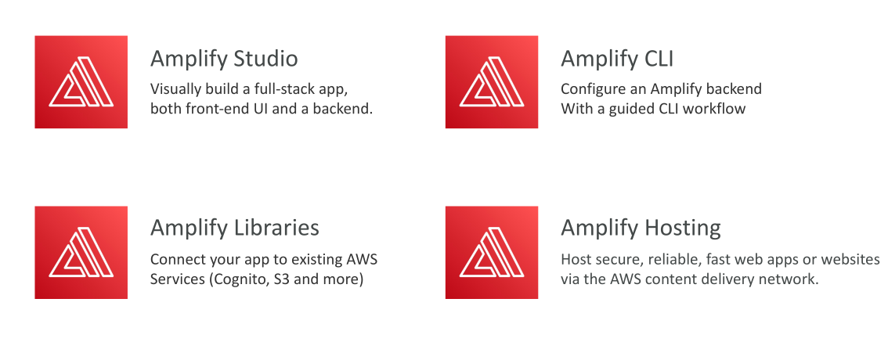
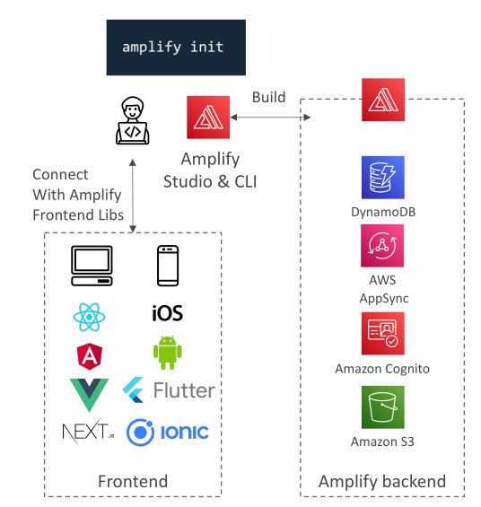
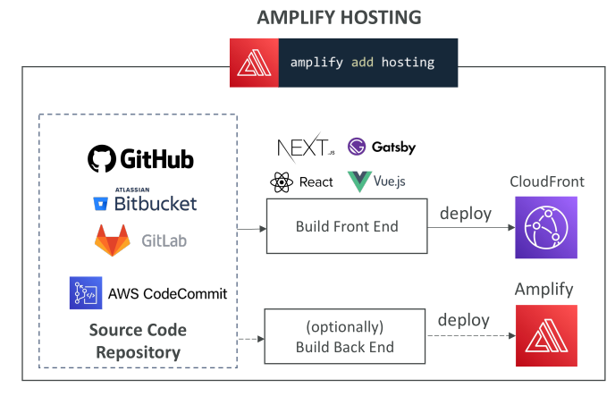

# AWS Amplify



AWS Amplify คือบริการที่ช่วยให้เราสามารถสร้าง **แอปพลิเคชันมือถือและเว็บ** ได้อย่างง่ายดาย ประกอบด้วยหลายส่วน เช่น **Amplify Studio** ซึ่งช่วยให้สร้าง Full-Stack Application ทั้ง Frontend และ Backend แบบ Visual


## Amplify CLI และ Libraries

* **Amplify CLI** → ใช้ทำงานเดียวกับ Amplify Studio แต่ผ่าน Command Line
* **Amplify Libraries** → เชื่อมแอปพลิเคชันกับบริการ AWS เช่น

  * Cognito → สำหรับ Authentication
  * S3 → สำหรับ Storage
  


## Amplify Hosting

* ใช้ **โฮสต์แอป Amplify บน AWS**
* ให้บริการด้วยความเร็วสูงและรองรับการ deploy แบบ CI/CD




## ภาพรวมของ AWS Amplify

* AWS Amplify เป็น **ชุดเครื่องมือ** สำหรับสร้างแอปมือถือและเว็บ
* สามารถเริ่มต้นได้ด้วย **Amplify Studio** หรือ **CLI**
* ตัวอย่างคำสั่งเริ่มต้น CLI:

```bash
amplify init
```

* Backend ของ Amplify ใช้บริการ AWS เช่น

  * DynamoDB → เก็บข้อมูล
  * AWS AppSync → สำหรับ GraphQL API
  * Cognito → สำหรับ Authentication
  * Amazon S3 → สำหรับเก็บไฟล์

* Frontend Libraries รองรับหลาย Framework เช่น React, Vue, JavaScript, iOS, Android, Flutter เป็นต้น

AWS Amplify เป็น **one-stop shop** สำหรับรวมทุกส่วนเข้าด้วยกัน พร้อมแนวทางการทำงานที่ปลอดภัยและมีประสิทธิภาพ

## การ Deploy แอปด้วย Amplify

* สามารถใช้ **Amplify CLI** หรือ **Amplify Studio**

## ฟีเจอร์หลักของ AWS Amplify

### 1. Authentication

* ใช้คำสั่งเพิ่ม Authentication:

```bash
amplify add auth
```

* ใช้ Amazon Cognito
* รองรับ:

  * การลงทะเบียนผู้ใช้
  * การเข้าสู่ระบบ (Authentication)
  * การกู้คืนบัญชี
  * MFA และ Social Sign-in
  * มี Component สำเร็จรูปสำหรับ Frontend
  * Fine-grained Authorization

### 2. Datastore / API

* ใช้คำสั่งเพิ่ม API/Datastore:

```bash
amplify add api
```

* ใช้ Amazon AppSync (GraphQL) + DynamoDB
* Data Store → ทำงานกับข้อมูล Local และ Sync ขึ้น Cloud อัตโนมัติ
* รองรับ Offline และ Real-time
* สามารถสร้าง Data Model ผ่าน Amplify Studio

### 3. Amplify Hosting

* คำสั่งเพิ่ม Hosting:

```bash
amplify add hosting
```

* รองรับ CI/CD → Build, Test, Deploy
* ฟีเจอร์:

  * Pull request previews
  * Custom domains
  * Monitoring
  * Redirects & Custom headers
  * Password protection
* คล้าย Netlify หรือ Vercel
* เชื่อมกับ GitHub, Bitbucket, GitLab, CodeCommit
* CI/CD Pipeline → Build Frontend และ Deploy เช่น ไปยัง CloudFront
* Backend สามารถ Build & Deploy ได้ด้วย

## การทดสอบใน Amplify

* รองรับ 2 แบบ:

  1. **Unit Testing** → ตรวจสอบโค้ดช่วง Build
  2. **End-to-End Testing** → ตรวจสอบการทำงานหลัง Deploy
* Framework ที่แนะนำ: **Cypress** → สร้าง E2E Test, UI Report, simulate browser, click actions, verify behavior

## สรุป

AWS Amplify ช่วยให้เราสร้างแอปมือถือและเว็บได้ครบวงจร มีเครื่องมือเช่น **Amplify Studio, CLI, Libraries, Hosting**

* Integrate กับบริการ AWS เช่น Cognito, DynamoDB, AppSync, S3
* Hosting รองรับ CI/CD, custom domain, monitoring, E2E testing
* รองรับ **Unit และ End-to-End Testing** เพื่อความเสถียรก่อน Deploy

## Key Takeaways

* AWS Amplify → บริการครบวงจรสำหรับ Mobile/Web Apps
* Amplify Studio/CLI/Libraries/Hosting → รวมทุกส่วนไว้ในที่เดียว
* Authentication → Cognito
* Data/Backend → DynamoDB, AppSync, GraphQL
* Hosting → CI/CD, Pull Request Preview, Custom Domains
* Testing → Unit & End-to-End (Cypress)