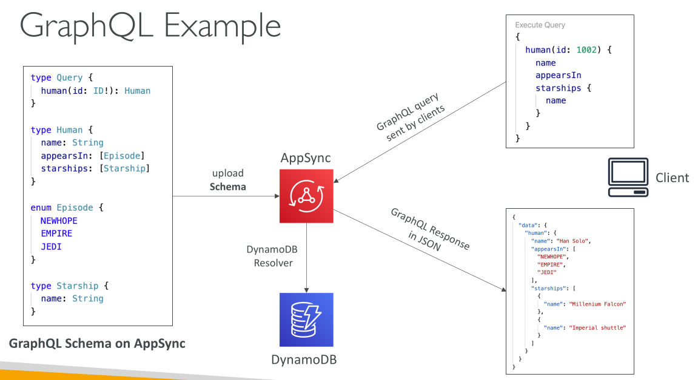
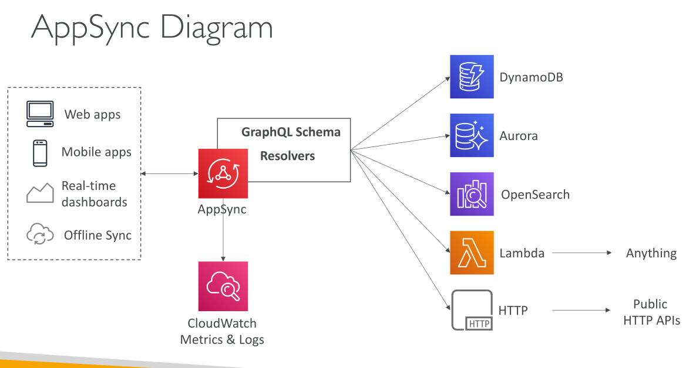

# AWS AppSync

AWS AppSync คือบริการที่ **จัดการ (managed service)** สำหรับสร้าง **GraphQL API** บน AWS

* ช่วยให้แอปพลิเคชันสามารถ **ร้องขอข้อมูลเฉพาะที่ต้องการ** ทำให้การดึงข้อมูลมีประสิทธิภาพและยืดหยุ่น

**GraphQL** เป็นรูปแบบ API ใหม่ที่ให้ผู้ใช้งานระบุได้ว่าต้องการ **field ไหนบ้าง**

* แอปพลิเคชันจะได้รับข้อมูลตามที่ขอ **ไม่มากเกินไป** และไม่ต้องดึงข้อมูลที่ไม่จำเป็น

## การรวมข้อมูลด้วย GraphQL ใน AppSync

* GraphQL สามารถรวมข้อมูลจากหลายแหล่งเป็น **graph เดียว**
* แหล่งข้อมูลเหล่านี้ได้แก่:

  * NoSQL Databases
  * Relational Databases
  * HTTP APIs

* AppSync มีการเชื่อมต่อโดยตรงกับ:

  * DynamoDB
  * Aurora
  * OpenSearch
  * Lambda → เพื่อดึงข้อมูลจากแหล่งอื่น ๆ

## Real-Time Data และ WebSockets

* AppSync รองรับแอปแบบ **real-time** ผ่าน **WebSockets** หรือ **MQTT over WebSockets**
* เหมาะกับแอปที่ต้องการ **live data feed**
* แม้มีทางเลือกอื่นเช่น **Application Load Balancer** หรือ **API Gateway**

  * AppSync เป็นตัวเลือกที่ดีสำหรับ **WebSocket integration**

## Offline Data Access และ Synchronization

* สำหรับแอปมือถือที่ต้องการเข้าถึงข้อมูลแบบ **local** และ **sync กับ cloud**
* AppSync เป็น **ตัวแทนสมัยใหม่** ของบริการเก่า **AWS Cognito Sync**

## การเริ่มต้นใช้งาน AppSync

1. **อัปโหลด GraphQL schema**

   * กำหนดโครงสร้าง API และข้อมูลที่ client สามารถ query ได้
2. AppSync ทำหน้าที่เป็น **ตัวกลางระหว่าง client และ data sources**

   * Client ส่ง query ระบุข้อมูลที่ต้องการ
   * AppSync ใช้ **resolvers** เพื่อดึงข้อมูลจากแหล่งข้อมูลต่าง ๆ

**ตัวอย่าง Query:**

* Client ขอชื่อมนุษย์, ภาพยนตร์ที่ปรากฏ, และยานอวกาศที่เกี่ยวข้อง
* AppSync ใช้ resolver ดึงข้อมูลจาก DynamoDB หรือแหล่งอื่น
* คืนค่าผลลัพธ์เป็น **JSON** ตรงกับ field ที่ client ขอ

## ภาพรวมระดับสูง

* AppSync ใช้สำหรับ Web & Mobile Applications ผ่าน **GraphQL**
* รองรับ:

  * Real-time dashboards
  * Offline data synchronization
* ต้องการ:

  * **GraphQL schema**
  * **Resolvers** สำหรับดึงข้อมูล
* แหล่งข้อมูลรองรับ:

  * DynamoDB, Aurora, OpenSearch, Lambda, HTTP endpoints

## Monitoring และ Logging

* Integrate กับ **CloudWatch Metrics** และ **CloudWatch Logs**
* สามารถ monitor API activity และ troubleshoot ได้

## Security และ Authorization

มี 4 วิธีหลักในการกำหนดสิทธิ์เข้าถึง AppSync API:

1. **API_KEY** → สร้าง API Key และแจกจ่ายให้ผู้ใช้งาน
2. **AWS_IAM** → ใช้ IAM Users/Roles หรือ Cross-account access
3. **OPENID_CONNECT** → เชื่อมต่อกับ OpenID Connect Provider (JWT)
4. **AMAZON_COGNITO_USER_POOL** → ใช้ Cognito User Pools + Federation (Social login)

* สำหรับ HTTPS บน **Custom Domain** → แนะนำใช้ **CloudFront** ข้างหน้า AppSync

## สรุป

* AWS AppSync เป็นบริการ **managed** สำหรับสร้าง **GraphQL API**
* GraphQL ช่วยให้ client ดึงข้อมูลเฉพาะที่ต้องการจากหลายแหล่ง
* AppSync เชื่อมต่อโดยตรงกับ DynamoDB, Aurora, OpenSearch, Lambda, HTTP APIs
* รองรับ **real-time data** ผ่าน WebSockets และ **offline sync** สำหรับแอปมือถือ

## Key Takeaways

* AWS AppSync → Managed service สำหรับ GraphQL API
* GraphQL → ดึงข้อมูลเฉพาะที่ต้องการ
* Data Sources → DynamoDB, Aurora, OpenSearch, Lambda, HTTP APIs
* Real-time & Offline → WebSockets + Mobile Sync