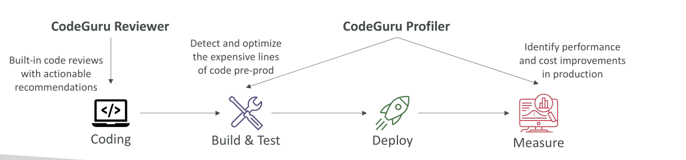
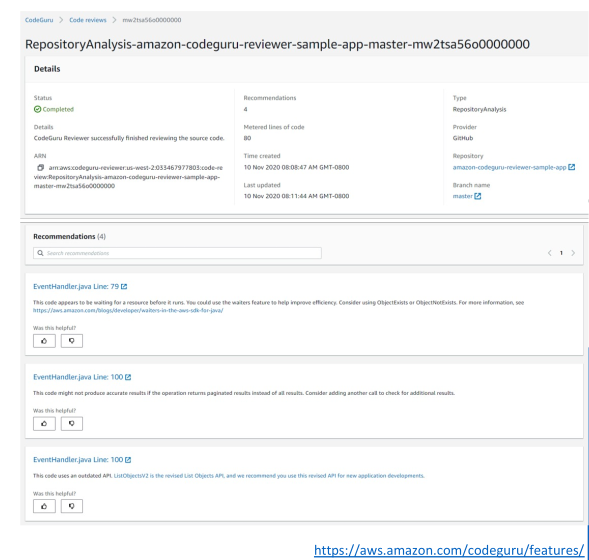
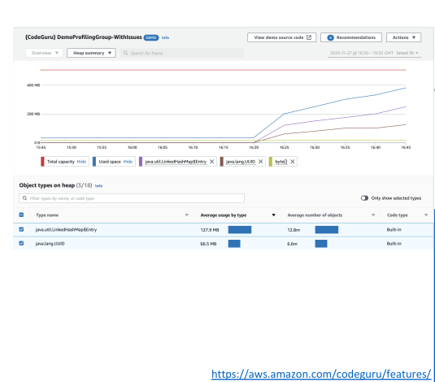

# CodeGuru

Amazon CodeGuru เป็นบริการที่ใช้ **Machine Learning (ML)** ในการช่วยนักพัฒนา โดยมีฟังก์ชันหลัก 2 อย่างคือ:

1. **Automated Code Reviews** – ตรวจสอบโค้ดอัตโนมัติ
2. **Application Performance Recommendations** – แนะนำการปรับปรุงประสิทธิภาพของแอปพลิเคชัน

ตามปกติแล้วเมื่อมีการ push โค้ด นักพัฒนาคนอื่นจะเป็นผู้ทำ code review และเมื่อโค้ดถูกนำไปใช้งานใน production ก็ต้องมีการเฝ้าติดตามประสิทธิภาพเพื่อตรวจจับบั๊กที่อาจเกิดขึ้น CodeGuru จะช่วย **ทำงานอัตโนมัติ** ทั้งสองอย่างนี้

## CodeGuru Reviewer

* ใช้ **Static Code Analysis** เพื่อทำการตรวจสอบโค้ดอัตโนมัติ
* เมื่อมีการ deploy โค้ดไปยัง repository เช่น CodeCommit หรือ GitHub → CodeGuru จะทำการวิเคราะห์ทุกบรรทัดของโค้ด
* หากพบ **บั๊ก, memory leaks, หรือปัญหาที่เคยตรวจเจอมาก่อน** → จะให้คำแนะนำเชิงปฏิบัติ (actionable recommendations)
* ด้วยความสามารถของ Machine Learning → สามารถตรวจหาบั๊กได้แม้กระทั่งก่อน reviewer คนจริงจะเจอ

## CodeGuru Profiler

* ใช้สำหรับดูข้อมูล **ประสิทธิภาพของแอปพลิเคชัน** ระหว่าง runtime หรือใน production
* ตรวจหาบรรทัดโค้ดที่มีต้นทุนสูง (expensive lines of code) และแนะนำการปรับปรุง
* สามารถใช้ได้ทั้งใน **pre-production** และ **production**
* มีการวัดประสิทธิภาพแบบ real-time และแนะนำโอกาสในการ **ลดต้นทุน (cost optimization)** และเพิ่มประสิทธิภาพ

## เจาะลึก CodeGuru Reviewer

* วิเคราะห์ commit ทุกครั้งที่มีการ push โค้ด
* เน้นหาบรรทัดที่มีความเสี่ยงหรือมีปัญหา เช่น:

  * **Critical issues**
  * **Security vulnerabilities**
  * **Hard-to-find bugs**
* ช่วยเรื่อง **Best Practices** เช่น

  * ป้องกัน resource leaks
  * ตรวจหาช่องโหว่ด้าน security
  * ตรวจสอบ input validation
* ใช้ Machine Learning และ **Automated Reasoning**
* เรียนรู้จาก **code review ใน open-source repositories** และ **Amazon.com repositories**
* ปัจจุบันรองรับ **Java และ Python** และเชื่อมต่อกับ **GitHub, Bitbucket, CodeCommit**

## เจาะลึก CodeGuru Profiler

* วิเคราะห์ **runtime behavior** ของแอปพลิเคชัน
* ระบุการใช้ CPU ที่มากเกินไป เช่น ใน logging routine
* ลดการใช้ CPU และลดต้นทุน compute
* ให้ **heap summaries** เพื่อตรวจหาวัตถุ (objects) ที่ใช้ memory มาก
* ทำ anomaly detection เพื่อตรวจจับพฤติกรรมที่ผิดปกติ
* ใช้งานได้ทั้งใน **AWS Cloud** และ **On-Premises**
* มี overhead น้อยต่อแอปพลิเคชันที่ถูก monitor

## Amazon CodeGuru – การตั้งค่า Agent

* **MaxStackDepth** – ความลึกสูงสุดของ stack ในโค้ดที่แสดงในโปรไฟล์

* **ตัวอย่าง**: ถ้า CodeGuru Profiler พบว่า method A เรียก method B → method B เรียก method C → method C เรียก method D
  → ความลึกเท่ากับ 4
  → ถ้าตั้งค่า MaxStackDepth = 2 ตัว profiler จะประเมินเฉพาะ A และ B

* **MemoryUsageLimitPercent** – เปอร์เซ็นต์ของหน่วยความจำที่ profiler ใช้

* **MinimumTimeForReportingInMilliseconds** – เวลาขั้นต่ำระหว่างการส่งรายงาน (หน่วยมิลลิวินาที)

* **ReportingIntervalInMilliseconds** – ช่วงเวลาในการส่งรายงานโปรไฟล์ (หน่วยมิลลิวินาที)

* **SamplingIntervalInMilliseconds** – ช่วงเวลาในการสุ่มตัวอย่างที่ใช้ในการทำ profiling (หน่วยมิลลิวินาที)
  → ค่าที่ลดลง = อัตราการสุ่มตัวอย่างที่สูงขึ้น

## สรุป

Amazon CodeGuru เป็นบริการที่ช่วยให้คุณ:

* ตรวจสอบโค้ดอัตโนมัติด้วย **Reviewer**
* วิเคราะห์ประสิทธิภาพ runtime ด้วย **Profiler**

## Key Takeaways

* **Amazon CodeGuru** ใช้ Machine Learning เพื่อทำ **Automated Code Reviews** และ **Performance Recommendations**
* **CodeGuru Reviewer** → ตรวจสอบโค้ด (Static Analysis) เพื่อหาบั๊ก, ช่องโหว่ด้าน security, และ resource leaks
* **CodeGuru Profiler** → เฝ้าดูพฤติกรรม runtime เพื่อตรวจหาคอขวดด้านประสิทธิภาพและแนะนำการปรับปรุง
* รองรับ **Java และ Python** เชื่อมต่อกับ **GitHub, Bitbucket, CodeCommit**
* ใช้งานได้ทั้งบน **AWS Cloud** และ **On-Premises**