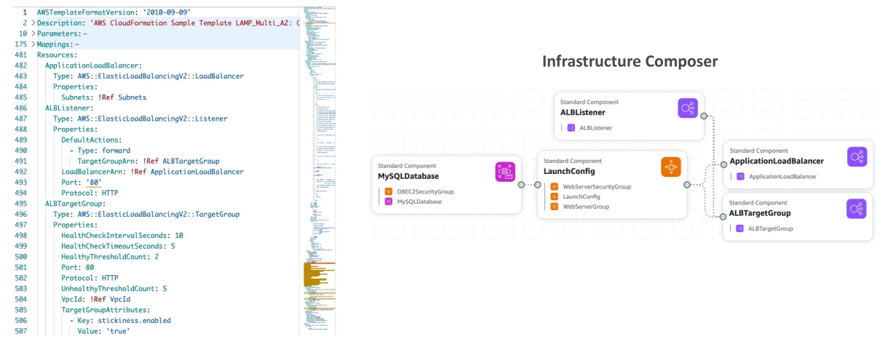
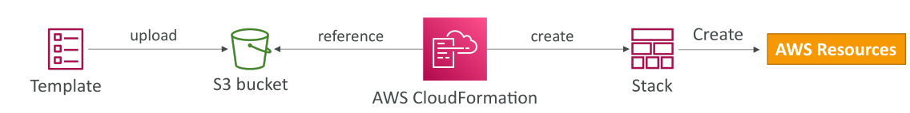
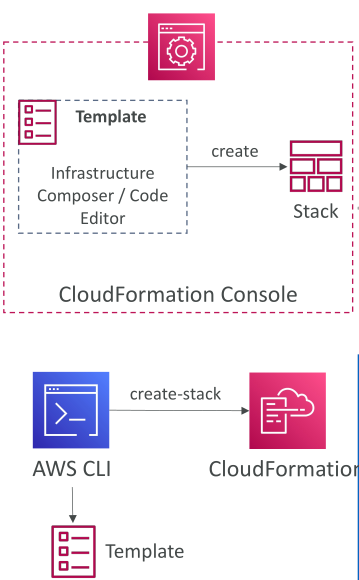

# CloudFormation

AWS CloudFormation เป็นหนึ่งในบริการโปรดส่วนตัวของผมใน AWS เพราะช่วยให้คุณ **กำหนดโครงสร้างพื้นฐานและทรัพยากร AWS ด้วยโค้ดเพียงอย่างเดียว**

ตัวอย่างเช่น ใน **CloudFormation template** คุณสามารถระบุว่าต้องการ:

* Security Group หนึ่งอัน
* EC2 Instances สองเครื่องที่ใช้ Security Group ดังกล่าว
* Elastic IP สำหรับ EC2 Instances เหล่านี้
* S3 Bucket
* Load Balancer ข้างหน้า EC2 Instances

โดยการประกาศทรัพยากรเหล่านี้และความสัมพันธ์ของมัน **CloudFormation จะสร้างทรัพยากรเหล่านี้โดยอัตโนมัติในลำดับที่ถูกต้องและตามการตั้งค่าที่คุณระบุ**

วิธีนี้ช่วยลดงานแบบ manual และลดความผิดพลาด เพราะทุกอย่างถูก provision ผ่าน CloudFormation

## CloudFormation Templates

**CloudFormation template** คือโค้ดที่ **ประกาศว่าโครงสร้างพื้นฐานของคุณประกอบด้วยอะไรบ้าง**
คุณสามารถใช้ **Infrastructure Composer** เพื่อ visualize โครงสร้างพื้นฐานและดูความสัมพันธ์ระหว่าง component ภายใน CloudFormation

## ทำไมต้องใช้ AWS CloudFormation?

* **Infrastructure as Code:** ไม่ต้องสร้างทรัพยากรด้วยตนเอง ทำให้ควบคุมง่ายขึ้น
* **Version Control:** โค้ด template สามารถใช้ version control เช่น Git
* **Change Management:** การเปลี่ยนแปลง infrastructure ถูกตรวจสอบผ่านการแก้ไขโค้ด
* **Cost Management:** ทุกทรัพยากรถูกติด tag ให้สามารถติดตามค่าใช้จ่ายได้ง่าย
* **Saving Strategy:** ใน environment การพัฒนา สามารถลบและสร้างใหม่โดยอัตโนมัติตามเวลา
* **Productivity:** สามารถลบและสร้าง infrastructure ใหม่ได้ทันที ใช้ประโยชน์จาก pay-as-you-go ของ cloud
* **Automated Diagrams:** CloudFormation สร้าง diagram สถาปัตยกรรมให้อัตโนมัติ
* **Declarative Programming:** ไม่ต้องกังวลเรื่องลำดับการสร้างทรัพยากร CloudFormation จะจัดการให้
* **Separation of Concerns:** สามารถสร้างหลาย stack สำหรับแอปหรือเลเยอร์ต่างๆ เช่น stack สำหรับ network/VPC และ stack สำหรับแอป
* **Reuse:** ใช้ template และเอกสารที่มีอยู่แล้วบนเว็บเพื่อสร้าง template ของตัวเองได้อย่างรวดเร็ว

## CloudFormation ทำงานอย่างไร?

1. **Template** ต้องอัปโหลดไปยัง **Amazon S3**
2. อ้างอิง template จาก CloudFormation เพื่อสร้าง **stack**
3. **Stack** ประกอบด้วยทรัพยากร AWS ที่คุณประกาศใน template

* หากต้องการอัปเดต template **ไม่สามารถแก้ไขเวอร์ชันเก่าโดยตรง** ต้องอัปโหลด template เวอร์ชันใหม่แล้วอัปเดต stack
* Stack จะถูกระบุด้วยชื่อในแต่ละ region
* หากลบ stack ทุกทรัพยากรที่ CloudFormation สร้างจะถูกลบทั้งหมด

## การ Deploy CloudFormation Templates

มี 2 วิธีหลัก:

1. **Manual Way:** ใช้ Infrastructure Composer หรือ code editor สร้าง template แล้วใช้ AWS console ป้อน parameters และ deploy

   * มักใช้สำหรับการเรียนรู้

2. **Automated Way:** แก้ไข template ในไฟล์ YAML แล้ว deploy ผ่าน **AWS CLI** หรือ **continuous delivery tools**

   * แนะนำสำหรับการทำ deployment อัตโนมัติเต็มรูปแบบ

## ส่วนประกอบของ CloudFormation Templates

CloudFormation template ประกอบด้วยหลาย component:

* **AWSTemplateFormatVersion:** ระบุเวอร์ชัน template สำหรับ AWS
* **Description:** คำอธิบาย template
* **Resources:** ส่วนจำเป็นที่สุด ระบุทุกทรัพยากร AWS
* **Parameters:** ค่าป้อนเข้าที่ปรับเปลี่ยนได้
* **Mappings:** ตัวแปรคงที่สำหรับ template
* **Outputs:** อ้างอิงสิ่งที่ถูกสร้างแล้วใน template
* **Conditionals:** เงื่อนไขสำหรับควบคุมการสร้างทรัพยากร
* **Template Helpers:** ฟังก์ชันช่วยเหลือต่างๆ เช่น การอ้างอิงและฟังก์ชันใน template

เราจะศึกษาแต่ละ component และตัวอย่างโค้ดในรายละเอียดต่อไป

## สรุป

AWS CloudFormation ช่วยให้คุณ **กำหนดและ provision infrastructure ด้วยโค้ด**
Template ของ CloudFormation เป็นแบบ declarative และ **อัตโนมัติสร้างและจัดการทรัพยากร**

## Key Takeaways

* AWS CloudFormation ช่วยให้กำหนดและสร้าง AWS infrastructure ด้วยโค้ด
* Template ของ CloudFormation เป็น declarative และจัดการ orchestration อัตโนมัติ
* Infrastructure as Code ช่วย version control, ติดตามค่าใช้จ่าย, และทำ automation
* Template ประกอบด้วย component เช่น **Resources, Parameters, Mappings, Outputs, Conditionals**
