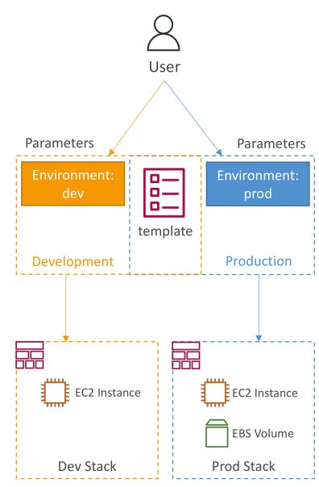
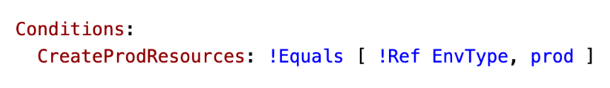
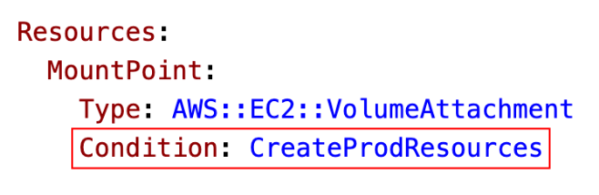

# CloudFormation - Conditions

**Conditions** ตามชื่อคือใช้เพื่อ **ควบคุมการสร้าง resource หรือ output** ขึ้นอยู่กับเงื่อนไขที่กำหนด

ตัวอย่าง:

* บาง resource อาจสร้าง **เฉพาะใน environment development** เช่น Dev Stack
* บาง resource อาจสร้าง **เฉพาะใน environment production** เช่น Prod Stack

ความแตกต่างระหว่าง environment อาจเป็น เช่น **มี EBS volume แนบหรือไม่แนบ**
คุณสามารถกำหนดเงื่อนไขได้ตามต้องการ

เงื่อนไขทั่วไปมักอ้างอิงจาก:

* Environment เช่น dev, test, prod
* Region
* ค่าพารามิเตอร์
* เงื่อนไขแต่ละตัวสามารถอ้างอิง **เงื่อนไขอื่น ๆ, พารามิเตอร์, หรือ mappings**

## ตัวอย่างการกำหนด Condition

ตัวอย่าง: กำหนด condition ชื่อ `CreateProdResources`

* ตรวจสอบว่า **พารามิเตอร์ Env เท่ากับ prod หรือไม่**
* ถ้า Env = prod → Condition นี้จะประเมินเป็น true

ฟังก์ชันที่ใช้สร้าง logical expression ของ condition ได้แก่:

* `And`
* `Equals`
* `If`
* `Not`
* `Or`

## การใช้ Conditions

* สามารถนำ condition ไปใช้กับ **resource, output หรือองค์ประกอบอื่น ๆ** ใน template
* ตัวอย่าง: resource `EC2 VolumeAttachment` ชื่อ `MountPoint`

  * ถ้าใช้ condition `CreateProdResources`
  * ถ้า condition เป็น true → resource `MountPoint` จะถูกสร้าง
  * ถ้า condition เป็น false → resource จะไม่ถูกสร้าง

**หมายเหตุ:**

* สำหรับการสอบ คุณไม่จำเป็นต้องรู้วิธีเขียน condition เพราะถือว่าเป็นเรื่องขั้นสูง
* แต่ควรทราบว่า **Conditions มีอยู่และสามารถใช้ได้**

## สรุป

* Conditions ใน CloudFormation ใช้ควบคุมการสร้าง resource หรือ output ตาม **เงื่อนไขที่กำหนด**
* เงื่อนไขทั่วไป: environment type (dev, test, prod), region, หรือค่าพารามิเตอร์
* เงื่อนไขสามารถอ้างอิง **เงื่อนไขอื่น ๆ, พารามิเตอร์, หรือ mappings**
* เงื่อนไขถูกนำไปใช้กับ resource หรือ output เพื่อ **ตัดสินใจสร้างหรือไม่สร้าง** ตามค่า true/false