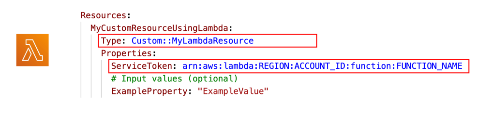
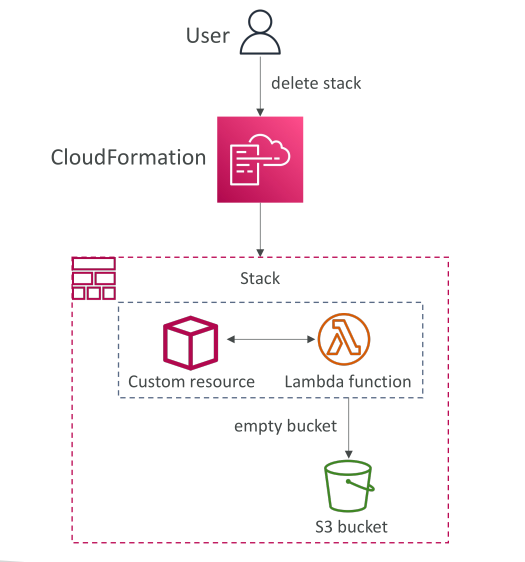

# CloudFormation - Custom Resources



CloudFormation รองรับ resource หลายประเภทโดยตรง แต่ **Custom Resources** ช่วยให้คุณสามารถกำหนด resource ที่ CloudFormation ยังไม่รองรับ หรือใช้เพื่อสร้าง **logic การจัดเตรียม (provisioning) แบบกำหนดเอง** สำหรับ resource ที่อยู่นอกการจัดการโดยตรงของ CloudFormation

Custom Resources สามารถเป็นได้ทั้ง:

* Resource ของคุณเองที่อยู่ on-premises
* Resource ของบุคคลที่สาม
* การรันสคริปต์แบบกำหนดเองในช่วง **สร้าง (create), อัปเดต (update), ลบ (delete)** ของ stack ผ่าน Lambda function

**ตัวอย่างที่ใช้จริง:**



* รัน Lambda function เพื่อ **ล้าง S3 bucket ก่อนลบ**
* เป็นตัวอย่างที่พบบ่อยในข้อสอบและเป็น use case ทั่วไปของ Custom Resources

## การกำหนด Custom Resource

* ใน CloudFormation template ระบุชนิด resource เป็น:

  ```cli
  Custom::MyCustomResourceTypeName
  ```

* Resource นี้ต้องมี **backing** เป็น Lambda function หรือ SNS topic
* วิธีที่ใช้บ่อยที่สุดคือ Lambda function

**ตัวอย่าง:**

* กำหนด Custom Resource ชนิด `Custom::MyLambdaResource`
* ใน `Properties` ระบุ `ServiceToken` ซึ่งเป็น ARN ของ Lambda function หรือ ARN ของ SNS topic
* Lambda function จะมี logic สำหรับสร้าง resource หรือทำ action ที่ต้องการ
* สามารถส่งค่า input parameter ให้ Lambda function ผ่าน properties ของ Custom Resource

## Use Case: ล้าง S3 Bucket ก่อนลบ

* CloudFormation ไม่สามารถลบ S3 bucket ที่ไม่ว่างได้โดยตรง
* ต้องลบ object ทั้งหมดใน bucket ก่อนลบ bucket
* วิธีแก้: ใช้ **Custom Resource** ที่ backed ด้วย Lambda function

  * เมื่อ resource ถูกลบ Lambda function จะรัน API เพื่อ **ล้าง bucket**
  * หลังจาก bucket ว่างแล้ว CloudFormation จึงลบ bucket ได้สำเร็จ

## สรุป

* Custom Resources ช่วยขยายความสามารถของ CloudFormation โดยให้คุณกำหนด resource และ logic การจัดเตรียมที่ไม่รองรับโดยตรง
* การใช้ Lambda-backed Custom Resources เป็นวิธีที่ใช้บ่อยที่สุด
* ช่วยให้สามารถทำ action แบบกำหนดเองในช่วง lifecycle ของ stack ได้

## Key Takeaways

* Custom Resources ช่วยสร้าง resource ที่ CloudFormation ยังไม่รองรับ
* โดยปกติ Custom Resource ใช้ Lambda function หรือ SNS topic ใน region เดียวกัน
* Custom Resources ช่วยรัน logic การจัดเตรียมแบบกำหนดเอง เช่น การรันสคริปต์ช่วง create, update, delete
* ตัวอย่างที่พบบ่อยคือ Lambda-backed Custom Resource เพื่อล้าง S3 bucket ก่อนลบ