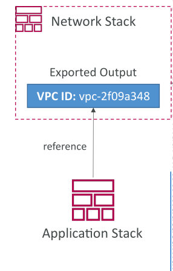
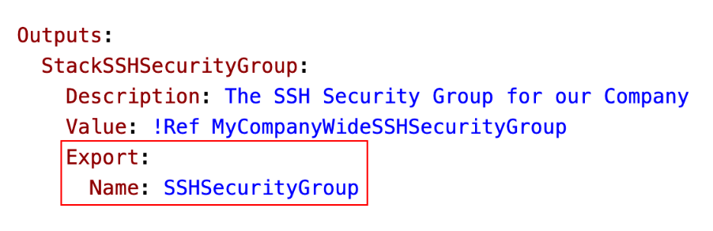
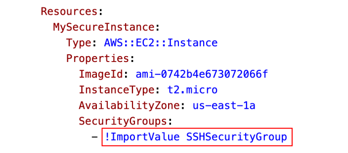

# CloudFormation - Outputs & Exports

**Output section** ใน CloudFormation เป็น **ส่วนเสริม (optional)**

* ใช้ประกาศค่า output ที่สามารถ **นำไปใช้งานใน stack อื่น ๆ**
* ฟีเจอร์นี้ช่วยให้สามารถ **เชื่อมโยง stack ต่าง ๆ เข้าด้วยกัน**

ตัวอย่าง:

* Network stack ส่งออกค่า **VPC ID** เป็น output
* Application stack อื่นสามารถ **อ้างอิง VPC ID ที่ถูก export** จาก stack ก่อนหน้า
* วิธีนี้สะดวกมากสำหรับ **การ reuse resource ข้าม stack**

คุณสามารถดู Outputs ได้ทั้งใน **AWS Management Console** หรือ **AWS CLI**

* มีประโยชน์อย่างยิ่งเมื่อต้องการสร้าง **network stack** แล้วส่งออก **VPC IDs** และ **Subnet IDs** เพื่อใช้งานใน stack อื่น

วิธีนี้ช่วยให้หลายทีมสามารถทำงานร่วมกันได้

* แต่ละทีมดูแล stack ของตัวเอง
* แต่ยังสามารถเชื่อม stack ผ่าน **exported outputs**

## ตัวอย่าง Output

สมมติว่า template สร้าง **SSH security group**

* Template มี **output section** อ้างอิง security group
* Output มี **export block** เพื่อ export ค่าโดยใช้ชื่อเฉพาะ เช่น `SSHSecurityGroup`

**เงื่อนไขสำคัญ:**

* Export name ต้อง **ไม่ซ้ำ** กับ exports อื่น ๆ ใน region เดียวกัน
* เพื่อให้ค่า export ถูกอ้างอิงโดย stack อื่นได้อย่างเชื่อถือได้

จาก output ที่ export นี้ คุณสามารถ **เข้าถึง Security Group ID** ของ SSH Security Group ภายในองค์กรได้

## การนำ Exported Outputs ไปใช้ซ้ำ

* Stack ใหม่สามารถใช้ **ImportValue function** เพื่อนำค่า output ที่ export มาใช้
* ตัวอย่าง: สร้าง EC2 instance แล้ว assign security group โดย **import security group ID** จาก stack อื่น
* การเชื่อมโยงแบบนี้ช่วยให้ **resource สามารถแชร์ข้าม stack** ได้

**ข้อควรระวัง:**

* ไม่สามารถลบ stack ที่ export ค่าได้ **ถ้า stack อื่นยังอ้างอิง output ของมันอยู่**
* Dependency นี้ช่วย **รักษาความถูกต้องและป้องกันการลบ resource โดยไม่ตั้งใจ**

## สรุป

* Outputs ใน CloudFormation เป็นเครื่องมือที่ทรงพลังสำหรับ **แชร์ข้อมูล resource ข้าม stack**
* ช่วยให้การจัดการ infrastructure เป็น **โมดูลและร่วมมือกันได้**

## Key Takeaways

* Output section เป็น **optional** แต่ช่วยประกาศค่า output ที่สามารถ **import ไปใช้ใน stack อื่น**
* Outputs ช่วย **เชื่อม stack** เช่น อ้างอิง VPC ID จาก network stack ใน application stack
* Exported output ต้องมีชื่อ **unique ใน region** เพื่อหลีกเลี่ยงความขัดแย้ง
* Stack ที่ถูก linked จะไม่สามารถลบได้จนกว่า **stack อื่นที่อ้างอิง outputs ของมันจะถูกลบหรือยกเลิก**
