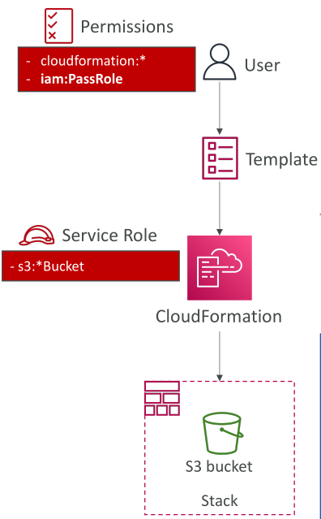

# CloudFormation - Service Role

CloudFormation สามารถใช้ **service roles** ซึ่งเป็น **IAM roles** ที่คุณสร้างขึ้นและมอบให้ CloudFormation โดยเฉพาะ

* Service role นี้ช่วยให้ CloudFormation สามารถ **สร้าง, อัปเดต, และลบ resource ใน stack** แทนคุณได้

ตัวอย่าง:

* หากคุณต้องการให้ผู้ใช้สามารถสร้าง, อัปเดต, และลบ resource ใน stack แต่ **ไม่มีสิทธิ์ตรงในการจัดการ resource เหล่านั้น**
* คุณสามารถสร้าง **CloudFormation template** และให้ผู้ใช้มีสิทธิ์ **ทำงานกับ CloudFormation** รวมถึงสิทธิ์ `iam:PassRole`
* จากนั้นสร้าง **service role สำหรับ CloudFormation** ที่มีสิทธิ์ เช่น **full access บน S3**
* CloudFormation จะสามารถสร้าง S3 bucket โดยใช้ service role นี้ เพราะผู้ใช้สามารถ **pass role ให้ CloudFormation**

## การใช้ Service Role เพื่อความปลอดภัย

* วิธีนี้สอดคล้องกับ **principle of least privilege**

  * ไม่ต้องให้ผู้ใช้สิทธิ์เต็มบน resource ทั้งหมด
  * เพียงให้สิทธิ์ในการ **เรียกใช้งาน service role ผ่าน CloudFormation**
* สิ่งสำคัญ: ผู้ใช้ต้องมีสิทธิ์ `iam:PassRole` เพื่อมอบ role ให้บริการ AWS เฉพาะ

## การสร้าง IAM Role สำหรับ CloudFormation

1. ไปที่ **IAM console** → เลือก **Roles**
2. สร้าง **role ใหม่** สำหรับ **AWS service** → เลือก **CloudFormation** เป็น service
3. กำหนด **permission policies** ที่จำเป็น เช่น **full access บน S3**
4. ตั้งชื่อ role เช่น `DemoRole-for-CFN-with-S3`
5. Role นี้จะช่วยให้ CloudFormation ทำงานใดๆ กับ Amazon S3 ได้

## การใช้ Service Role เมื่อสร้าง CloudFormation Stack

* ตอนสร้าง stack สามารถระบุ **IAM role** ในส่วน permissions ได้ (ไม่บังคับ)
* หากไม่ระบุ → CloudFormation ใช้ **permissions ของผู้ใช้**
* หากระบุ service role เช่น `DemoRole-for-CFN-with-S3` → CloudFormation จะใช้ **role นี้แทน permissions ของผู้ใช้**
* หมายเหตุ:

  * หาก service role ไม่มีสิทธิ์ครอบคลุม resource ใน stack เช่น EC2 instance → stack creation จะล้มเหลว
  * สิทธิ์ที่กำหนดใน service role **กำหนดสิ่งที่ CloudFormation สามารถทำได้**

## สรุป

* Service roles ช่วยให้สามารถ **มอบสิทธิ์อย่างปลอดภัย** สำหรับการจัดการ stack
* ผู้ใช้สามารถ **จัดการ stack โดยไม่ต้องมีสิทธิ์ตรงบน resource**
* ผู้ใช้ต้องมีสิทธิ์ `iam:PassRole` เพื่อมอบ role ให้ CloudFormation
* การระบุ service role ใน stack operations → **แทน permissions ของผู้ใช้สำหรับการดำเนินการนั้น**

## Key Takeaways

* CloudFormation service roles คือ **IAM roles ที่มอบให้ CloudFormation จัดการ stack แทนผู้ใช้**
* ผู้ใช้สามารถสร้าง, อัปเดต, ลบ resource ใน stack **โดยไม่ต้องมีสิทธิ์ตรงบน resource**
* ผู้ใช้ต้องมีสิทธิ์ `iam:PassRole` เพื่อมอบ role ให้ CloudFormation
* การระบุ service role ใน stack operations → **แทน permissions ของผู้ใช้ในการดำเนินการ stack**
