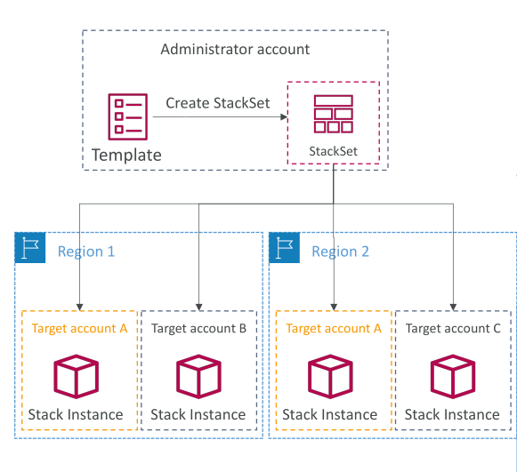

# CloudFormation - StackSets

**CloudFormation StackSets** ช่วยให้คุณสามารถสร้าง (create), อัปเดต (update), หรือ ลบ (delete) **stacks ข้ามหลายบัญชี (accounts) และหลาย region** ได้ด้วยการทำงานเพียงครั้งเดียวหรือจาก template เดียว

* จาก **บัญชีผู้ดูแล (administrative account)** คุณใช้ template เพื่อสร้าง StackSet
* StackSet นี้จะช่วยให้คุณ deploy stack ข้ามหลายบัญชีและหลาย region ได้พร้อมกัน ซึ่งเป็นที่มาของชื่อ **StackSet**

เมื่อคุณ **อัปเดต StackSet** ทุก instance ของ stack ในทุกบัญชีและทุก region จะถูกอัปเดตพร้อมกัน ทำให้สามารถทำงานแบบ all-at-once ได้

คุณสามารถใช้ StackSets กับบัญชีที่คุณเลือกได้ แต่ use case ที่พบบ่อยคือ **ใช้กับทุกบัญชีใน AWS Organization** ซึ่งเป็นกลุ่มบัญชีที่ถูกจัดการภายใน AWS

* ใน AWS Organization จะมีเพียง **บัญชีผู้ดูแล (administrator account)** หรือผู้ที่ได้รับมอบหมายเป็นผู้ดูแลเท่านั้นที่สามารถสร้าง StackSets
* ข้อจำกัดนี้สำคัญเพื่อป้องกันความสับสนและความเสี่ยงด้านความปลอดภัย

## Key Takeaways

* StackSets ช่วยสร้าง, อัปเดต, หรือ ลบ stacks ข้ามหลายบัญชีและหลาย region ด้วยการทำงานเพียงครั้งเดียว
* StackSets ถูกสร้างจาก template ในบัญชีผู้ดูแลและ deploy ข้ามหลายบัญชีและหลาย region
* การอัปเดต StackSet จะอัปเดตทุก stack instance ในบัญชีและ region เป้าหมายพร้อมกัน
* StackSets สามารถใช้กับบัญชีที่เลือกหรือทุกบัญชีใน AWS Organization โดยการสร้างถูกจำกัดเฉพาะบัญชีผู้ดูแลเพื่อรักษาความปลอดภัย