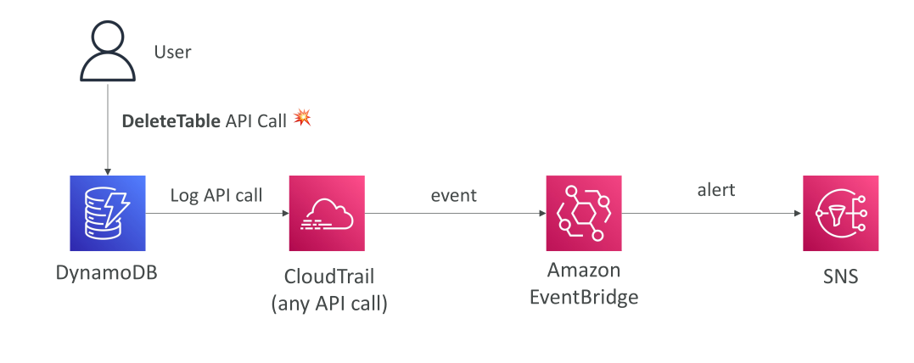
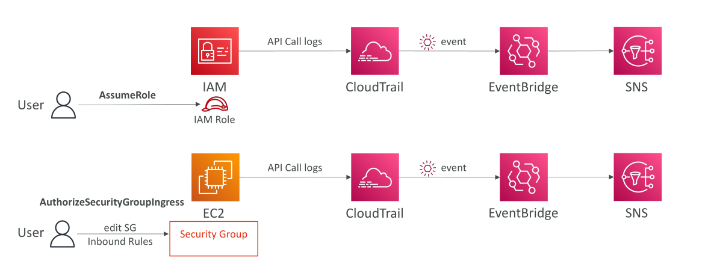

# Amazon EventBridge – การดักจับ API Calls

## Amazon EventBridge + CloudTrail

### การผสานงานระหว่าง CloudTrail และ Amazon EventBridge

การผสานงานที่สำคัญที่คุณควรรู้คือ **CloudTrail กับ Amazon EventBridge** ซึ่งสามารถใช้ดักจับ (intercept) การเรียกใช้งาน API Calls ได้

📌 ตัวอย่าง:
สมมติว่าคุณต้องการรับ **SNS Notification** ทุกครั้งที่มีผู้ใช้ลบตาราง DynamoDB ผ่านการเรียก `DeleteTable` API

* ทุกครั้งที่มี API Call เกิดขึ้นใน AWS → จะถูกบันทึกใน **CloudTrail**
* จากนั้น API Calls เหล่านี้ → จะถูกส่งเป็น **Events ใน Amazon EventBridge**

ดังนั้น เราสามารถสร้างกฎ (Rule) ใน EventBridge เพื่อจับการเรียก API ที่เฉพาะเจาะจง เช่น `DeleteTable` และตั้งค่าปลายทาง (Destination) เป็น **Amazon SNS** เพื่อสร้างการแจ้งเตือน (Alert) ได้

### ตัวอย่างเพิ่มเติมของการใช้งาน EventBridge + CloudTrail

1. **ตรวจจับการ AssumeRole**

   * หากคุณต้องการถูกแจ้งเตือนทุกครั้งที่มีผู้ใช้ **AssumeRole** ในบัญชี AWS ของคุณ → API `AssumeRole` ของ IAM จะถูกบันทึกโดย CloudTrail
   * เมื่อมี Event → EventBridge สามารถ Trigger ข้อความไปยัง **SNS Topic** ได้

2. **ตรวจจับการแก้ไข Security Group Inbound Rules**

   * API Call ที่ใช้เปลี่ยนกฎ Inbound ของ Security Group คือ `AuthorizeSecurityGroupIngress` (เป็น API ของ EC2)
   * Call นี้จะถูกบันทึกใน CloudTrail → ส่งต่อไปยัง EventBridge → และสามารถตั้งให้ส่งแจ้งเตือนไปที่ SNS ได้

🔑 **สรุปสำคัญ (Key Takeaways)**

* **Amazon EventBridge** สามารถดักจับ API Calls ของ AWS ที่ถูกบันทึกใน **CloudTrail** เพื่อนำไปใช้สร้างการตอบสนองแบบอัตโนมัติ (Automated Responses)
* สามารถสร้าง **EventBridge Rules** เพื่อตรวจจับ API Calls ที่เฉพาะเจาะจง เช่น `DeleteTable` ของ DynamoDB แล้วส่ง Notification ผ่าน **SNS**
* ใช้สำหรับเฝ้าระวังเหตุการณ์สำคัญ เช่น การ **AssumeRole** ของ IAM หรือการแก้ไข **Security Group Inbound Rules**
* การผสานงานนี้ช่วยให้เราสามารถสร้างระบบ **Monitoring & Alerting แบบ Event-driven** ได้อย่างยืดหยุ่นใน AWS
