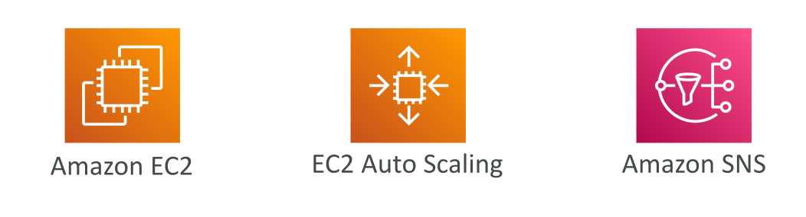
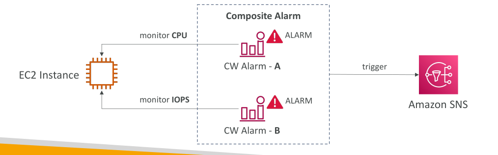
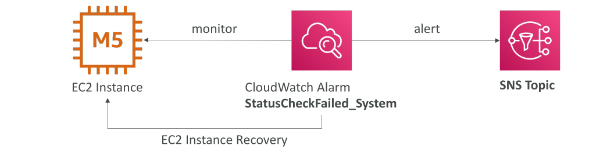
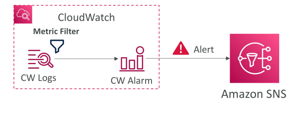

# CloudWatch Alarms



**CloudWatch Alarms** ใช้สำหรับ **ส่งการแจ้งเตือน** ตามค่า metrics ที่กำหนด คุณสามารถสร้าง alarm ที่ซับซ้อนได้ด้วยตัวเลือกหลายแบบ เช่น วิธีการ sampling, ค่าเปอร์เซ็นต์ หรือค่ามากสุด

**สถานะของ Alarm** มี 3 แบบ:

1. **OK** : Alarm ยังไม่ถูกทริกเกอร์
2. **INSUFFICIENT_DATA** : ข้อมูลไม่เพียงพอสำหรับประเมินสถานะ
3. **ALARM** : ค่าเกิน threshold และจะส่งการแจ้งเตือน

**Period** คือช่วงเวลาที่ Alarm ใช้ประเมิน metric

* สามารถตั้งสั้นหรือยาวได้
* ใช้ได้กับ **high-resolution custom metrics** เช่น 10 วินาที, 30 วินาที หรือเป็น multiples ของ 60 วินาที

## เป้าหมายของ Alarm

CloudWatch Alarms สามารถตั้ง action ได้ 3 แบบหลัก:

1. **จัดการ EC2 instance** เช่น stop, terminate, reboot, หรือ recover instance
2. **Trigger การทำงานของ auto-scaling** เช่น scale out หรือ scale in
3. **ส่งการแจ้งเตือนผ่าน SNS** ซึ่งสามารถเรียก Lambda เพื่อทำ action แบบกำหนดเองได้

## Composite Alarms



* ปกติ CloudWatch Alarms **ตรวจสอบ metric เดียว**
* หากต้องการตรวจสอบ **หลาย metrics พร้อมกัน** ใช้ **Composite Alarms**
* Composite Alarms รวมหลาย alarms ด้วย **เงื่อนไข AND/OR**

**ประโยชน์**: ลด alarm noise และสร้าง alert ที่แม่นยำ เช่น

* แจ้งเตือนเมื่อ CPU สูง **และ** network ต่ำ
* ไม่แจ้งเตือนเมื่อ CPU และ network สูงพร้อมกัน

**ตัวอย่าง**:

* EC2 instance มี 2 alarms:

  * Alarm A: ตรวจ CPU usage
  * Alarm B: ตรวจ IOPS ของ instance
* Composite Alarm = Alarm A AND Alarm B

  * จะอยู่ใน **ALARM state** เมื่อทั้ง A และ B เกิน threshold
  * สามารถ trigger SNS notification ได้

## การกู้คืน EC2 Instance



EC2 มี **3 การตรวจสอบสถานะ**:

1. **Instance status check** : ตรวจ VM ของ EC2
2. **System status check** : ตรวจ hardware ชั้นล่าง
3. **Attached EBS status check** : ตรวจสุขภาพของ EBS ที่แนบ

* สามารถตั้ง CloudWatch Alarm เพื่อตรวจสอบ EC2 เฉพาะตัว
* หาก alarm ถูกทริกเกอร์ สามารถทำ **EC2 instance recovery**

  * ย้าย instance ไป host ใหม่
  * รักษา **private IP, public IP, elastic IP, metadata, placement group**
* สามารถส่ง alert ผ่าน **SNS** เมื่อเกิดการ recovery

## CloudWatch Alarms กับ Logs

* สามารถสร้าง Alarms บน **CloudWatch Logs metric filters**

  * ตัวอย่าง: metric filter ตรวจพบคำว่า "error" มากเกินไป → trigger alarm → ส่งข้อความไปยัง SNS

* สำหรับ **ทดสอบ alarm และ notification**

  * ใช้ CLI **`set-alarm-state`**
  * สามารถ trigger alarm แบบ manual แม้ threshold ยังไม่ถึง เพื่อยืนยันการทำงาน

## เป้าหมายของ CloudWatch Alarm

* **หยุด (Stop), ลบ (Terminate), รีบูต (Reboot), หรือกู้คืน (Recover) EC2 Instance**
* **เรียกใช้งาน Auto Scaling Action**
* **ส่งการแจ้งเตือนไปยัง SNS** (จากนั้นคุณสามารถทำอะไรก็ได้ตามต้องการ)

## สิ่งที่ควรรู้เกี่ยวกับ CloudWatch Alarm



* สามารถสร้าง **Alarm** บนพื้นฐานของ **CloudWatch Logs Metric Filters** ได้
* สำหรับ **ทดสอบ Alarm และการแจ้งเตือน**

  * ใช้คำสั่ง CLI เพื่อ **ตั้งสถานะ Alarm เป็น ALARM**

  ```bash
  aws cloudwatch set-alarm-state --alarm-name "myalarm" --state-value ALARM --state-reason "testing purposes"
  ```

  * ใช้เพื่อทดสอบว่า Alarm จะ trigger การแจ้งเตือนตามที่ตั้งค่าไว้หรือไม่
  
## สรุป

CloudWatch Alarms เป็นเครื่องมือที่ทรงพลังสำหรับ **การตรวจสอบและทำ automation** ของ AWS resources

* ช่วยให้การจัดการและแจ้งเตือนเป็นไปอย่าง **เชิงรุก**

## Key Takeaways

* CloudWatch Alarms ตรวจสอบ metrics และ trigger การแจ้งเตือนตาม threshold
* มี 3 สถานะ: **OK, INSUFFICIENT_DATA, ALARM**
* **Composite Alarms** รวมหลาย alarms ด้วย logic AND/OR เพื่อลด noise
* การกู้คืน EC2 instance สามารถทำ automation ผ่าน alarms บน status checks
* Alarm สามารถ trigger จาก metric filters ของ logs และทดสอบผ่าน CLI ได้
