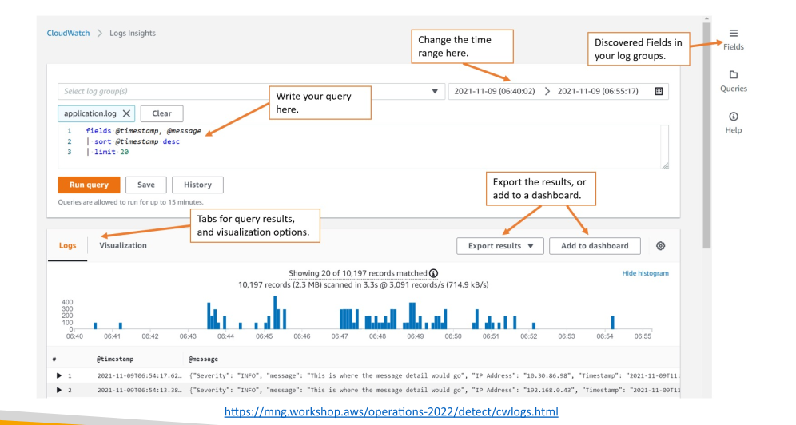
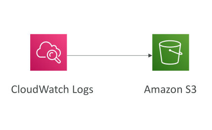
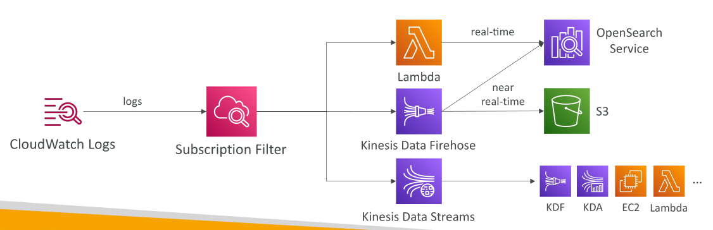
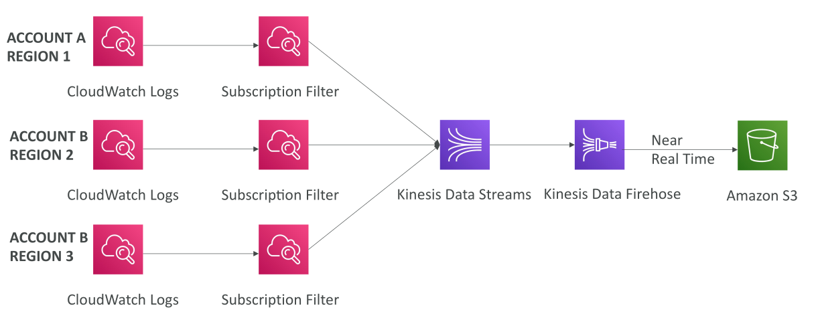
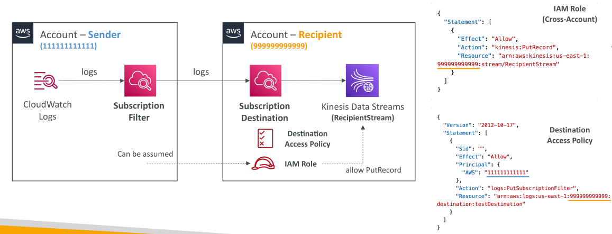
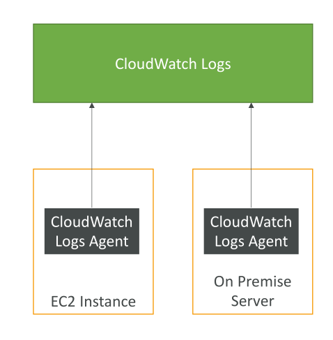
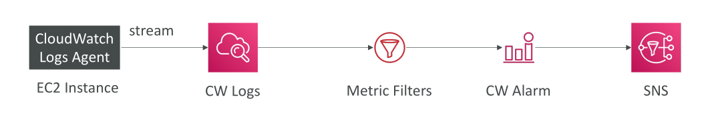

# CloudWatch Logs

**CloudWatch Logs** เป็นบริการที่เหมาะสมสำหรับการเก็บ **application logs** ภายใน AWS

ก่อนเริ่มใช้งาน ต้องสร้าง **Log Groups** ก่อน ซึ่งสามารถตั้งชื่อได้ตามต้องการ แต่โดยทั่วไปจะสื่อถึงแอปพลิเคชันหนึ่ง

ภายใน **Log Group** จะมีหลาย **Log Streams** ซึ่งแทนการบันทึก log ของแต่ละ instance ของแอปพลิเคชัน, ไฟล์ log เฉพาะ, หรือ container เฉพาะใน cluster

สามารถตั้ง **นโยบายการหมดอายุของ log** ได้:

* เก็บแบบไม่หมดอายุ (indefinitely)
* หรือกำหนดให้หมดอายุระหว่าง **1 วัน – 10 ปี**

**CloudWatch Logs** สามารถส่ง log ไปยังหลายปลายทาง เช่น:

* ส่งแบบ batch ไปยัง **Amazon S3**
* สตรีมไปยัง **Kinesis Data Streams**, **Kinesis Data Firehose**, **AWS Lambda**, หรือ **Amazon OpenSearch**

ทุก log ถูกเข้ารหัสโดยค่าเริ่มต้น และสามารถกำหนด **KMS-based encryption** ของตัวเองได้

## ประเภทของ Logs และแหล่งข้อมูล

Log สามารถส่งไปยัง CloudWatch Logs ผ่าน:

* AWS SDK
* CloudWatch Logs Agent (ปัจจุบันเลิกใช้งานแล้ว)
* CloudWatch Unified Agent

บริการ AWS ต่าง ๆ ที่ส่ง log ไปยัง CloudWatch Logs โดยตรง:

* **Elastic Beanstalk:** ส่ง logs จากแอปพลิเคชัน
* **ECS:** ส่ง logs จาก container
* **Lambda:** ส่ง logs จากฟังก์ชัน
* **VPC Flow Logs:** ส่ง metadata ของ network traffic
* **API Gateway:** ส่งทุก request
* **CloudTrail:** ส่ง logs ตาม filter
* **Route53:** ส่ง DNS query logs

## การค้นหา Logs ด้วย CloudWatch Logs Insights

**CloudWatch Logs Insights** เป็นเครื่องมือสำหรับ query logs:

* เขียน query และกำหนดช่วงเวลา
* ผลลัพธ์แสดงเป็น visualization อัตโนมัติ
* ดู log line ที่สร้าง visualization ได้

สามารถบันทึก query และนำไปใช้ใน **CloudWatch Dashboard** ได้
สามารถ query หลาย **Log Groups** พร้อมกัน แม้จะอยู่คนละ AWS Account

**ข้อสำคัญ:** CloudWatch Logs Insights ใช้สำหรับ query ข้อมูล **ย้อนหลัง** ไม่ใช่ real-time

## การส่งออก CloudWatch Logs

1. **Batch Export:** ส่ง logs ไปยัง **Amazon S3** ผ่าน API **CreateExportTask**

   * ใช้เวลาส่งข้อมูลสูงสุด 12 ชั่วโมง
   * ไม่ใช่ real-time

2. **Real-Time Streaming:** ใช้ **CloudWatch Logs subscriptions**

   * ส่ง log แบบ real-time ไปยัง **Kinesis Data Streams**, **Kinesis Data Firehose**, หรือ **Lambda**
   * ใช้ **subscription filter** เพื่อเลือก log ที่จะส่ง

* สามารถรวม logs จากหลาย account/region ไปยังปลายทางเดียว เช่น Kinesis Data Stream ใน account ที่กำหนด
* จากนั้นส่งต่อไปยัง S3 หรือ OpenSearch Service ผ่าน Kinesis Data Firehose

## การรวม Log ข้าม Account (Cross-Account Aggregation)

* ใช้ **destinations**
* ตัวอย่าง:

  1. มี **sender account** และ **recipient account**
  2. สร้าง **subscription filter** ใน sender account ส่งไปยัง **destination** (virtual Kinesis Data Stream ใน recipient account)
  3. กำหนด **destination access policy** ให้ sender account ส่งข้อมูลได้
  4. สร้าง **IAM role** ใน recipient account ให้ sender account assume เพื่อส่งข้อมูล

เมื่อทุกอย่างพร้อม สามารถส่ง log จาก CloudWatch Logs ใน account หนึ่ง ไปยังปลายทางในอีก account ได้

## CloudWatch Agent & CloudWatch Logs Agent

เราจะพูดถึงการใช้ **CloudWatch Agents** เพื่อเก็บ **logs** และ **metrics** จาก **EC2 instances** แล้วส่งไปยัง **CloudWatch**

โดยค่าเริ่มต้น **EC2 instance** จะไม่ส่ง logs ไปยัง CloudWatch
เพื่อให้ทำงานได้ ต้องติดตั้งและรัน **agent** ซึ่งเป็นโปรแกรมขนาดเล็กบน EC2 instance ของคุณ ทำหน้าที่ส่งไฟล์ log ที่คุณต้องการไปยัง CloudWatch

แนวคิดคือ **EC2 instance** ของคุณจะมี **CloudWatch Log Agent** ทำงานอยู่ ส่ง logs ไปยัง CloudWatch Logs เพื่อประมวลผล

**EC2 instance ต้องมี IAM role** ที่อนุญาตให้ส่ง logs ไปยัง CloudWatch Logs ซึ่งจำเป็นต่อการทำงานของ agent

นอกจากนี้ **CloudWatch log agents** สามารถติดตั้งบน **on-premises servers** ได้ เช่น เซิร์ฟเวอร์ VMware ภายในองค์กร โปรแกรม agent ตัวเดียวกันนี้สามารถส่ง logs ไปยัง CloudWatch Logs ได้เช่นกัน

## ประเภทของ CloudWatch Agents

มี agent ให้ใช้งาน 2 ประเภท:

1. **CloudWatch Logs Agent** – รุ่นเก่า
2. **CloudWatch Unified Agent** – รุ่นใหม่

ทั้งสอง agent ออกแบบสำหรับ **virtual servers** เช่น EC2 instances หรือ on-premises servers

* **CloudWatch Logs Agent:**

  * รุ่นเก่า
  * ส่งได้เฉพาะ **logs** ไปยัง CloudWatch Logs

* **CloudWatch Unified Agent:**

  * รุ่นใหม่
  * เก็บ **system-level metrics** เช่น RAM, process
  * ส่งทั้ง **logs** และ **metrics** ไปยัง CloudWatch Logs
  * เรียกว่า Unified เพราะจัดการได้ทั้ง metrics และ logs
  * สามารถกำหนดค่าแบบ **centralized** ผ่าน **SSM Parameter Store** ซึ่ง agent รุ่นเก่าไม่มี

## Metrics ที่ CloudWatch Unified Agent เก็บ

เมื่อใช้งานบน **EC2 instance** หรือ **Linux server** จะเก็บ metrics รายละเอียดสูง ดังนี้:

* **CPU metrics:** active, guest, idle, system, user, steal
* **Disk metrics:** free, used, total space
* **Disk IO metrics:** number of writes, reads, bytes, IOPS
* **RAM metrics:** free, inactive, used, total, cached memory
* **Network statistics:** TCP/UDP connections, packets, bytes
* **Process information:** total processes, dead, blocked, idle, running, sleeping
* **Swap space metrics:** free, used, usage percentage

**สรุป:** Unified Agent ให้ metrics รายละเอียดมากกว่าการ monitoring มาตรฐานของ EC2 instance

* EC2 ปกติให้ข้อมูลระดับสูงของ CPU, disk, network แต่ **ไม่รวม memory หรือ swap**
* ถ้าต้องการรายละเอียดมากขึ้น ให้ใช้ **CloudWatch Unified Agent**

## CloudWatch Logs - Metric Filters

**CloudWatch Logs metric filters** ช่วยให้คุณสามารถกำหนด **filter expressions** บน logs ของคุณได้
ตัวอย่างเช่น:

* ค้นหา **IP address** เฉพาะใน log
* นับจำนวนครั้งของคำว่า **error** ใน log

ฟังก์ชันนี้เรียกว่า **metric filter** ซึ่งสามารถสร้าง **metrics** จากข้อมูลที่กรองได้

หลังจากสร้าง metric filter แล้ว สามารถนำไปใช้กับ **CloudWatch alarm** เพื่อแจ้งเตือนตาม **metric data** ที่เกิดขึ้น

**ข้อสำคัญ:**

* การสร้าง filter **จะไม่ย้อนกลับไปกรองข้อมูลเดิม**
* metric จะถูกสร้าง **เฉพาะจาก event ที่เกิดหลังจากสร้าง filter เท่านั้น**
* สามารถกำหนด **dimensions ได้สูงสุด 3 มิติ** เพื่อสร้าง metric ที่ละเอียดมากขึ้น

## ตัวอย่างสถานการณ์

สมมติว่าเรามี **CloudWatch Logs agent** ติดตั้งบน **EC2 instance** และส่ง logs ไปยัง CloudWatch Logs

* เราสร้าง **metric filter** โดยใช้ filter expression บน logs เหล่านี้
* ผลลัพธ์คือ **CloudWatch metric** ที่มาจาก log ที่ถูกกรอง

จาก metric นี้ สามารถเชื่อมต่อกับ **CloudWatch alarm** ได้
ตัวอย่าง: กำหนด alarm แจ้งเตือนทาง **SNS topic** หากคำว่า **error** ปรากฏ **5 ครั้งภายใน 1 นาที**

* ช่วยให้คุณรู้ปัญหาได้อย่างรวดเร็วและสามารถตอบสนองทันที

## สรุป

**CloudWatch Logs** เป็นบริการที่ยืดหยุ่นและทรงพลังสำหรับการเก็บ, query และส่งออก log

* รองรับหลายแหล่งข้อมูล
* มี query engine ที่ทรงพลัง
* สามารถส่งออกแบบ batch หรือ real-time
* รองรับ aggregation ข้าม account และ region
**CloudWatch Agents** มีความสำคัญสำหรับการส่ง **logs** และ **metrics** จาก EC2 instances ไปยัง CloudWatch
* **CloudWatch Logs Agent:** รุ่นเก่า, ส่งได้เฉพาะ logs
* **CloudWatch Unified Agent:** ส่งทั้ง logs และ metrics รายละเอียดสูง
* **Unified Agent** รองรับการตั้งค่าแบบ centralized ผ่าน **SSM Parameter Store**
* Metrics รายละเอียดรวมถึง CPU states, disk IO, RAM usage, network statistics, process states, swap
**Metric filters** เป็นเครื่องมือที่มีประสิทธิภาพสำหรับสร้าง **metrics จาก logs** และช่วยให้สามารถเฝ้าตรวจสอบแบบ **proactive** ผ่าน alarms

## Key Takeaways

* เก็บ application logs ใน AWS จัดเป็น **log groups** และ **log streams**
* Logs สามารถเก็บแบบไม่หมดอายุ หรือหมดอายุระหว่าง 1 วัน – 10 ปี
* รองรับการส่ง logs ไปยัง S3, Kinesis Data Streams, Firehose, Lambda และ OpenSearch
* **CloudWatch Logs Insights** ช่วยวิเคราะห์และ visualise log ด้วย query language เฉพาะ
* Metric filters ใน CloudWatch Logs ช่วยสร้าง **metrics จาก filter expressions** บน logs
* สามารถตรวจจับ **pattern เฉพาะ** เช่น IP หรือคำว่า “error”
* Metrics ที่ได้สามารถใช้ **trigger CloudWatch alarms** เพื่อเฝ้าตรวจสอบเชิงรุก
* Metric filters จะใช้กับ **event หลังจากสร้าง filter** และรองรับ **สูงสุด 3 dimensions**
