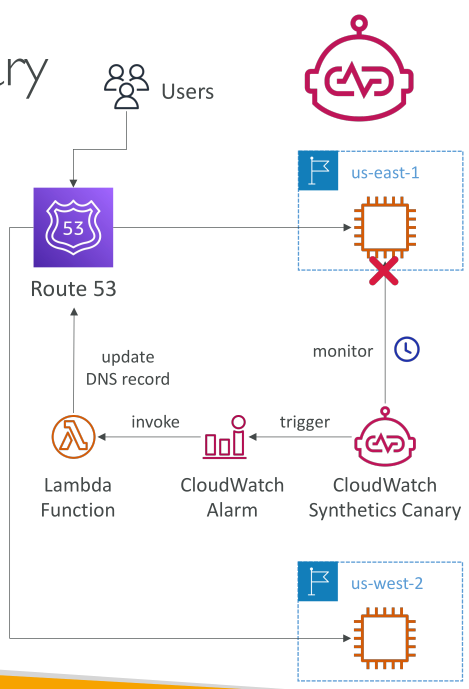

# CloudWatch Synthetics Canary

CloudWatch Synthetics Canary ช่วยให้คุณสร้างสคริปต์ที่ปรับแต่งได้เพื่อรันจาก CloudWatch สำหรับตรวจสอบ **API, URL หรือเว็บไซต์** ของคุณ สคริปต์เหล่านี้สามารถจำลองการกระทำของลูกค้าได้อย่างอัตโนมัติ

ตัวอย่างเช่น หากลูกค้าเข้าชมหน้าเว็บสินค้า เพิ่มสินค้าลงในตะกร้า ดำเนินการชำระเงิน ใส่รายละเอียดบัตรเครดิต และทำการซื้อ คุณสามารถทดสอบและจำลองขั้นตอนเหล่านี้ทั้งหมดด้วย CloudWatch Synthetics Canary

หากสคริปต์ล้มเหลวในขั้นตอนไหน นั่นหมายถึงมีปัญหา ซึ่งช่วยให้คุณตรวจพบปัญหาก่อนที่ลูกค้าจะเจอ ทำให้มั่นใจได้ว่ากระบวนการทำงานต่าง ๆ ของแอปพลิเคชันถูกต้อง

CloudWatch Synthetics Canary ยังสามารถตรวจสอบ **ความพร้อมใช้งานและความหน่วงของ endpoints, บันทึกเวลาโหลดหน้าเว็บ, และแม้แต่ถ่ายภาพหน้าจอของ UI**

## ตัวอย่างการใช้งาน

สมมติว่าแอปพลิเคชันถูก deploy ใน region **us-east-1** CloudWatch Synthetics Canary ตรวจสอบแอปพลิเคชันนี้ หากพบความล้มเหลว **CloudWatch Alarm** จะ trigger ฟังก์ชัน Lambda

ฟังก์ชัน Lambda สามารถอัปเดต **DNS record ใน Route 53** เพื่อชี้ไปยัง instance ใน **us-west-2** โดยอัตโนมัติ ทำให้ traffic ถูกเปลี่ยนไปยังเวอร์ชันแอปที่ใช้งานได้ ซึ่งนี่เป็นตัวอย่างของการ **failover อัตโนมัติ** โดยใช้ CloudWatch Synthetics Canary

## การพัฒนาและรันสคริปต์

สคริปต์ที่ Canary รันสามารถเขียนได้ใน **Node.js หรือ Python**
นอกจากนี้ Synthetics Canary ยังให้คุณใช้งาน **headless Google Chrome** เพื่อทำทุกอย่างที่ปกติทำในเบราว์เซอร์ได้โดยตรง

คุณสามารถรันสคริปต์ **ครั้งเดียว** หรือ **ตามกำหนดเวลา** เพื่อเช็คความพร้อมใช้งานของ endpoints อย่างต่อเนื่อง

## Blueprints ที่มีให้ใช้งาน

CloudWatch Synthetics มี blueprints หลายแบบเพื่อเริ่มต้นใช้งาน:

* **Heartbeat Monitor**: โหลด URL, บันทึก screenshot และ HTTP archive, ตรวจสอบว่าเว็บทำงานถูกต้อง
* **API Canary**: ทดสอบฟังก์ชัน read/write ของ REST API
* **Broken Link Checker**: ตรวจสอบว่าลิงก์ทั้งหมดบน URL ที่ตรวจสอบไม่เสีย
* **Visual Monitoring**: เปรียบเทียบ screenshot ระหว่าง run ปัจจุบันกับ baseline ที่บันทึกไว้
* **Canary Recorder**: ใช้บันทึกการกระทำบนเว็บไซต์และสร้างสคริปต์อัตโนมัติให้รันบน Canary
* **GUI Workflow Builder**: ตรวจสอบการทำงานของเว็บ เช่น การ submit login form

## สรุป

CloudWatch Synthetics Canary เป็นเครื่องมือที่ทรงพลังสำหรับตรวจสอบ **ฟังก์ชันและความพร้อมใช้งานของเว็บแอปและ API** โดยจำลองการกระทำของผู้ใช้และทำการตรวจสอบอัตโนมัติ

## Key Takeaways

* CloudWatch Synthetics Canary ช่วยสร้างสคริปต์เพื่อตรวจสอบ API, URL และเว็บไซต์โดยจำลองการกระทำของลูกค้า
* สคริปต์ Canary เขียนได้ด้วย Node.js หรือ Python และรันผ่าน headless Google Chrome
* รองรับการรันตามกำหนดเวลา, ถ่าย screenshot, บันทึกเวลาโหลด, และตรวจสอบความพร้อมใช้งานและความหน่วงของ endpoints
* สามารถรวมกับ **CloudWatch Alarms** และ **AWS Lambda** เพื่อทำการตอบสนองอัตโนมัติ เช่น การอัปเดต DNS สำหรับ failover
