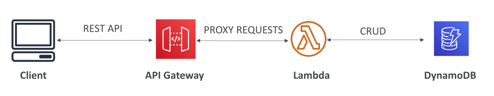
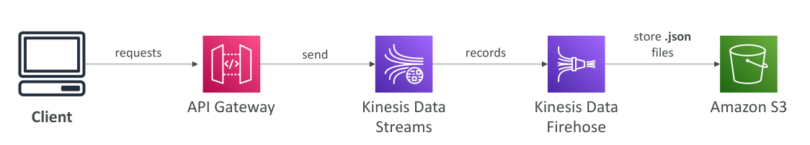

# API Gateway

API Gateway คือบริการ **Serverless ของ AWS** ที่ให้เราสร้าง **REST APIs แบบสาธารณะ** ที่ Client เข้าถึงได้ โดยที่ Client จะสื่อสารกับ API Gateway และ API Gateway จะ **Proxy** คำร้องขอไปยัง Lambda

**เหตุผลที่ใช้ API Gateway** คือมันมีมากกว่าแค่ HTTP Endpoint เพราะยังมีฟีเจอร์อื่น ๆ เช่น การยืนยันตัวตน, Usage Plan, Stages และอื่น ๆ การผสานรวม API Gateway กับ Lambda ช่วยให้ได้ **ระบบ Serverless เต็มรูปแบบ โดยไม่ต้องจัดการโครงสร้างพื้นฐานเอง**

## ฟีเจอร์หลักของ API Gateway

* รองรับ **WebSocket** สำหรับ Real-time Streaming
* รองรับ **API Versioning** → อัปเกรด API ได้โดยไม่กระทบ Client
* รองรับหลาย Environment เช่น Dev, Test, Prod
* มี **ตัวเลือกด้านความปลอดภัย** สำหรับการ Authentication และ Authorization
* สร้าง **API Keys** และกำหนด **Request Throttling** ได้
* รองรับ **Swagger และ OpenAPI 3.0** สำหรับ Import/Export API Definition
* **Transform และ Validate** Request/Response ที่ระดับ API Gateway
* สร้าง **SDKs และ API Specifications** ได้
* มี **API Caching** ช่วยปรับปรุง Performance

> ฟีเจอร์เหล่านี้ไม่สามารถทำได้หากใช้เพียง Application Load Balancer

Example: Building a Serverless API

## การเชื่อมต่อ (Integration) ของ API Gateway

API Gateway สามารถเชื่อมต่อได้กับหลาย Backend เช่น:

1. **Lambda Functions**

   * วิธีที่นิยมที่สุด → ทำให้สร้าง REST API ที่ใช้ Lambda เป็น Backend ได้
   * ใช้ในระบบ **Serverless เต็มรูปแบบ**

2. **HTTP Endpoints**

   * ใช้กับ HTTP Backend อื่น ๆ เช่น On-Premise APIs หรือ ALB ใน Cloud
   * API Gateway จะเพิ่มฟีเจอร์ เช่น Rate Limit, Caching, Authentication, API Keys

3. **AWS Services**

   * เรียกใช้ AWS Services โดยตรง เช่น Step Functions, SQS
   * เพิ่ม Authentication และ Rate Limit โดยไม่ต้องให้ Client ใช้ AWS Credentials โดยตรง

## ตัวอย่าง: API Gateway + Kinesis Data Streams

* ให้ Client ส่งข้อมูลไปยัง Kinesis Data Stream โดยไม่ต้องมี AWS Credentials
* Client ส่ง HTTP Request → API Gateway → ส่งข้อมูลไปยัง Kinesis Data Stream
* จากนั้นข้อมูลสามารถส่งต่อไปที่ Kinesis Firehose → เก็บลง S3 ในรูปแบบ JSON

นี่แสดงถึงพลังของ API Gateway ที่สามารถเปิด AWS Services ให้ Client ภายนอกใช้อย่างปลอดภัย

## ประเภท Endpoint ของ API Gateway

1. **Edge-Optimized (ค่าเริ่มต้น)**

   * สำหรับ Client ทั่วโลก
   * ใช้ CloudFront Edge Location เพื่อลด Latency
   * API Gateway อยู่ใน Region เดียว แต่เข้าถึงได้ทั่วโลก

2. **Regional**

   * เหมาะสำหรับผู้ใช้ที่อยู่ใน Region เดียวกับ API Gateway
   * ไม่ใช้ CloudFront อัตโนมัติ แต่สามารถสร้าง CloudFront เองได้

3. **Private**

   * ไม่ใช่สาธารณะ
   * เข้าถึงได้เฉพาะภายใน VPC ผ่าน VPC Endpoint (ENI)
   * ควบคุมการเข้าถึงด้วย Resource Policy

## API Gateway – Security

การยืนยันและอนุญาตผู้ใช้สามารถทำได้หลายวิธี เช่น:

* **IAM Roles** → เหมาะสำหรับ Internal Application (เช่น EC2 เรียก API)
* **Amazon Cognito** → เหมาะสำหรับ External Users (Mobile, Web App)
* **Custom Authorizers** → Lambda ทำหน้าที่ตรวจสอบสิทธิ์เอง

นอกจากนี้ยังสามารถใช้ **HTTPS + Custom Domain** (ผ่าน AWS ACM) ได้:

* **Edge-Optimized** → ใบรับรองต้องอยู่ใน `us-east-1`
* **Regional** → ใบรับรองต้องอยู่ใน Region เดียวกับ API Gateway

และสุดท้าย ต้องตั้งค่า **DNS (CNAME หรือ A-alias)** ใน Route 53 เพื่อชี้โดเมนไปที่ API Gateway

## สรุป

API Gateway คือบริการที่ทรงพลังในการสร้าง API แบบ **Serverless** ที่ปลอดภัย, ขยายตัวได้, และมีฟีเจอร์ครบ โดยสามารถเชื่อมต่อกับ Lambda, HTTP Endpoints และ AWS Services โดยไม่ต้องจัดการโครงสร้างพื้นฐานเอง

## Key Takeaways

* API Gateway ช่วยสร้าง REST API แบบ Serverless ที่ Proxy ไปยัง Lambda
* มีฟีเจอร์ขั้นสูง เช่น Authentication, Usage Plan, API Versioning, Throttling
* รองรับการเชื่อมต่อกับ **Lambda, HTTP Endpoints, และ AWS Services**
* Endpoint มี 3 แบบ: **Edge-Optimized, Regional, Private**
