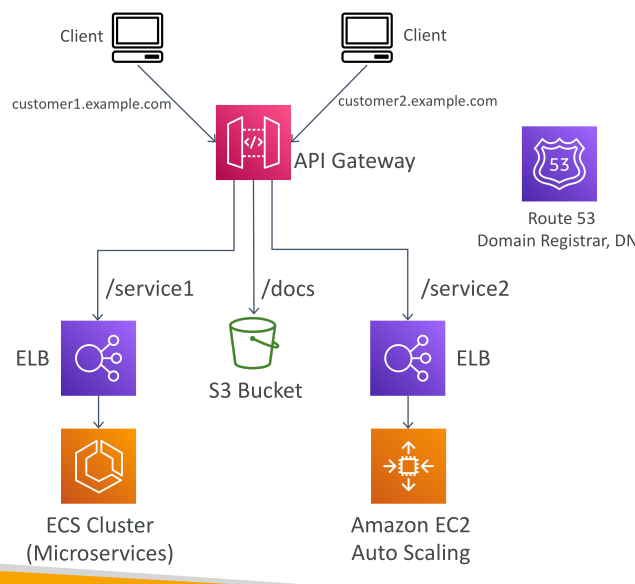

# API Gateway - Architecture

* บทเรียนนี้อธิบายภาพรวมการใช้งาน **Microservice Architecture** ด้วย **API Gateway**
* API Gateway ช่วยให้คุณมี **อินเทอร์เฟซเดียว (single interface)** สำหรับทุก microservices ของบริษัท
* ช่วยให้สามารถใช้ **API endpoints** กับ resources ต่าง ๆ ใน backend โดย **ซ่อนความซับซ้อนจากไคลเอนต์**

## Routing ผ่าน API Gateway

ตัวอย่างการใช้งาน:

* `/service1` → ส่งคำขอไปยัง **Elastic Load Balancer** ซึ่งต่อกับ **ECS cluster** ของ microservices
* `/docs` → ส่งคำขอไปยัง **S3 bucket** ที่เก็บเอกสารหรือเนื้อหาการศึกษา
* `/service2` → เชื่อมต่อไปยัง **Elastic Load Balancer** ที่ต่อกับ **EC2 Auto Scaling group**

## URL แบบรวมเดียวและ Routing

* ทุก route สามารถกำหนด **paths** ของตัวเอง
* API Gateway ทำหน้าที่เป็น **URL รวมเดียว** สำหรับเชื่อมต่อกับทุกบริการ
* ทำให้ **การเข้าถึงง่ายขึ้น** และ **ซ่อนความซับซ้อนของ routing**

## Custom Domains และ SSL Certificates

* สามารถใช้ **Route 53** ลงทะเบียน domain ของตัวเอง แทนการใช้ default DNS ของ API Gateway
* ตัวอย่าง:

  * `customer1.example.com` สำหรับลูกค้ารายหนึ่ง
  * `customer2.example.com` สำหรับลูกค้าอีกคน
* สามารถติดตั้ง **SSL certificate** สำหรับแต่ละ domain เพื่อให้การเชื่อมต่อปลอดภัย

## การ Forwarding และ Transformation ของข้อมูล

* API Gateway สามารถกำหนด **กฎการส่งต่อและแปลงข้อมูล** ก่อนส่งไป backend
* ช่วยให้ **จัดการข้อมูลได้ยืดหยุ่น** และ **ปรับให้เข้ากับความต้องการของ backend**

## สรุปสถาปัตยกรรม API Gateway

* API Gateway ช่วย **รวม microservices หลายตัวเป็น URL ภายนอกเดียว**
* ซ่อนความซับซ้อนของ **routing, การแปลงข้อมูล, SSL certificate**
* ฟังก์ชันทั้งหมดนี้ **จัดการได้ในระดับ API Gateway**

## Key Takeaways

1. API Gateway เป็น **อินเทอร์เฟซเดียวสำหรับทุก microservices** ทำให้การเข้าถึงง่ายขึ้นสำหรับไคลเอนต์
2. สามารถกำหนด routes เพื่อส่งคำขอไปยัง **ECS cluster, S3 bucket, หรือ EC2 Auto Scaling group**
3. ใช้ **Route 53** เพื่อลงทะเบียน **custom domains** และกำหนด **SSL certificates** สำหรับลูกค้าแต่ละราย
4. API Gateway รองรับ **forwarding และ transformation rules** เพื่อปรับข้อมูลก่อนส่งไป backend