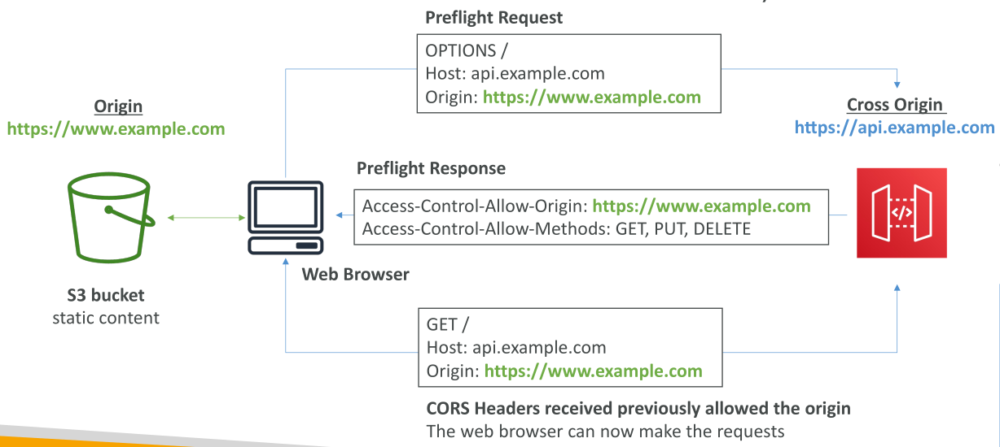

# AWS API Gateway - CORS

API Gateway รองรับการรักษาความปลอดภัยของเบราว์เซอร์ด้วย **Cross-Origin Resource Sharing (CORS)**

* หากเราต้องการให้ API สามารถถูกเรียกใช้งานจาก **โดเมนอื่น** (ต่าง Origin) จำเป็นต้องเปิดใช้งาน CORS

เมื่อเปิดใช้งาน CORS → API Gateway จะสร้าง **OPTIONS pre-flight request** โดย request นี้จะมี **CORS Headers** ดังนี้:

* `Access-Control-Allow-Methods`
* `Access-Control-Allow-Headers`
* `Access-Control-Allow-Origin`

เราสามารถกำหนดค่าเหล่านี้ได้จาก **API Gateway Console**

## การทำงานของ CORS: ตัวอย่างจริง

ลองพิจารณาสถานการณ์นี้:

* มีเว็บเบราว์เซอร์ที่เข้าถึง **S3 bucket** เพื่อโหลด static website (เช่น `example.com` หรือ `www.example.com`)
* เว็บไซต์นั้นมี JavaScript ที่พยายามเรียก API ที่อยู่ต่างโดเมน เช่น `api.example.com`

🔒 เนื่องจากนโยบายความปลอดภัยของเบราว์เซอร์ → เบราว์เซอร์จะส่ง **OPTIONS pre-flight request** ไปยัง API Gateway ก่อน

* จากนั้น **API Gateway จะตอบกลับด้วย Pre-flight Response** ที่บอกว่า Origin นั้นสามารถทำ Cross-Origin Request ได้หรือไม่
* ถ้า Origin ได้รับอนุญาต → เบราว์เซอร์และ API Gateway ก็จะสื่อสารกันได้ และ API Calls สามารถทำงานต่อไปได้ตามปกติ

## สรุป

สำหรับมุมมองการสอบ (Exam Tips) ต้องรู้ว่า:

* **API Gateway สามารถเปิด CORS ได้** เพื่อรองรับ cross-origin requests

## Key Takeaways

* API Gateway รองรับการรักษาความปลอดภัยของเบราว์เซอร์ผ่าน **CORS**
* ต้องเปิด CORS หากต้องการให้ API ถูกเรียกจาก **ต่างโดเมน**
* API Gateway จัดการ CORS ด้วยการสร้าง **OPTIONS pre-flight request** พร้อม headers เฉพาะ
* Pre-flight request/response จะเป็นตัวตรวจสอบว่า **cross-origin requests ได้รับอนุญาตหรือไม่** ก่อนจะทำ API Calls จริง
