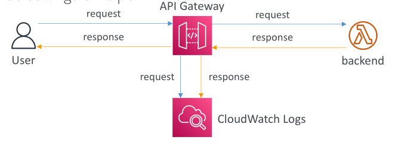

# Logging & Tracing

เรามาเริ่มจาก **Logging และ Tracing** กันก่อน

* ตัวเลือกแรกคือ **CloudWatch Logs**
  เมื่อเราเปิดการเชื่อมต่อ CloudWatch Logs กับ API Gateway เราจะได้ข้อมูลเกี่ยวกับ **request และ response body** ที่ผ่าน API Gateway เข้ามา

  * เราสามารถเปิดใช้งานได้ในระดับ **Stage Level**
  * และเลือก **Log Level** ได้ เช่น `ERROR`, `DEBUG`, `INFO`
  * โดย `DEBUG` จะให้ข้อมูลละเอียดที่สุด
  * เราสามารถ override ค่านี้ได้เป็นราย API

👉 กระบวนการคือ:

* ผู้ใช้ (Client) เรียกใช้งาน API Gateway → API Gateway บันทึก request ไปที่ CloudWatch Logs
* Request ถูกส่งต่อไปยัง backend → Backend ส่ง response กลับมา
* Response จะถูก API Gateway บันทึกลง CloudWatch Logs ก่อนส่งกลับไปยังผู้ใช้

⚠️ ข้อควรระวัง: หากเปิด Logging อาจทำให้ **ข้อมูลสำคัญ (Sensitive Information)** ถูกบันทึกลงใน Logs ได้

* **AWS X-Ray**
  ใช้สำหรับ **Tracing** ข้อมูลการทำงานของ request ที่ผ่าน API Gateway

  * หากเปิดใช้งานทั้ง API Gateway และ Lambda จะได้ภาพรวมการไหลของ request ทั้งหมด (End-to-End Tracing)

## Monitoring API Gateway ด้วย CloudWatch Metrics

API Gateway สามารถเฝ้าติดตามได้ด้วย **CloudWatch Metrics** ซึ่งทำงานในระดับ Stage และสามารถเปิด **detailed metrics** เพื่อดูเชิงลึกได้

📊 Metrics ที่สำคัญ:

* **CacheHitCount** → จำนวน request ที่เจอข้อมูลใน cache (บ่งบอกว่า cache มีประสิทธิภาพ)
* **CacheMissCount** → จำนวน request ที่ไม่เจอข้อมูลใน cache (บ่งบอกว่า cache ใช้งานไม่ค่อยดี)
* **IntegrationLatency** → เวลาในการส่ง request ไป backend และรอ response (เป็นเวลาที่ backend ใช้ประมวลผล)
* **Latency** → เวลารวมตั้งแต่ API Gateway ได้รับ request จนส่ง response กลับ (รวมการตรวจสอบ Auth, Cache, Mapping template ฯลฯ)
  👉 ค่า Latency จะ **มากกว่า** IntegrationLatency เสมอ

⚠️ API Gateway มี **Timeout สูงสุด 29 วินาที** ต่อ request

* ถ้า **Latency** หรือ **IntegrationLatency** เกิน 29 วินาที → API Gateway จะตัดการเชื่อมต่อ

### Metrics ของ Error

* **4XXError** → ความผิดพลาดฝั่ง Client (Client เรียกใช้งาน API ผิด)
* **5XXError** → ความผิดพลาดฝั่ง Server (Backend มีปัญหา)

## API Gateway Throttling และ Limits

API Gateway รองรับการ **Throttling** เพื่อป้องกัน backend และควบคุมการใช้งาน

* ค่าเริ่มต้น (Soft Limit): **10,000 requests/วินาที ต่อทุก API รวมกัน** (สามารถขอเพิ่มได้)
* ถ้ามี API ใดใช้งานหนักเกินไป → API อื่น ๆ อาจถูก throttled ด้วย

เมื่อเกิด throttling → Client จะได้รับ error `429 Too Many Requests`
👉 ควรใช้ **Exponential Backoff** ในการ retry

เราสามารถปรับปรุง throttling ได้โดย:

* ตั้ง **Stage Limits** และ **Method Limits** → เพื่อป้องกันไม่ให้ Stage เดียวกิน quota ทั้งหมด
* ใช้ **Usage Plans** → เพื่อกำหนด throttling แบบรายลูกค้า

## API Gateway Error Codes

API Gateway แบ่ง Error ออกเป็น 2 กลุ่มใหญ่:

### 🔹 4XX (Client Errors) → เกิดจากผู้ใช้งาน API

* **400 Bad Request** → Request ไม่ถูกต้อง
* **403 Access Denied** → ถูกบล็อก เช่นจาก WAF
* **429 Quota Exceeded** → ถูก throttling

### 🔹 5XX (Server Errors) → เกิดจาก Backend

* **502 Bad Gateway** → Lambda Proxy Integration ไม่ตอบกลับอย่างถูกต้อง
* **503 Service Unavailable** → Backend ไม่พร้อมใช้งาน
* **504 Integration Failure** → Backend ใช้เวลานานเกินไป (เกิน 29 วินาที) → Timeout

## สรุป Key Takeaways

* API Gateway ทำงานร่วมกับ **CloudWatch Logs** เพื่อบันทึก request/response (เลือก Log Level ได้)
* **AWS X-Ray** ให้ Tracing เชิงลึกของ request flow ระหว่าง API Gateway และ Lambda
* Metrics สำคัญ ได้แก่: `CacheHitCount`, `CacheMissCount`, `IntegrationLatency`, `Latency`, `4XXError`, `5XXError`
* API Gateway มี **Throttling Limit เริ่มต้น 10,000 req/sec** และใช้ `429` สำหรับการแจ้งเตือนว่าเกิน limit
* Error ถูกแบ่งเป็น **4XX (Client)** และ **5XX (Backend)** เพื่อช่วยวิเคราะห์ปัญหา
