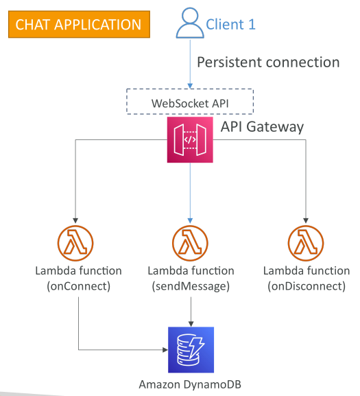
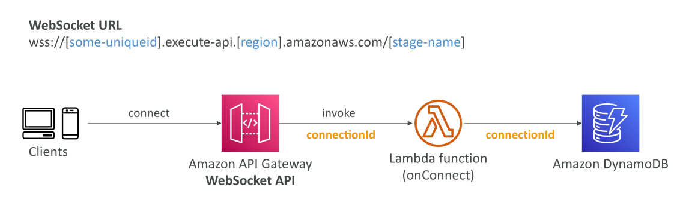
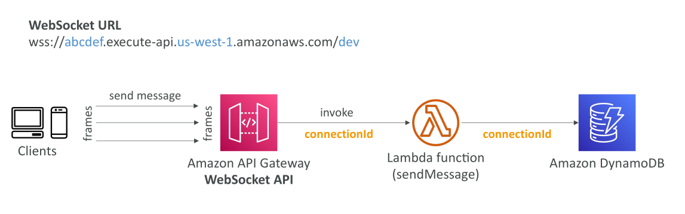
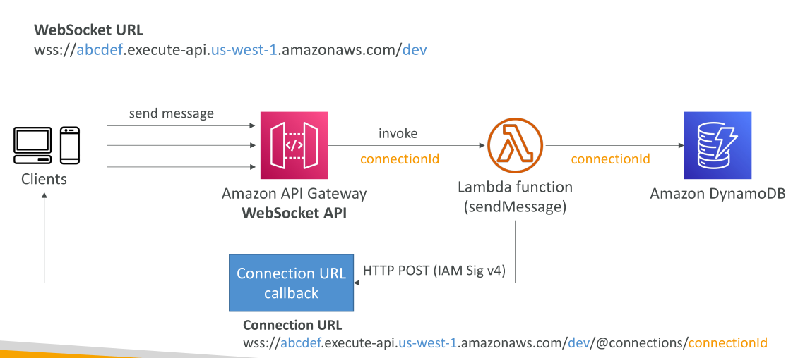
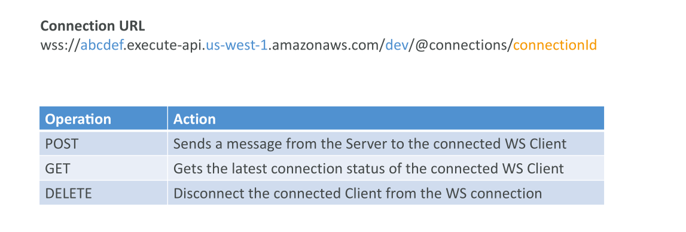
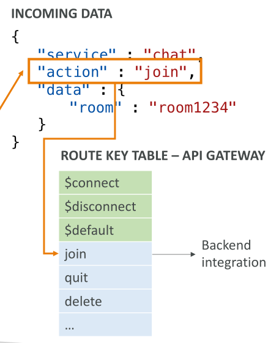

# API Gateway WebSocket API

WebSocket API ใน API Gateway ช่วยให้เกิด **การสื่อสารสองทาง (two-way interactive communication)** ระหว่างเบราว์เซอร์ของผู้ใช้กับเซิร์ฟเวอร์

* การสื่อสารสองทางนี้ทำให้เซิร์ฟเวอร์สามารถส่งข้อมูลกลับไปยังไคลเอนต์ได้โดยไม่ต้องรอให้ไคลเอนต์ส่งคำขอ



## กรณีการใช้งานของ WebSocket API

* ใช้สำหรับแอปพลิเคชันแบบ **stateful**
* ตัวอย่างการใช้งาน เช่น

  * แอปแชทแบบเรียลไทม์
  * แพลตฟอร์มสำหรับทำงานร่วมกัน (collaboration)
  * เกมผู้เล่นหลายคน (multiplayer games)
  * แพลตฟอร์มการซื้อขายทางการเงิน

## การเชื่อมต่อแบบ Persistent และ Lifecycle Events



* ตัวอย่าง: แอปแชท

  * ไคลเอนต์เชื่อมต่อกับ WebSocket API บน API Gateway
  * การเชื่อมต่อเป็น **persistent** (คงอยู่ตลอด) ไม่ต้องสร้างหลายการเชื่อมต่อ
  * Lambda function `onConnect` ถูกเรียกเมื่อเชื่อมต่อครั้งแรก เช่น บันทึก connection ID ลงใน DynamoDB
  * เมื่อไคลเอนต์ส่งข้อความ, Lambda function `sendMessage` จะถูกเรียก
  * เมื่อต้องการยกเลิกการเชื่อมต่อ, Lambda function `onDisconnect` จะถูกเรียก

## การ Integrate กับ Backend

* API Gateway สามารถเชื่อมต่อกับ backend หลายแบบ เช่น

  * Lambda functions
  * DynamoDB tables
  * HTTP endpoints
  * หรือ integration แบบอื่น ๆ
* WebSocket API จะจัดการ **การสื่อสารสองทาง** นี้

## โครงสร้าง URL ของ WebSocket

* URL เริ่มต้นด้วย `wss://` แสดงว่าเป็น WebSocket แบบเข้ารหัส
* ตัวอย่าง:

```cli
wss://<unique-id>.execute-api.<region>.amazonaws.com/<stage-name>
```

* เมื่อ deploy API WebSocket, ไคลเอนต์เชื่อมต่อ URL นี้เพื่อสร้าง **persistent connection**
* Lambda function ถูกเรียกเพื่อสร้าง connection ID ซึ่งคงอยู่จนกว่าไคลเอนต์จะยกเลิกการเชื่อมต่อ

## การเก็บ Metadata ของ Connection

* Connection ID สามารถบันทึกลง DynamoDB เพื่อเก็บข้อมูลผู้ใช้หรือ metadata อื่น ๆ

## การส่งข้อความและ Frames

* ไคลเอนต์ส่งข้อความผ่าน **persistent connection**
* ข้อความเรียกว่า **frames**
* แต่ละ frame สามารถเรียก Lambda function ใหม่ และใช้ connection ID เดิม
* Lambda สามารถดึงข้อมูลผู้ใช้จาก DynamoDB และบันทึกข้อความตามต้องการ



## การสื่อสารจาก Server ไป Client

* เซิร์ฟเวอร์สามารถส่งข้อความกลับไปไคลเอนต์โดยไม่ต้องรอ request จากไคลเอนต์
* ใช้ URL callback:

```แสร
https://<unique-id>.execute-api.<region>.amazonaws.com/<stage-name>/@connections/<connectionid>
```

* Lambda หรือ backend อื่นสามารถส่ง HTTP POST พร้อม Sign ด้วย IAM Sig v4 ไปยัง URL นี้ เพื่อส่งข้อความไปยังไคลเอนต์



## การจัดการ Connections ผ่าน API Gateway

สำหรับ URL `/@connections/<connectionid>` สามารถทำได้ดังนี้:

* **POST** → ส่งข้อความจาก server ไปยังไคลเอนต์ WebSocket ที่เชื่อมต่อ
* **GET** → ตรวจสอบสถานะการเชื่อมต่อล่าสุดของไคลเอนต์
* **DELETE** → ตัดการเชื่อมต่อของไคลเอนต์



## Routing ใน WebSocket API

* WebSocket API ใช้ **routing** เพื่อตัดสินใจว่า Lambda function หรือ backend ไหนจะถูกเรียก
* ข้อความ JSON ที่เข้ามาจะถูก route ตาม **route selection expression**
* ถ้าไม่กำหนด route, ข้อความจะถูกส่งไปยัง **default route**

**ตัวอย่าง:**

```json
{
  "service": "chat",
  "action": "join",
  "data": {"room": "room1234"}
}
```

* กำหนด Route Key Table ใน API Gateway: เช่น `connect`, `disconnect`, `default`, หรือ custom routes (`join`, `quit`, `delete`)
* Route selection expression เช่น `request.body.action`

  * ถ้า `action` เป็น `join`, API Gateway จะเรียก Lambda backend ที่แม็พกับ route `join`



## สรุป

* WebSocket API ใน API Gateway ทำให้เกิด **การสื่อสารสองทางแบบ interactive**
* การเชื่อมต่อเป็น **persistent**
* Routing ช่วยกำหนด Lambda function หรือ backend ตามเนื้อหาของข้อความ
* ใช้ Lambda เช่น `onConnect`, `sendMessage`, `onDisconnect` จัดการ lifecycle ของ connection

## Key Takeaways

* WebSocket API → การสื่อสารสองทางระหว่างเบราว์เซอร์และเซิร์ฟเวอร์
* การเชื่อมต่อคงอยู่, Lambda function จัดการ lifecycle: `onConnect`, `sendMessage`, `onDisconnect`
* ข้อความส่งเป็น **frames** ผ่าน connection คงที่
* Routing ช่วยกำหนด backend ที่ถูกเรียกตามเนื้อหาข้อความ
* API Gateway มี operation สำหรับจัดการ connection: ส่งข้อความ, ตรวจสอบสถานะ, และยกเลิกการเชื่อมต่อ