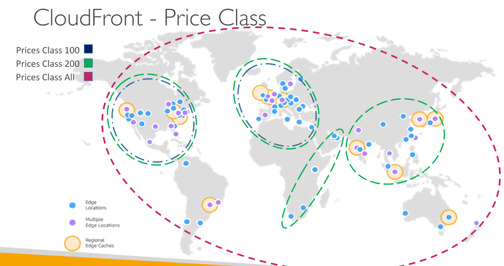
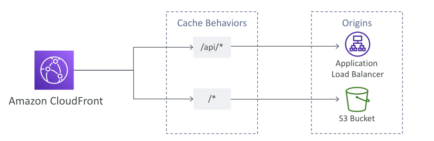
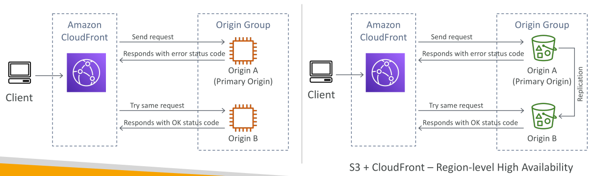
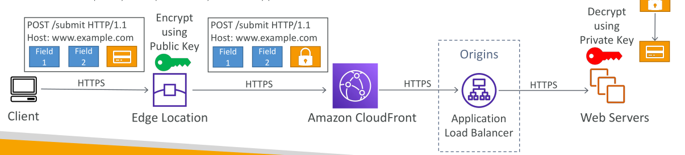

# CloudFront Advanced Concepts

## การกำหนดราคาและ Price Classes

CloudFront มี **edge locations** กระจายอยู่ทั่วโลก และค่าใช้จ่ายของ **data transfer out** (การส่งข้อมูลออกจาก CloudFront) จะแตกต่างกันไปตามภูมิภาค

ตัวอย่างเช่น:

* ใน **เม็กซิโก, สหรัฐอเมริกา, แคนาดา** 10 เทระไบต์แรกคิด \$0.08 ต่อ GB
* ใน **อินเดีย** ค่าใช้จ่ายสูงกว่าประมาณสองเท่าที่ \$0.17 ต่อ GB
* การส่งข้อมูลมากขึ้น → **ค่าใช้จ่ายต่อ GB ลดลง**

  * ตัวอย่าง: เมื่อส่งข้อมูลเกิน 5 เพตะไบต์ในสหรัฐฯ → ลดเหลือ \$0.02 ต่อ GB

**Price Classes**
เพื่อลดค่าใช้จ่าย คุณสามารถจำกัด **จำนวน edge locations** ที่ใช้โดย CloudFront distribution ของคุณ มี 3 Price Class ให้เลือก:

1. **Price Class All** → ครอบคลุมทุกภูมิภาค → ประสิทธิภาพดีที่สุด แต่ค่าใช้จ่ายสูง
2. **Price Class 200** → ครอบคลุมภูมิภาคส่วนใหญ่ ยกเว้นบางภูมิภาคที่แพงที่สุด
3. **Price Class 100** → ครอบคลุมเฉพาะภูมิภาคที่ถูกที่สุด

สรุปภาพรวม:

* Price Class 100 → ครอบคลุม **North America และ Europe**
* Price Class 200 → เพิ่มบางภูมิภาคเพิ่มเติม
* Price Class All → ครอบคลุม **ทั่วโลก**

## Multiple Origins และ Origin Groups

CloudFront รองรับ **หลาย origin และ origin groups** เพื่อ:

* กำหนด **routing ตาม path หรือ content type**
* เพิ่ม **high availability** ด้วย **failover**

### Multiple Origins

สามารถกำหนดให้ requests ไปยัง **origin ต่างกัน** ตาม path หรือ content type ตัวอย่าง:

* Requests ไปที่ `/API/*` → ส่งไปยัง **Application Load Balancer**
* Requests อื่น ๆ → ส่งไปยัง **S3 bucket**

ทำได้โดยการตั้งค่า **cache behaviors** ที่แตกต่างกันตาม path patterns

### Origin Groups

Origin groups ช่วยเพิ่ม **high availability** โดยกำหนด **primary origin** และ **secondary origin**

* หาก primary origin ล้มเหลว → CloudFront จะ **failover** ไปยัง secondary origin อัตโนมัติ

ตัวอย่าง:

* Origin group มี EC2 2 ตัว:

  1. EC2 ตัวแรก → primary origin
  2. EC2 ตัวที่สอง → secondary origin
* หาก primary origin มี error → CloudFront จะลอง request ไปที่ secondary origin

กลไก failover นี้สามารถใช้กับ **S3 bucket** ได้ด้วย โดยการตั้ง origin groups ของ S3 ในภูมิภาคต่าง ๆ และเปิด replication ระหว่างกัน → จะได้ **regional high availability** และ **disaster recovery**

## Field-Level Encryption

Field-level encryption ช่วยปกป้อง **ข้อมูลสำคัญ** ตลอดการส่งข้อมูล โดยเพิ่ม **ชั้นความปลอดภัย** นอกจาก HTTPS

### วิธีการทำงาน

1. Client ส่ง POST request ผ่าน **HTTPS** ไปยัง **CloudFront edge location**
2. Edge location จะ **เข้ารหัสข้อมูลเฉพาะฟิลด์** (สูงสุด 10 ฟิลด์) ด้วย **public key**
3. ข้อมูลที่เข้ารหัสถูกส่งต่อผ่าน HTTPS ไปยัง **Application Load Balancer** และ origin web server
4. Web server ใช้ **private key** เพื่อถอดรหัสฟิลด์นั้น

> ข้อมูลสำคัญจะถูกเข้ารหัสตลอดการเดินทาง และมีเพียง **origin server** เท่านั้นที่เข้าถึงข้อมูลเดคริปต์ได้

## สรุป

บทเรียนนี้ครอบคลุม **แนวคิดขั้นสูงของ CloudFront** ได้แก่:

* การกำหนดราคาและ Price Classes
* Multiple origins และ origin groups สำหรับ routing และ high availability
* Field-level encryption เพื่อความปลอดภัยของข้อมูลสำคัญ