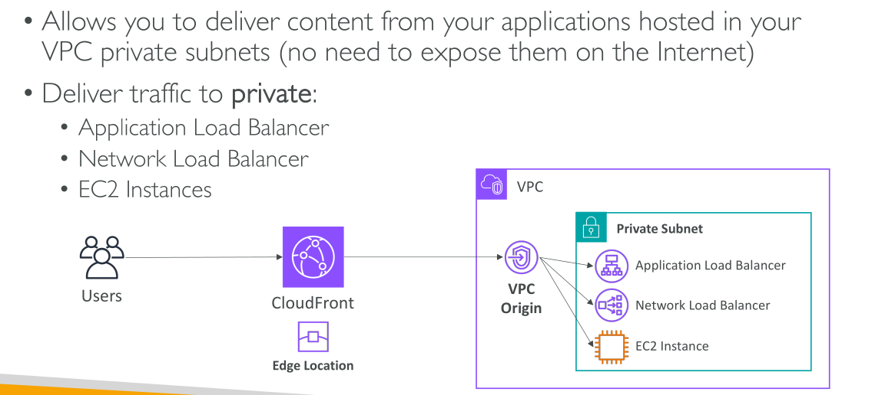
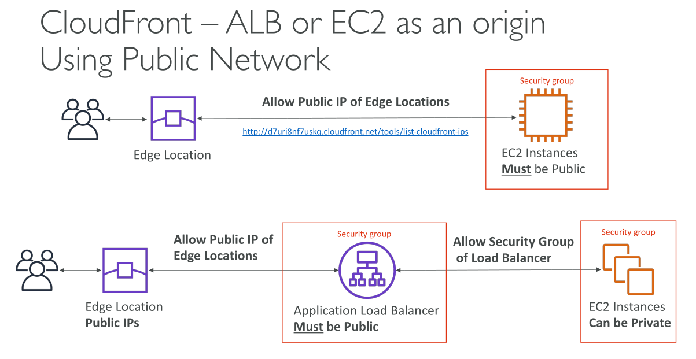

# CloudFront - ALB/EC2 เป็น Origin

## การเชื่อมต่อ CloudFront กับ Application Load Balancer และ EC2 Instance

เราจะเชื่อมต่อ **CloudFront** เข้ากับ **Application Load Balancer (ALB)** หรือ **EC2 instance** ในฐานะ origin ได้อย่างไร?

มีอยู่ 2 วิธี โดยวิธีที่ใหม่กว่าและดีกว่าคือการใช้ **VPC origins**

### VPC Origins คืออะไร

**VPC origins** ช่วยให้คุณสามารถส่งเนื้อหาโดยตรงจากแอปพลิเคชันที่โฮสต์อยู่ใน **private subnets** ของ VPC ได้ โดยที่ทุกอย่างยังคงเป็น **private** และ **ไม่ต้องเปิดเผยสู่สาธารณะอินเทอร์เน็ต**

ซึ่งหมายความว่า:

* คุณสามารถส่งทราฟฟิกไปยัง **private ALB**, **NLB**, และ **EC2 instance** ได้โดยตรง

## วิธีการทำงานของ VPC Origins

1. เราสร้าง **CloudFront distribution** ที่มี edge locations หลายแห่ง
2. ผู้ใช้เข้าถึง CloudFront ผ่าน edge locations เหล่านี้
3. จาก CloudFront เราสร้าง **VPC origin** และเชื่อมต่อเข้ากับ backend ของเรา (เช่น ALB, NLB หรือ EC2)
4. CloudFront จะส่งทราฟฟิกผ่าน VPC origin ไปยัง **private subnet และแอปพลิเคชัน** ของคุณ

📌 จากมุมมองด้านเครือข่าย นี่ถือเป็นวิธีที่ **ปลอดภัยที่สุด** เพราะแอปพลิเคชันของคุณยังคงอยู่ใน private environment และคุณสามารถเลือกได้เองว่าจะเปิดเผยสิ่งใดผ่าน CloudFront

## วิธีเดิม (Public Network Method)

ก่อนที่ VPC origin จะมีให้ใช้งาน วิธีการเก่าคือการใช้ **public network**

* คุณต้องทำให้ **EC2 instance เป็น public**
* CloudFront มี **edge locations** จำนวนมาก แต่ละแห่งจะมี **public IP**
* คุณต้องไปเอา **ลิสต์ CloudFront IPs** มาใส่ใน **security group** ของ EC2 เพื่ออนุญาตเฉพาะ IP เหล่านั้นเข้ามา

### สำหรับ ALB

* ALB จะต้องเป็น **public**
* แต่ EC2 ด้านหลัง ALB สามารถเป็น **private** ได้
* คุณต้องกำหนด security group ของ ALB ให้อนุญาตเฉพาะ public IPs จาก CloudFront

📌 ปัญหาคือ:

* ต้องคอยตามหาและอัปเดต **CloudFront public IPs** ตลอดเวลา
* มีความเสี่ยงว่า หาก security group ของ ALB หรือ EC2 ถูกแก้ไขผิดพลาด → instance อาจถูกเปิดเผยสู่สาธารณะโดยไม่ตั้งใจ

## สรุป

* วิธีเก่า → ต้องเปิด public และจำกัดด้วย IP restrictions (ยุ่งยากและเสี่ยง)
* วิธีใหม่ (VPC origins) → ไม่ต้องเปิด public, ปลอดภัยกว่า, และจัดการง่ายกว่า