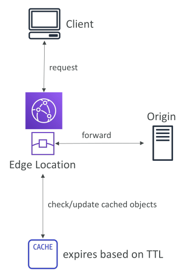
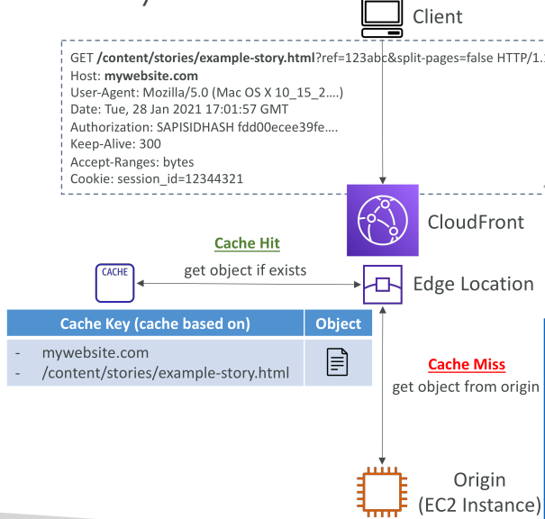
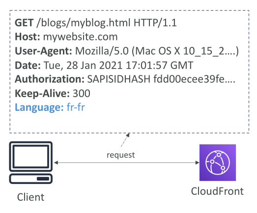
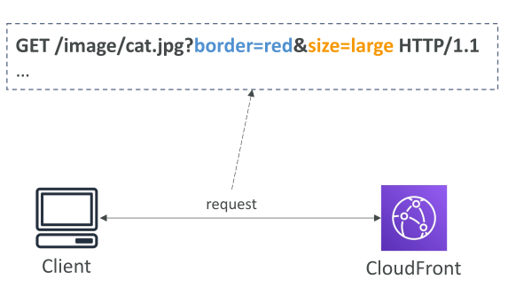
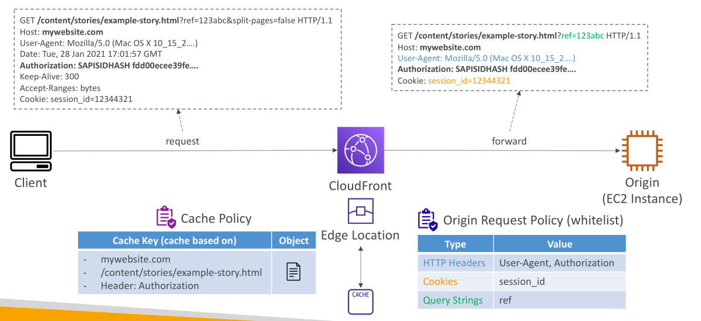
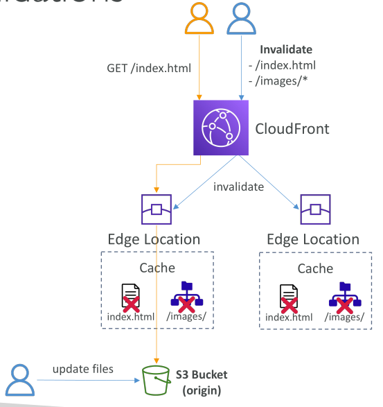
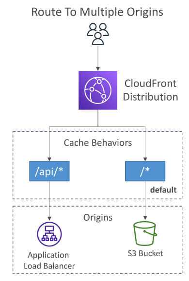

# CloudFront - Caching

## CloudFront - การแคช (Caching) และนโยบายการแคช (Caching Policies)

### ความเข้าใจเกี่ยวกับการแคชของ CloudFront

การแคช (Cache) ของ CloudFront จะอยู่ที่ **Edge Location** แต่ละแห่ง ซึ่งหมายความว่า **มีจำนวน Cache เท่ากับจำนวน Edge Location ที่มีอยู่ทั่วโลก**

* แต่ละวัตถุ (Object) ใน Cache จะถูกระบุด้วย **Cache Key**
* เมื่อมีการร้องขอ (Request) ผ่าน Edge Location → CloudFront จะตรวจสอบก่อนว่าไฟล์นั้นมีอยู่ใน Cache แล้วหรือไม่ และตรวจสอบด้วยว่าไฟล์นั้นหมดอายุ (ตามค่า TTL – Time To Live) หรือยัง
* ถ้าไม่มี หรือหมดอายุแล้ว → Request จะถูกส่งไปยัง Origin และ Response จาก Origin จะถูกเก็บไว้ที่ Edge Location เพื่อให้ Request ในอนาคตสามารถดึงจาก Cache ได้ทันที

**เป้าหมายหลัก** คือการทำให้ **Cache Hit Ratio** สูงที่สุด โดยลดจำนวนครั้งที่ต้องไปดึงข้อมูลจาก Origin ให้น้อยที่สุด
นอกจากนี้ เรายังสามารถ **ลบข้อมูลออกจาก Cache ก่อนหมดอายุได้** ด้วยการทำ Invalidation

### CloudFront Cache Key คืออะไร?

**Cache Key** คือ ตัวระบุที่ไม่ซ้ำกันของแต่ละวัตถุใน Cache

* ค่าเริ่มต้น (Default): Cache Key ประกอบด้วย **Host name** + **Resource portion** ของ URL

**ตัวอย่าง**
URL: `mywebsite.com/GET/content/stories/example-story.html`

* Host name = `mywebsite.com`
* Resource portion = `/GET/content/stories/example-story.html`

Request ที่มี Host name และ Resource portion เหมือนกัน → จะเกิด **Cache Hit** ถ้ามีไฟล์อยู่ใน Cache

แต่บางครั้งเราต้องการให้ Cache Key **ซับซ้อนขึ้น** เพราะเนื้อหาอาจแตกต่างกันตาม **ผู้ใช้, อุปกรณ์, ภาษา หรือ Location**
→ เราสามารถเพิ่มข้อมูลเข้าไปใน Cache Key ได้ เช่น **HTTP Headers, Cookies, Query Strings** โดยใช้ **Cache Policy**

### การตั้งค่า Cache Policy

**Cache Policy** ใช้ควบคุมวิธีสร้าง Cache Key สามารถระบุได้ว่า:

* **HTTP Headers** → จะไม่ใช้เลย / ใช้เฉพาะที่ whitelist / ใช้ทั้งหมด
* **Cookies** → จะไม่ใช้เลย / ใช้เฉพาะที่ whitelist / ใช้ทั้งหมด / ใช้ทั้งหมด ยกเว้นบางตัว
* **Query Strings** → ไม่ใช้ / whitelist / ใช้ทั้งหมด / ใช้ทั้งหมด ยกเว้นบางตัว

**TTL (Time to Live)** → ตั้งค่าได้ตั้งแต่ 0 วินาที จนถึง 1 ปี

* TTL ยังสามารถถูกกำหนดจาก HTTP Headers เช่น `Cache-Control` หรือ `Expires` ได้ด้วย

AWS มี **Managed Policies** ให้ใช้งาน หรือจะสร้างเองก็ได้

### ผลกระทบของ Cache Policy ต่อการส่ง Request ไปยัง Origin

ทุก **Headers, Cookies, Query Strings** ที่อยู่ใน Cache Key → จะถูกส่งไปยัง Origin ด้วย

**ตัวอย่าง**:
Request ที่มี Header `Accept-Language: fr-fr` (ภาษาฝรั่งเศส)

* ถ้า Cache Policy ไม่รวม Headers → Header จะไม่ถูกแคชและไม่ถูกส่งไปที่ Origin
* ถ้า Whitelist Language Header → Header จะถูกใส่ใน Cache Key และถูกส่งไป Origin → Origin จะตอบกลับด้วยเนื้อหาภาษาฝรั่งเศส

กรณี Query Strings เช่น `?border=red&size=large` → จะถูกแคชหรือไม่ขึ้นอยู่กับ Policy เช่นเดียวกัน
⚠️ แต่ถ้า Query String เยอะเกินไป อาจทำให้ **Cache Hit Ratio ลดลง**

### Origin Request Policies

บางครั้งเราต้องการส่ง **ข้อมูลเพิ่มเติม** ไปที่ Origin แต่ไม่อยากให้ข้อมูลนั้นอยู่ใน Cache Key → ใช้ **Origin Request Policy**

* ใช้ส่ง **Headers, Cookies, Query Strings** ไปยัง Origin โดยไม่กระทบต่อ Cache Key
* สามารถเพิ่ม **Custom Headers** ได้ เช่น API Key หรือ Secret Header
* เหมือนกับ Cache Policy → สามารถใช้ Managed Policy ของ AWS หรือสร้างเองก็ได้

### Cache Policy vs Origin Request Policy

* **Cache Policy** → กำหนดการทำงานของ Cache และระบุว่า **อะไรบ้าง** (Host name, Resource, Headers, Cookies, Query Strings) จะถูกนำมาใช้สร้าง Cache Key
* **Origin Request Policy** → กำหนดว่าจะส่งข้อมูลอะไรไปที่ Origin **โดยไม่กระทบต่อ Cache Key**

**ตัวอย่าง**

* Cache Key = Host name + Resource + Authorization Header
* แต่ Origin ต้องการข้อมูลเพิ่ม เช่น `User-Agent`, `Session ID` หรือ Query Strings บางตัว → ใช้ Origin Request Policy เพื่อส่งไป Origin

## CloudFront - การทำ Cache Invalidation

CloudFront ใช้ **Backend Origin** (เช่น S3, Load Balancer หรือ HTTP Server) เพื่อให้บริการคอนเทนต์แก่ผู้ใช้ แต่เมื่อมีการอัปเดตคอนเทนต์ที่ Origin → **Edge Location ของ CloudFront จะยังไม่รู้การเปลี่ยนแปลงทันที** เพราะมันยังคงเสิร์ฟไฟล์ที่แคชไว้จนกว่า **TTL (Time To Live)** จะหมดอายุ

ดังนั้น ไฟล์ใหม่จาก Origin จะถูกนำมาใช้ **หลังจาก TTL เดิมหมดอายุแล้ว**

อย่างไรก็ตาม บางครั้งเราไม่ต้องการรอ TTL หมด → ต้องการให้ผู้ใช้ได้เห็นคอนเทนต์ล่าสุดทันที → เราสามารถ **บังคับให้ล้างหรือรีเฟรช Cache** ได้ ซึ่งเรียกว่า **CloudFront Invalidation**

ในการทำ Invalidation → เราจะระบุว่าไฟล์หรือเส้นทาง (Path) ไหนที่ต้องการล้างออกจาก Cache

* ใช้ **Wildcard `*`** เพื่อล้างทุกไฟล์
* หรือเจาะจง Path เช่น `/images/` เพื่อล้างเฉพาะโฟลเดอร์

### การทำงานของ Cache Invalidations

สมมติว่ามี **CloudFront Distribution** ที่มี 2 Edge Location

* แต่ละ Edge Location มีไฟล์ที่แคชไว้ เช่น `index.html` และ `images/*` ที่ดึงมาจาก Origin (เช่น S3 Bucket)
* TTL ของไฟล์ตั้งไว้ **1 วัน** → Edge Location จะรีเฟรชไฟล์ทุก ๆ 24 ชั่วโมง

ในฐานะผู้ดูแลระบบ หากมีการอัปเดตไฟล์ใน S3 เช่น:

* เพิ่ม/แก้ไขรูปภาพ
* แก้ไขไฟล์ `index.html`

คุณต้องการให้ผู้ใช้เห็นการเปลี่ยนแปลงทันที ไม่ต้องรอ 24 ชั่วโมง

**วิธีแก้** → ทำ Invalidation บน Path ที่เกี่ยวข้อง เช่น:

* `/index.html` → ล้างเฉพาะไฟล์ `index.html`
* `/images/` → ล้างไฟล์รูปทั้งหมดในโฟลเดอร์ `/images/`

หลังจากนั้น CloudFront จะสั่งให้ Edge Location **ลบไฟล์ออกจาก Cache**

ดังนั้นเมื่อผู้ใช้ร้องขอ `index.html` → Edge Location จะตรวจพบว่าไม่มีไฟล์นี้ใน Cache แล้ว → Forward ไปยัง Origin (S3) เพื่อดึงไฟล์ใหม่ล่าสุดมาเก็บ และส่งกลับให้ผู้ใช้ทันที

### สรุป

**Cache Invalidation** ใน CloudFront ช่วยให้เราสามารถรีเฟรชไฟล์ใน Cache ได้ทันที โดยไม่ต้องรอ TTL หมดอายุ เหมาะสำหรับการอัปเดตคอนเทนต์ที่ต้องการเผยแพร่ให้ผู้ใช้เห็นแบบ **Real-time**

## CloudFront - Cache Behaviors

มาลองทำความเข้าใจเกี่ยวกับ **Cache Behaviors** ใน CloudFront กันครับ
แนวคิดหลักคือ คุณอาจต้องการกำหนด **Origin** หรือ **การแคช** ที่แตกต่างกันตาม **URL Path Pattern**

ตัวอย่างเช่น:

* คุณอาจต้องการกำหนด Cache Behavior พิเศษสำหรับไฟล์ **JPEG** ทั้งหมดที่มาจาก Origin Web Server
* หรืออาจต้องการกำหนดให้ **เส้นทาง (Path)** ที่แตกต่างกัน ถูกส่งไปยัง Origin หรือกลุ่ม Origin ที่ต่างกันตามประเภทของคอนเทนต์หรือรูปแบบของ Path

เช่น อาจตั้งค่า CloudFront ดังนี้:

* คำขอ (Request) ไปที่ `/images/` → ส่งไปยัง **S3 Bucket**
* คำขอไปที่ `/api/` → ส่งไปยัง **Origin Server**
* คำขอไปที่ `/` → ส่งไปยัง **Default Origin** (เรียกว่า **Default Cache Behavior**)

### ตัวอย่างของ Cache Behaviors

ในตัวอย่าง CloudFront ด้านล่างนี้มี 2 Cache Behaviors:

* `/api/` → ถูกส่งไปยัง **Application Load Balancer** (ALB)
* `/` → เป็น **Default Cache Behavior**

หรือคุณสามารถกำหนดให้ Redirect ไปยัง S3 Bucket ได้เช่นกัน

เมื่อผู้ใช้เข้าถึง CloudFront → จะถูกส่งไปยัง Cache Behavior ที่ตรงกับ **Resource Path** ที่ร้องขอ

* หากมีหลาย Cache Behavior → CloudFront จะตรวจสอบ **Path ที่เฉพาะเจาะจงที่สุดก่อน**
* ถ้าไม่เจอ → จะกลับไปใช้ **Default Cache Behavior (/)**

### Use Case: การควบคุมการเข้าถึง S3 Bucket

กรณีใช้งานที่พบบ่อยคือ การ **ควบคุมการเข้าถึง S3 Bucket** เพื่อบังคับให้ผู้ใช้ต้อง **ล็อกอิน** ก่อน

วิธีทำ:

* กำหนด Cache Behavior สำหรับ `/login` → ให้ส่งไปยัง **EC2 Instance**
* เมื่อผู้ใช้เข้า `/login` → EC2 จะสร้าง **CloudFront Signed Cookies** และส่งกลับให้ผู้ใช้
* ผู้ใช้สามารถใช้ **Signed Cookies** เหล่านี้เพื่อเข้าถึง **Default Cache Behavior** (ไฟล์ใน S3 Bucket)

ถ้าผู้ใช้พยายามเข้าถึง Default Cache Behavior โดย **ไม่มี Signed Cookies** → CloudFront จะปฏิเสธและ Redirect ผู้ใช้ไปยัง `/login` เพื่อให้ทำการล็อกอินก่อน → ช่วยเพิ่ม **การควบคุมความปลอดภัย**

### การเพิ่ม Cache Hit

อีกเหตุผลหนึ่งที่ควรใช้ **Cache Behaviors** คือการเพิ่ม **Cache Hit Ratio**

* สำหรับ **Static Content** (ไฟล์คงที่ เช่น รูปภาพ, CSS, JS) → สามารถส่งตรงจาก Amazon S3 โดยไม่ต้องใช้ Header หรือ Session → เพิ่มโอกาส Cache Hit ได้สูงสุด
* สำหรับ **Dynamic Content** (คอนเทนต์แบบไดนามิก เช่น REST API, แอปพลิเคชันหลัง Load Balancer และ EC2) → คุณอาจต้องการแคชตาม **Headers และ Cookies** ที่เฉพาะเจาะจง → กำหนดได้จาก Cache Policy

## CloudFront - Caching & Caching Invalidations - ภาคปฏิบัติ

### ภาพรวมพฤติกรรมการแคชของ CloudFront

เรามาเจาะลึกพฤติกรรมการแคชของ CloudFront distribution กัน เริ่มจาก **default behavior** ซึ่งถูกแทนด้วย path pattern แบบ wildcard (`*`) โดย path pattern นี้ไม่สามารถแก้ไขได้ แต่เรายังสามารถปรับตั้งค่าอื่น ๆ ได้

เมื่อเลื่อนลงมาจะเห็นตัวเลือกในการตั้งค่า **cache key และ origin request** โดยเราสามารถกำหนด **cache policy** และเลือกสร้าง **origin request policy** เพิ่มเติมได้ เพื่อควบคุมว่าการ request จะถูกจัดการและแคชอย่างไร

### การสร้าง Cache Policy

เราจะสร้าง **cache policy** ชื่อ `DemoCachePolicy` ซึ่งสามารถควบคุมค่าต่าง ๆ ของ **Time-to-Live (TTL)** ได้แก่:

* **Minimum TTL** – ระยะเวลาขั้นต่ำที่ไฟล์จะถูกแคช
* **Maximum TTL** – ระยะเวลาสูงสุดที่ไฟล์จะถูกแคช
* **Default TTL** – ระยะเวลาแคชมาตรฐาน

ค่าทั้งหมดนี้จะเป็นตัวกำหนดว่าไฟล์จะถูกเก็บไว้ใน cache ของ CloudFront นานแค่ไหน

### การตั้งค่า Cache Key

เราสามารถกำหนดได้ว่า **headers** ไหนบ้างที่จะถูกนำมาใช้สร้าง cache key โดยสามารถเลือกจากลิสต์ที่มี หรือกำหนด headers เองก็ได้

นอกจากนี้ เรายังเลือกได้ว่า **query strings** จะรวมทั้งหมดหรือเฉพาะบางตัว และในทำนองเดียวกัน เราเลือกได้ว่าจะเก็บ **cookies** ทั้งหมดหรือเฉพาะบางตัวเท่านั้น

ตัวเลือกเหล่านี้จะเป็นตัวกำหนด **cache key** ที่ CloudFront ใช้ในการแยกความแตกต่างของ object ที่ถูกแคช

* ถ้า headers ถูกนำมาใช้ใน cache key → headers นั้นก็จะถูกส่งไปยัง origin ด้วย
* ถ้าอยากส่ง headers, query strings, หรือ cookies ไปที่ origin เพิ่มเติม (โดยไม่ต้องเอามาใช้ใน cache key) → เราสามารถสร้าง **origin request policy** ได้

### การสร้าง Origin Request Policy

เราจะสร้าง **origin request policy** ชื่อ `DemoOriginPolicy` ซึ่งอนุญาตให้เรากำหนดว่า **headers, query strings และ cookies** ตัวใดบ้างจะถูกส่งไปยัง origin

นโยบายนี้ช่วยให้ request ที่ไปยัง origin มีข้อมูลที่ละเอียดมากขึ้น ไม่จำกัดแค่สิ่งที่รวมไว้ใน cache key เท่านั้น

### การสร้าง Cache Behaviors เพิ่มเติม

นอกจาก default behavior แล้ว เรายังสามารถสร้าง **cache behaviors** อื่น ๆ ได้ เพื่อแทนที่ค่า default สำหรับ path patterns ที่เจาะจง เช่น:

* `/images/` → route ไปยัง S3 bucket หรือ EC2 instance
* `/api/` → route ไปยัง Application Load Balancer
* `/` → ใช้ default behavior

แต่ละ behavior สามารถกำหนด cache key และ origin request policy ของตัวเองได้
เวลาที่ CloudFront ประมวลผล request → มันจะ match กับ **path ที่เฉพาะที่สุดก่อน** แล้วถ้าไม่ตรงถึงจะ fallback ไปยัง default behavior

### การสาธิตการ Invalidate Cache

มาดูกันว่าค่า **TTL** มีผลกับการแคชอย่างไร

1. เราแก้ไขไฟล์ `index.html` โดยเปลี่ยนข้อความจาก
   `"I really love coffee"` → `"I really love coffee every morning"`
2. อัปโหลดไฟล์ใหม่ขึ้น S3 (แทนที่ไฟล์เก่า เนื่องจากไม่ได้เปิด versioning)
3. เมื่อเปิดไฟล์จาก S3 → เห็นข้อความใหม่ `"I really love coffee every morning"`
4. แต่เมื่อเปิดผ่าน CloudFront → ยังเห็นข้อความเก่า `"I really love coffee"`

สาเหตุ: CloudFront ยังคงแคชไฟล์เก่าไว้ตาม TTL (1 วัน)

### การแก้ไข → Cache Invalidation

* เข้าไปที่แท็บ **Invalidations** ของ CloudFront
* สร้าง invalidation ใหม่ โดยใส่ path pattern `/*`
* เมื่อ invalidation เสร็จสิ้น → Refresh CloudFront URL → ได้เนื้อหาใหม่จาก S3 ทันที