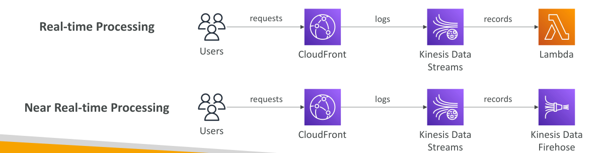

# CloudFront - Real Time Logs

บทเรียนนี้พูดถึง **การบันทึก Log แบบเรียลไทม์ (Real-Time Logs)** ใน CloudFront ซึ่งช่วยให้ **ทุกคำขอที่ CloudFront รับเข้ามา** สามารถส่งไปยัง **Kinesis Data Stream** ได้ทันที
ฟีเจอร์นี้ช่วยให้เราสามารถ **ตรวจสอบ, วิเคราะห์, และดำเนินการ** ตามประสิทธิภาพการส่งเนื้อหาได้แบบเรียลไทม์

## ภาพรวมการทำงานของ Real-Time Logging

1. ผู้ใช้ส่งคำขอจำนวนมากมายมายัง CloudFront
2. เมื่อเปิดใช้งาน Real-Time Logs **คำขอทั้งหมดจะถูกบันทึกลงใน Kinesis Data Stream**
3. ตัวอย่าง: ฟังก์ชัน Lambda สามารถประมวลผลข้อมูลจาก Kinesis Data Stream เหล่านี้ได้

## การประมวลผลแบบ Near Real-Time ด้วย Kinesis Data Firehose

* หากต้องการประมวลผล **ใกล้เรียลไทม์** ขั้นตอนเริ่มต้นยังเหมือนเดิม เพราะ CloudFront สามารถส่ง Log ไปยัง **Kinesis Data Stream** เท่านั้น
* จากนั้นใช้ **Kinesis Data Firehose** ประมวลผล Log เหล่านี้เป็น **batch** และส่งต่อไปยัง **ปลายทาง** เช่น:

  * Amazon S3
  * OpenSearch
  * หรือปลายทางอื่น ๆ ตามต้องการ

## การกำหนด Sampling Rate และ Log Fields

* สามารถเลือก **sampling rate** คือ **เปอร์เซ็นต์ของคำขอ** ที่ต้องการบันทึกใน Kinesis Data Stream

  * มีประโยชน์สำหรับ API หรือ endpoint ที่มี **traffic สูงมาก** ไม่ต้องการบันทึกทุกคำขอ
  * สามารถบันทึกเฉพาะตัวอย่างบางส่วน (sample)

* นอกจากนี้ยังสามารถกำหนดได้ว่า **ฟิลด์ใด** และ **cache behavior หรือ path pattern ใด** ที่ต้องการเก็บ Log

  * ตัวอย่าง: บันทึก Log เฉพาะคำขอที่ตรงกับ cache behavior ของ path pattern เช่น `/images` เพื่อ **ตรวจสอบคำขอเฉพาะเส้นทางนั้น**

## สรุป

ฟีเจอร์ **Real-Time Logs** ของ CloudFront ช่วยให้เราสามารถ **ตรวจสอบและวิเคราะห์การส่งเนื้อหาได้อย่างยืดหยุ่นและมีประสิทธิภาพ** ผ่านการสตรีมและประมวลผลข้อมูลแบบเรียลไทม์
