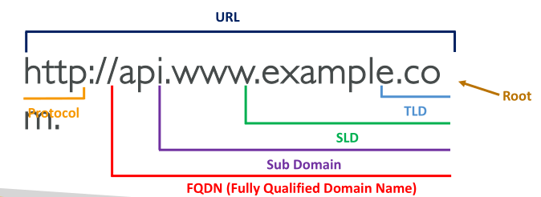
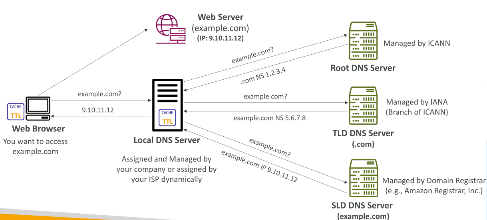
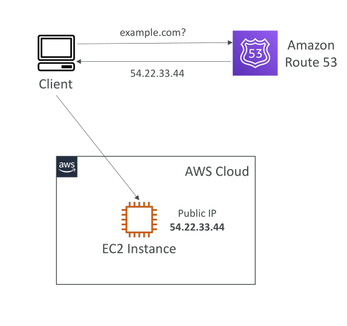
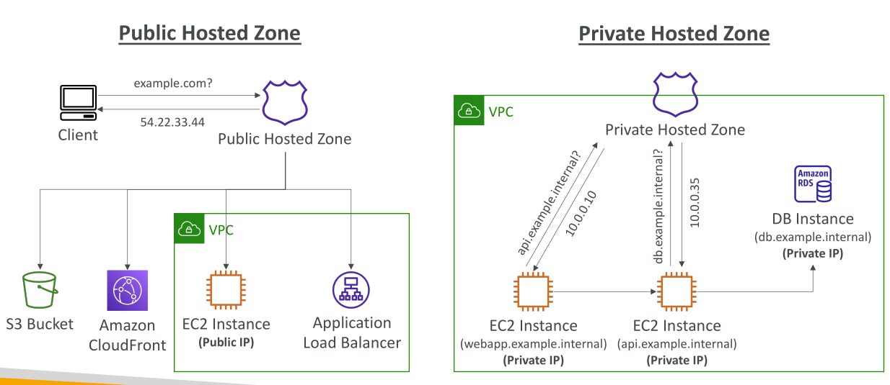
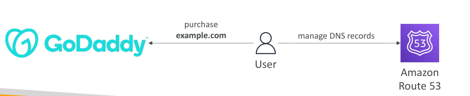

# AWS Route 53

## Route 53 คืออะไร?

Amazon Route 53 เป็นบริการ **DNS (Domain Name System) ที่มีความพร้อมใช้งานสูง (Highly Available), ปรับขนาดได้ (Scalable), มีการจัดการเต็มรูปแบบ (Fully Managed) และเป็นแบบ Authoritative**

* คำว่า *Authoritative* หมายถึง ลูกค้าสามารถแก้ไข DNS Records ได้เอง ทำให้มี **การควบคุม DNS ได้อย่างสมบูรณ์**

ตัวอย่างเช่น ลูกค้าอยากเข้าถึง EC2 Instance ผ่านชื่อ **example.com** แต่ EC2 Instance มีเพียง **Public IP Address** เท่านั้น
ดังนั้น เราจะเขียน DNS Record ลงใน **Amazon Route 53** ภายใน **Hosted Zone**
เมื่อมี Client เรียก **example.com** → Route 53 จะตอบกลับด้วย IP Address เช่น `54.22.33.44` เพื่อให้ Client เชื่อมต่อไปยัง EC2 Instance ได้โดยตรง

Route 53 ยังสามารถทำหน้าที่เป็น **Domain Registrar** สำหรับการลงทะเบียนชื่อโดเมน เช่น `example.com`
และยังสามารถตรวจสอบ **Health Check ของ Resource** ได้

ที่สำคัญ Route 53 เป็นบริการ AWS เพียงตัวเดียวที่มี **SLA ความพร้อมใช้งาน 100%**

ชื่อ **Route 53** มาจาก **Port 53** ซึ่งเป็นพอร์ตมาตรฐานของ DNS

Route 53 ประกอบด้วย 3 ความสามารถหลัก:

1. Domain registration (การจดโดเมน)
2. DNS routing (การชี้ชื่อโดเมนไปยังทรัพยากร)
3. Health checking (การตรวจสอบสถานะของ endpoint)

## DNS Records ใน Route 53

ใน Route 53 เราสามารถสร้าง **DNS Records** เพื่อกำหนดเส้นทางการรับส่งข้อมูลของโดเมน

แต่ละ Record จะประกอบด้วย:

* **Domain/Subdomain Name** เช่น `example.com`
* **Record Type** เช่น `A`, `AAAA`
* **Record Value** เช่น `12.34.56.78`
* **Routing Policy** กำหนดวิธีตอบ DNS Query
* **TTL (Time to Live)** ระยะเวลาที่ Record ถูกแคชใน DNS Resolver

## ประเภท Record สำคัญ

* **A Record** → Map โฮสต์เนม ไปยัง IPv4 Address (เช่น `example.com → 1.2.3.4`)
* **AAAA Record** → Map โฮสต์เนม ไปยัง IPv6 Address
* **CNAME Record** → Map โฮสต์เนม ไปยังโฮสต์เนมอีกตัวหนึ่ง (Target ต้องเป็น A หรือ AAAA Record)

  * **ข้อควรจำ:** ไม่สามารถสร้าง CNAME ที่ Zone Apex ได้ (เช่น `example.com` ใช้ CNAME ไม่ได้ แต่ `www.example.com` ใช้ได้)
* **NS Record** → ระบุ Name Server ของ Hosted Zone (เป็นเซิร์ฟเวอร์ที่ตอบ DNS Query และควบคุมการ Routing)

## Hosted Zones

Hosted Zone คือ Container สำหรับเก็บ DNS Records ซึ่งกำหนดการ Routing ของโดเมนและ Subdomain

* คือพื้นที่ที่ใช้เก็บ DNS records ของโดเมน
* มี 2 ประเภท:

**Public Hosted Zone**

* ใช้กับโดเมนสาธารณะ เช่น `mypublicdomain.com`
* ตอบ Query จากผู้ใช้บนอินเทอร์เน็ต

**Private Hosted Zone**

* ใช้กับโดเมนส่วนตัว เช่น `application1.company.internal`
* ตอบ Query ได้เฉพาะภายใน VPC เท่านั้น

> หมายเหตุ: การสร้าง Hosted Zone มีค่าใช้จ่าย (Route 53 ไม่ใช่บริการฟรี)

## Public vs Private Hosted Zone

* **Public Hosted Zone**

  * ตอบ Query จากอินเทอร์เน็ต เช่น เมื่อ Browser ขอ `example.com` → Public Hosted Zone จะคืน IP Address

* **Private Hosted Zone**

  * ตอบ Query ได้เฉพาะใน VPC เช่น

    * `webapp.example.internal` → ชี้ไปที่ EC2 Instance
    * `api.example.internal` → ชี้ไปที่อีก EC2 Instance
    * `database.example.internal` → ชี้ไปที่ Database
  * เช่น EC2 Instance แรกเรียก `api.example.internal` → Private Hosted Zone จะ resolve ไปเป็น **Private IP** เช่น `10.0.0.10` เพื่อเชื่อมต่อโดยตรง

**สรุป:** Public Hosted Zone ตอบจากทุกที่บนอินเทอร์เน็ต ส่วน Private Hosted Zone ตอบได้เฉพาะใน VPC เท่านั้น

## Health Checks

* ใช้ตรวจสอบว่าสถานะของ resource เช่น web server หรือ API ยังทำงานอยู่หรือไม่
* Protocol ที่รองรับ: HTTP, HTTPS, TCP
* ใช้ร่วมกับ routing policy เช่น failover, latency, weighted routing

## Profiles (ใหม่)

* Profiles คือการตั้งค่าคอนฟิกที่แชร์ได้ข้ามหลาย hosted zones
* ใช้ช่วยให้การจัดการ DNS record ข้ามหลายโดเมนง่ายขึ้น

## IP-based Routing

* การชี้ DNS ตาม IP address ranges หรือ prefix
* ใช้ร่วมกับ CIDR collections เพื่อควบคุม traffic ตาม location/IP ที่เข้ามา

## CIDR Collections

* ชุดของ IP ranges (CIDR blocks) ที่สามารถจัดกลุ่มเพื่อใช้กับ IP-based routing

## Traffic Flow

* เครื่องมือ visual สำหรับสร้าง routing policies ได้ง่ายและซับซ้อน
* ตัวอย่าง: weighted + geo-proximity + failover

### Traffic Policies

* เป็น logic ที่ใช้ในการกำหนดเส้นทางให้กับ DNS
* ประเภท policy:

  * Simple
  * Weighted
  * Latency
  * Failover
  * Geolocation
  * Geoproximity
  * IP-based

### Policy Records

* เป็น DNS record ที่เชื่อมโยงกับ traffic policy
* ใช้เพื่อเปิดใช้งาน traffic policy บน hosted zone

## Domains

### Registered Domains

* Route 53 รองรับการจดโดเมนโดยตรง
* รองรับ TLD (.com, .org, .dev ฯลฯ)
* มีบริการ WHOIS และ DNSSEC

### Requests

* แสดงข้อมูลการร้องขอ API ต่าง ๆ เช่น CreateHostedZone, ListRecords

## Resolver

Route 53 Resolver คือระบบ **DNS สำหรับภายใน VPC**

### VPCs

* คุณสามารถกำหนด Private Hosted Zones ให้ทำงานกับ VPC ได้โดยตรง

### Inbound Endpoints

* ให้ DNS server ภายนอกสามารถ query DNS records ภายใน AWS ได้
* ใช้ใน hybrid cloud หรือ On-prem → AWS

### Outbound Endpoints

* ให้ instance ภายใน AWS ส่ง query DNS ไปยัง DNS server ภายนอก
* ใช้ใน AWS → On-prem หรือ third-party DNS

### Rules

* ใช้ควบคุมการ forward DNS queries ตาม domain หรือ subdomain ที่กำหนด เช่น `corp.internal`

### Query Logging

* เก็บ log ของ DNS queries ผ่าน CloudWatch Logs, S3, หรือ Kinesis
* วิเคราะห์ความปลอดภัย หรือ debug DNS ได้

## Outposts

* รองรับการใช้งาน Route 53 Resolver ร่วมกับ AWS Outposts
* ให้คุณใช้ DNS resolution ภายในระบบ On-premise ที่ต่อเชื่อมกับ AWS ได้

## สรุป

Route 53 เป็นเครื่องมือสำคัญในโครงสร้างพื้นฐาน AWS ที่ให้ทั้งการจดโดเมน, การจัดการ DNS อย่างละเอียด, และการควบคุม routing traffic ตามสถานะและเงื่อนไขที่ยืดหยุ่นสูง สามารถใช้ได้ทั้งกับระบบสาธารณะและระบบภายในองค์กร (VPC)