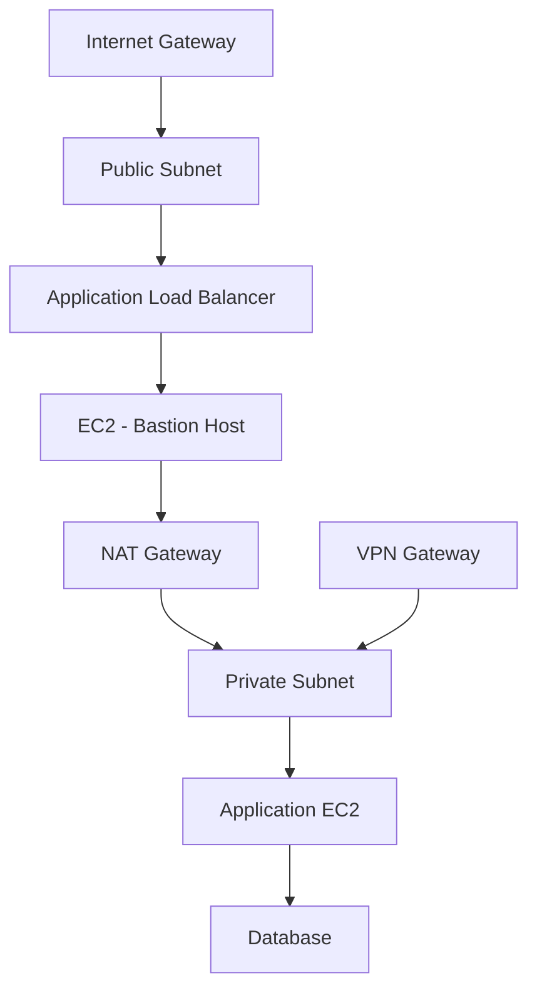

# AWS VPC (Virtual Private Cloud)

## 1. ภาพรวม (Overview)

Amazon VPC (Virtual Private Cloud) คือพื้นที่เครือข่ายเสมือน (virtual network) ที่คุณสามารถกำหนดค่าและควบคุมได้เต็มรูปแบบภายใน AWS โดยคล้ายกับการมี data center บนคลาวด์ของตนเอง

- ใช้สำหรับกำหนดขอบเขตของ private IP address
- สามารถแยก zone ความปลอดภัยของระบบต่าง ๆ ได้
- เชื่อมต่อกับ Internet, VPN, หรือ Direct Connect ได้
- รองรับ High Availability และ Multi-AZ Deployment

---

## 2. องค์ประกอบของ VPC

### 2.1 CIDR Block
CIDR (Classless Inter-Domain Routing) ใช้กำหนด range ของ IP address สำหรับ VPC

- ตัวอย่าง: `10.0.0.0/16` หมายถึงมี IP address ทั้งหมด 65,536 addresses (2⁶⁴)
- VPC จะต้องอยู่ในช่วง private IP ตาม RFC1918 เช่น:
  - 10.0.0.0 – 10.255.255.255 (/8)
  - 172.16.0.0 – 172.31.255.255 (/12)
  - 192.168.0.0 – 192.168.255.255 (/16)

---

### 2.2 Subnet
Subnets คือการแบ่ง IP range ของ VPC ออกเป็นส่วนย่อย ๆ เพื่อแยกการทำงานและควบคุมการเข้าถึง

- Public Subnet:
  - เชื่อมต่อ Internet ผ่าน Internet Gateway
  - เหมาะสำหรับ Load Balancer, Bastion Host

- Private Subnet:
  - ไม่สามารถเข้าถึงอินเทอร์เน็ตได้โดยตรง
  - ใช้ NAT Gateway/NAT Instance หากต้องการ outbound access
  - เหมาะสำหรับ Application Servers, DB Servers

- การใช้งานแบบ Multi-AZ:
  - เพื่อเพิ่ม availability ควรสร้าง subnet หลายอันใน AZ ที่แตกต่างกัน

---

### 2.3 Route Table
Routing Table ควบคุมการส่งข้อมูลระหว่าง subnet หรือออกสู่อินเทอร์เน็ต

- Default Route Table จะถูกสร้างเมื่อสร้าง VPC
- สามารถสร้าง Custom Table และ associate กับแต่ละ subnet ได้
- ตัวอย่าง:

```plaintext
  Destination      | Target
  -----------------|----------
  10.0.0.0/16      | local
  0.0.0.0/0        | igw-xxxxxxxx (Internet Gateway)
````

---

### 2.4 Internet Gateway (IGW)

อุปกรณ์ logical ที่อนุญาตให้ instance ใน VPC เข้าถึงอินเทอร์เน็ต

* ต้อง attach กับ VPC
* ต้องกำหนด route ไปยัง IGW ใน Route Table
* ต้อง assign Public IP หรือ Elastic IP ให้ instance

---

### 2.5 NAT Gateway / NAT Instance

**NAT Gateway** (managed service):

* ให้ private subnet มี outbound internet access
* รองรับ high throughput
* Scale ได้อัตโนมัติ

**NAT Instance** (EC2 instance):

* ควบคุมระดับล่างได้มากกว่า (ต้อง config เอง)
* ต้อง enable IP forwarding และกำหนด security group

> ใช้ NAT Gateway แทน NAT Instance ใน production เพื่อความเสถียร

---

### 2.6 Security Group

* เป็น stateful firewall ระดับ instance
* ควบคุม Inbound และ Outbound โดยใช้ rule ตาม Protocol, Port และ Source/Destination
* Rule ทั้งหมดเป็น Allow เท่านั้น (ไม่มี Deny)
* ใช้หลัก Principle of Least Privilege

ตัวอย่าง:

```plaintext
Inbound:
  Type    | Port | Source
  --------|------|-------------------
  SSH     | 22   | 203.0.113.10/32

Outbound:
  Type    | Port | Destination
  --------|------|-------------------
  All     | All  | 0.0.0.0/0
```

---

### 2.7 Network ACL (NACL)

* Stateless firewall ระดับ subnet
* มีทั้ง Allow และ Deny rule
* ใช้สำหรับควบคุมการเข้าถึง subnet ทั้งหมด
* Rule มีลำดับ (Rule #) และประเมินตามลำดับ

> ใช้ร่วมกับ Security Group เพื่อเพิ่มชั้นความปลอดภัย

---

### 2.8 Elastic IP (EIP)

* Static IPv4 ที่สามารถ remap ระหว่าง EC2 instances ได้
* มักใช้กับ NAT Gateway หรือ Bastion Host

> มีค่าใช้จ่ายหากไม่ได้ใช้งานหรือไม่ได้ associate กับ instance

---

### 2.9 VPC Peering

* เชื่อมต่อ VPC สองอันเข้าด้วยกัน
* รองรับการสื่อสารแบบ Private IP โดยไม่ต้องผ่านอินเทอร์เน็ต
* ไม่สามารถ transitive (A → B, B → C แต่ A คุยกับ C ไม่ได้)
* ต้องกำหนด route และ security group ให้ครอบคลุม

---

### 2.10 VPC Endpoints

* เชื่อมต่อกับบริการของ AWS (S3, DynamoDB) โดยไม่ต้องผ่านอินเทอร์เน็ต

* มี 2 ประเภท:

  * **Interface Endpoint**: สร้าง ENI ใน subnet
  * **Gateway Endpoint**: กำหนด route ให้ subnet ใช้ผ่าน Gateway (รองรับเฉพาะ S3 และ DynamoDB)

> ลดค่าใช้จ่ายและเพิ่มความปลอดภัย

---

### 2.11 DHCP Option Set

* ใช้กำหนดค่า DNS, NTP, และ domain name ให้ EC2 instance โดยอัตโนมัติ
* Default จะใช้ AmazonProvidedDNS

---

### 2.12 DNS และ Hostnames ใน VPC

* VPC จะเปิด DNS resolution และ hostnames ได้ (เปิดผ่าน VPC settings)
* Amazon DNS: `169.254.169.253`
* หากต้องการใช้ Route 53 Resolver ในแบบ Hybrid ต้องตั้งค่า DNS forwarding และ query rules

---

### 2.13 VPC Flow Logs

* บันทึก traffic ที่เข้า/ออก network interfaces
* ใช้สำหรับ security audit และ troubleshooting
* สามารถเก็บใน CloudWatch Logs หรือ S3

ตัวอย่างข้อมูล Flow Log:

```plaintext
version account-id interface-id srcaddr dstaddr srcport dstport protocol action log-status
2       1234567890 eni-xxxxxx   10.0.1.1  172.31.0.1 443     49152    6       ACCEPT OK
```

---

### 2.14 VPN & Direct Connect

* **VPN**: เชื่อมต่อ VPC กับ on-premise ผ่าน IPSec tunnel
* **AWS Direct Connect**: สายเชื่อมต่อโดยตรง ความเร็วสูง latency ต่ำ เหมาะสำหรับ production

---

## 3. การออกแบบ VPC ที่ดี

### ✅ ควรทำ

* ใช้ CIDR ที่ไม่ชนกันกับ network อื่น
* แยก Public/Private Subnet และ Security Group อย่างชัดเจน
* วาง Load Balancer ใน Public Subnet และ App/DB ใน Private Subnet
* เปิด VPC Flow Logs สำหรับการ audit

### ❌ ไม่ควรทำ

* ใช้ default VPC โดยไม่ปรับแต่ง
* เปิด wide-open Security Group เช่น 0.0.0.0/0 โดยไม่จำเป็น
* ใช้ CIDR block ใหญ่เกินความจำเป็น ทำให้เปลือง IP

---

## 4. Diagram (High-level)



---

## 5. สรุป

AWS VPC เป็นรากฐานของการวางระบบเครือข่ายใน AWS ซึ่งหากออกแบบอย่างเหมาะสมจะสามารถเพิ่มความปลอดภัย, รองรับการขยายตัว, และควบคุมการเข้าถึงระบบได้อย่างมีประสิทธิภาพ เหมาะสำหรับระบบขนาดเล็กจนถึงระดับองค์กรขนาดใหญ่