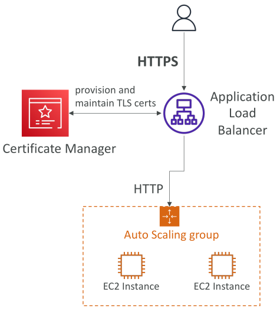
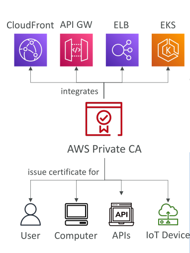

# Amazon Certificate Manager (ACM)

**AWS Certificate Manager (ACM)** เป็นบริการที่ช่วยให้คุณสามารถ **จัดหาสร้าง จัดการ และติดตั้งใบรับรอง SSL/TLS** ได้อย่างง่ายดาย

## วัตถุประสงค์ของใบรับรอง (Certificates)

ใบรับรองถูกใช้เพื่อ **เข้ารหัสข้อมูลระหว่างส่ง (in-flight encryption)** สำหรับเว็บไซต์ของคุณ โดยการเปิดใช้งาน **HTTPS endpoints**

## ตัวอย่างสถาปัตยกรรม

* สมมติว่าเรามี **Application Load Balancer (ALB)** เชื่อมต่อกับ **Auto Scaling Group** ที่มี EC2 instances ผ่าน HTTP
* เราต้องการให้ผู้ใช้งานเข้าถึงแอปพลิเคชันผ่าน **HTTPS endpoints**
* วิธีทำคือใช้ **ACM**

  1. เชื่อมต่อกับโดเมนของเรา
  2. ACM จะช่วย **จัดหาสร้างและดูแล TLS certificates**
  3. ใบรับรองจะถูกโหลดไปยัง **ALB**
  4. ALB จะให้บริการ **HTTPS endpoints** แก่ลูกค้าโดยอัตโนมัติ
* การตั้งค่านี้ช่วยให้เกิด **การเข้ารหัสข้อมูลระหว่างส่ง (in-flight encryption)** บนเครือข่ายสาธารณะ

## คุณสมบัติของ ACM

* รองรับ **TLS certificates** ทั้งแบบ **public** และ **private**
* **Public TLS certificates ฟรี**
* มีฟีเจอร์ **ต่ออายุ TLS certificates อัตโนมัติ**
* **Integrate กับบริการ AWS** หลายตัว เช่น

  * Elastic Load Balancer
  * CloudFront distributions
  * API Gateway
    เพื่อโหลดใบรับรอง TLS อัตโนมัติ

> เมื่อใดที่คุณต้องการให้บริการเข้ารหัสข้อมูลระหว่างส่ง และสร้างใบรับรอง TLS ให้คิดถึง ACM

## สรุปใจความสำคัญ (Key Takeaways)

* **ACM** ช่วยให้การจัดหา จัดการ และติดตั้ง SSL/TLS certificates ง่ายขึ้น
* ใบรับรองช่วยให้เกิด **การเข้ารหัสข้อมูลระหว่างส่ง** และเปิดใช้งาน **HTTPS endpoints** สำหรับเว็บไซต์
* ACM สามารถ **integrate กับ ALB, CloudFront, และ API Gateway** เพื่อโหลดใบรับรองโดยอัตโนมัติ
* **Public TLS certificates** จาก ACM **ฟรี** และมีฟีเจอร์ **ต่ออายุอัตโนมัติ**

## AWS Private Certificate Authority (Private CA)

## ภาพรวมของ AWS Private Certificate Authority

**AWS Certificate Manager (ACM)** สามารถออก **Public Certificates** ได้ แต่ยังสามารถออก **Private Certificates** ได้ด้วย โดยต้องสร้าง **AWS Private Certificate Authority (CA)**

* เป็น **บริการที่จัดการให้ (managed service)**
* สามารถสร้าง **Root CA** หรือ **Subordinate CA** ที่ขึ้นต่อ Root CA
* จาก CA เหล่านี้ สามารถออกและแจกจ่าย **X.509 end-entity certificates**

  * Certificates เหล่านี้ใช้ภายในแอปพลิเคชันของคุณ
  * **ไม่สามารถใช้สร้างใบรับรองใหม่ได้**
  * **เชื่อถือได้เฉพาะแอปพลิเคชันภายในองค์กรที่เชื่อถือ Private CA**

> ใบรับรองประเภทนี้ **ไม่สามารถใช้งานบนอินเทอร์เน็ตสาธารณะได้** เพราะออกโดย Private CA ทำให้ไม่ถูกเชื่อถือโดยสาธารณะ

## การใช้งานร่วมกับ AWS Services

* หากใช้บริการ AWS ที่ Integrate กับ ACM เช่น **Application Load Balancer** สามารถโหลด **Private Certificate** ลงบนบริการเหล่านี้ได้
* ทำให้สามารถ **สื่อสารอย่างปลอดภัยภายในสภาพแวดล้อมส่วนตัว (private environment)**
* ตัวอย่างบริการที่รองรับ Private Certificates:

  * CloudFront
  * API Gateway
  * Load Balancers
  * Kubernetes services
  * อื่น ๆ

> Certificates เหล่านี้สามารถออกให้กับ **ผู้ใช้งาน, คอมพิวเตอร์, API, HTTP endpoints, และ IoT devices** เพื่อความปลอดภัยภายในองค์กร

## กรณีการใช้งานของ AWS Private CA

* เปิดใช้งาน **การสื่อสารแบบเข้ารหัส TLS ภายในองค์กร**
* ใช้ **เข้ารหัสลายเซ็นดิจิทัล (cryptographic signing)** เพื่อยืนยันตัวตนของผู้ใช้, คอมพิวเตอร์, API endpoints และ IoT devices
* สร้าง **Public Key Infrastructure (PKI)** ภายในองค์กร

## Key Takeaways

* ACM สามารถออกทั้ง **Public** และ **Private Certificates**
* **AWS Private Certificate Authority (CA)** เป็นบริการที่จัดการให้ สามารถสร้าง **Root CA** และ **Subordinate CA**
* Private Certificates ที่ออกโดย Private CA **เชื่อถือได้เฉพาะภายในองค์กร** และ **ไม่สามารถใช้บนอินเทอร์เน็ตสาธารณะ**
* Private Certificates สามารถ Integrate กับบริการ AWS เช่น **ALB, CloudFront, API Gateway, Kubernetes** และใช้สำหรับ **ผู้ใช้งาน, คอมพิวเตอร์, API, IoT devices** เพื่อให้เกิด **การสื่อสารและการยืนยันตัวตนภายในองค์กรอย่างปลอดภัย**