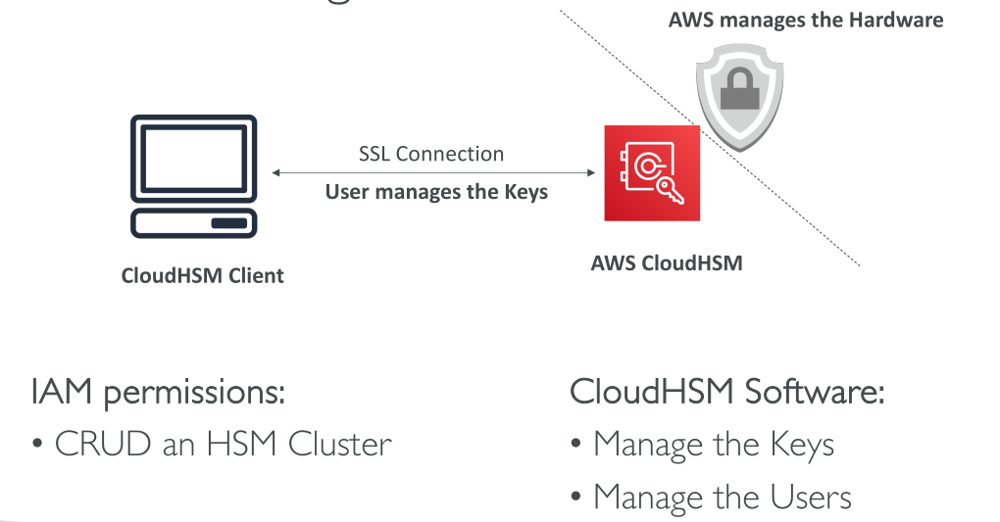
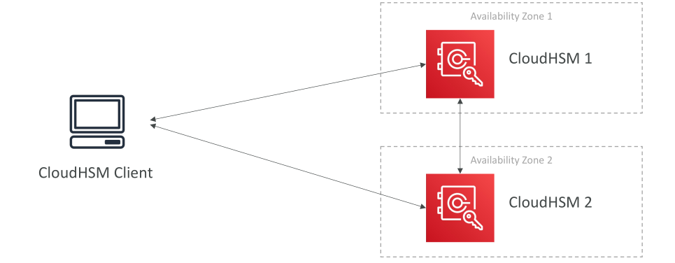
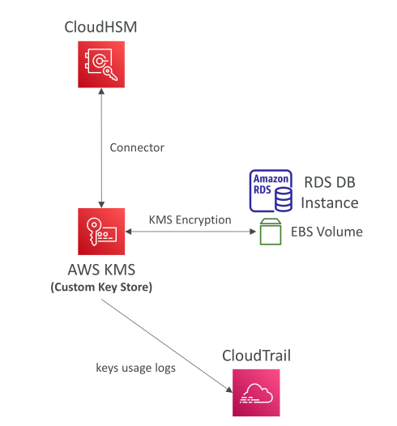

# CloudHSM

ก่อนหน้านี้เราได้เรียนรู้เกี่ยวกับ **KMS** สำหรับการเข้ารหัสแล้ว ตอนนี้มาดู **CloudHSM** กัน

* ใน KMS, AWS จะจัดการซอฟต์แวร์สำหรับการเข้ารหัสและควบคุมกุญแจเข้ารหัสให้เรา
* แต่ใน **CloudHSM**, AWS จะจัดเตรียม **ฮาร์ดแวร์เข้ารหัสเฉพาะ (HSM device: Hardware Security Module)** ให้เรา
* หมายความว่า **เราจัดการกุญแจเข้ารหัสทั้งหมดด้วยตัวเอง** ไม่ใช่ AWS
* เราจึงมี **การควบคุมเต็มรูปแบบ** เหนือกุญแจเข้ารหัส

HSM จะถูกติดตั้งใน AWS Cloud แต่เป็นอุปกรณ์ **tamper-resistant** และผ่านมาตรฐาน **FIPS 140-2 Level 3**

* หากใครพยายามเข้าถึงอุปกรณ์ HSM ด้วยตนเอง จะถูกป้องกันและบล็อกทันที

* อุปกรณ์ CloudHSM รองรับ **ทั้งกุญแจ symmetric และ asymmetric** เช่น SSL และ TLS

* CloudHSM **ไม่มี free tier**

* การใช้งานต้องใช้ **ซอฟต์แวร์ client** ที่ซับซ้อน

* มีการรวมกับ **Redshift** หากต้องการใช้ CloudHSM สำหรับการเข้ารหัสฐานข้อมูล

ตัวอย่างการใช้งาน:

* หากต้องการทำ **SSE-C บน S3** เราสามารถจัดการกุญแจเข้ารหัสเองใน CloudHSM
* AWS จัดการฮาร์ดแวร์ให้ แต่เราจัดการ service และกุญแจทั้งหมด
* **CloudHSM client** จำเป็นสำหรับการเชื่อมต่อกับ CloudHSM

IAM ใช้สำหรับการสร้าง, อ่าน, อัปเดต, และลบ **HSM cluster** แต่การจัดการกุญแจ, ผู้ใช้, และสิทธิ์เข้าถึง ทำผ่านซอฟต์แวร์ CloudHSM เอง

* แตกต่างจาก KMS ที่ทุกอย่างจัดการผ่าน IAM

CloudHSM cluster สามารถมี **High Availability** และกระจายข้ามหลาย **Availability Zones (AZs)**

* เช่น มีสอง AZ, หนึ่ง AZ ถูก replicate จากอีก AZ
* Client สามารถเชื่อมต่อกับ HSM device ใดก็ได้
* ความพร้อมใช้งานสูงเป็นสิ่งสำคัญ

## การรวม CloudHSM กับ AWS Services

* เราสามารถใช้ CloudHSM ภายใน AWS Services ผ่าน **KMS Custom Key Store**
* ขั้นตอน:

  

  1. สร้าง **CloudHSM cluster**
  2. สร้าง **KMS Custom Key Store** เชื่อมต่อกับ cluster
* ตัวอย่าง:

  * สร้าง RDS instance พร้อม EBS volume เข้ารหัสด้วย KMS
  * KMS จะใช้กุญแจใน CloudHSM cluster
* ข้อดี:

  1. ใช้กุญแจจาก CloudHSM cluster ของเรา
  2. ทุก API call ผ่าน KMS ที่เข้าถึง CloudHSM จะถูกบันทึกใน **CloudTrail**

## การเปรียบเทียบระหว่าง CloudHSM กับ KMS

| คุณสมบัติ                  | KMS                                      | CloudHSM                                               |
| -------------------------- | ---------------------------------------- | ------------------------------------------------------ |
| Tenant                     | Multi-tenant                             | Single-tenant                                          |
| Master Keys                | AWS owned, AWS managed, Customer managed | Customer managed เท่านั้น                              |
| Key Types                  | Symmetric, Asymmetric, Digital signing   | Symmetric, Asymmetric, Digital signing, Hashing        |
| Accessibility              | หลาย Region                              | VPC, สามารถแชร์ข้าม VPC/Region ได้                     |
| Cryptographic Acceleration | ไม่มี                                    | SSL/TLS acceleration, Oracle/TDE database acceleration |
| Access & Auth              | IAM                                      | ระบบ Security ของ CloudHSM เอง                         |
| High Availability          | Managed service                          | หลาย HSM device ข้าม AZs                               |
| Logging                    | CloudTrail, CloudWatch                   | MFS                                                    |
| Free Tier                  | มี                                       | ไม่มี                                                  |

## สรุป

* **CloudHSM** ให้ฮาร์ดแวร์เข้ารหัสเฉพาะสำหรับการจัดการกุญแจ
* อุปกรณ์ CloudHSM **tamper-resistant** และผ่านมาตรฐาน **FIPS 140-2 Level 3**
* การรวม CloudHSM กับ KMS ช่วยให้ใช้การเข้ารหัส CloudHSM ใน AWS Services เช่น EBS, S3, RDS
* รองรับ **High Availability** ข้ามหลาย AZ และใช้กลไกความปลอดภัยของตัวเองแตกต่างจาก IAM
