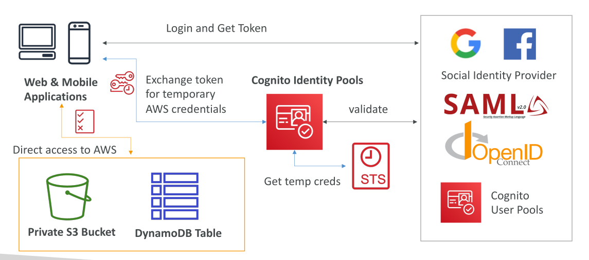
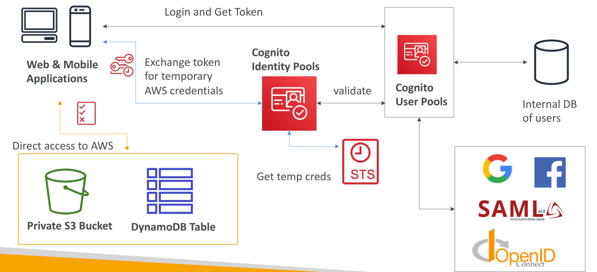
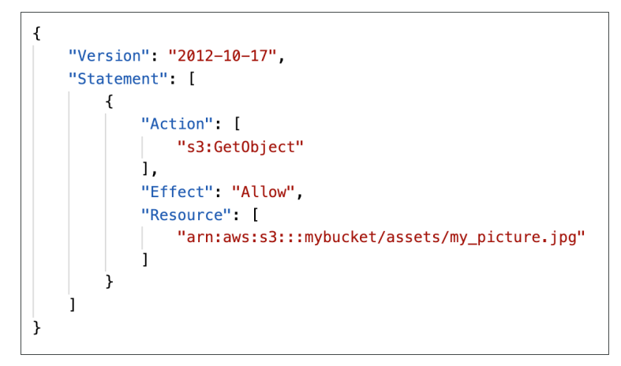
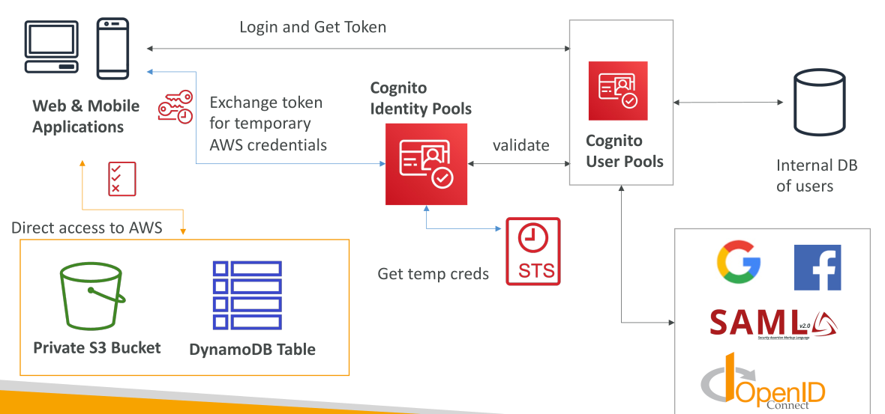

# Cognito Identity Pools

**Cognito Identity Pools** หรือที่รู้จักในชื่อ **Federated Identities** เป็นบริการที่แตกต่างจาก **Cognito User Pools** แม้ว่าจะอยู่ในกลุ่ม Cognito เหมือนกัน ซึ่งอาจทำให้สับสนได้

ผู้ใช้ของเราส่วนใหญ่อยู่ **ภายนอก AWS** เช่น ผู้ใช้เว็บหรือแอปมือถือที่ต้องการเข้าถึง AWS resources เช่น **DynamoDB tables** หรือ **S3 buckets** เพื่อทำสิ่งนี้ พวกเขาจำเป็นต้องมี **AWS temporary credentials**

การสร้าง IAM users ปกติให้ผู้ใช้เหล่านี้ไม่ใช่วิธีที่ปลอดภัยและไม่สามารถขยายตัวได้ จึงใช้ Cognito Identity Pools เพื่อให้ผู้ใช้สามารถ **login ผ่าน third-party identity providers** ที่เชื่อถือได้

ผู้ให้บริการที่เชื่อถือได้เหล่านี้ได้แก่ **Amazon, Facebook, Google, Apple** นอกจากนี้ยังรองรับผู้ใช้ที่ผ่านการ authenticate ด้วย **Cognito User Pools, OpenID Connect Providers, SAML Providers** หรือ **custom developer authenticated identities** (เช่น custom login servers)

Cognito Identity Pools ยังรองรับ **guest users** หรือผู้ใช้ไม่ระบุชื่อโดยกำหนด **Guest Policy** ทำให้ผู้ใช้เหล่านี้สามารถรับ AWS credentials พร้อมสิทธิ์จำกัด

เมื่อผู้ใช้ได้รับ temporary AWS credentials แล้ว พวกเขาสามารถเข้าถึง AWS services โดยตรงผ่าน API calls หรือ SDKs ได้ Credentials เหล่านี้จะมาพร้อม **IAM policies** ที่กำหนดไว้ใน Cognito Identity Pool ซึ่งสามารถปรับแต่งตามตัวตนผู้ใช้เพื่อควบคุมสิทธิ์แบบละเอียด

## การทำงานของ Cognito Identity Pools

สมมติว่าเว็บหรือแอปมือถือของเราต้องเข้าถึง **S3 bucket และ DynamoDB table**

* แทนที่จะสร้าง IAM users สำหรับแต่ละผู้ใช้ เราใช้ **Cognito Identity Pools**
* ผู้ใช้ทำการ authenticate กับ identity providers เช่น **Cognito User Pools, Google, Facebook, SAML, OpenID Connect**
* ผู้ใช้จะได้รับ **login token** จาก identity provider
* Token นี้ถูกส่งไปที่ **Cognito Identity Pool** เพื่อทำการตรวจสอบกับ provider
* หากตรวจสอบผ่าน Identity Pool จะเรียก **AWS Security Token Service (STS)** เพื่อขอ **temporary AWS credentials**
* Credentials จะถูกส่งกลับไปยังแอป เพื่อให้ผู้ใช้เข้าถึง AWS resources ตาม IAM policies ที่กำหนด

## การรวม Cognito Identity Pools กับ Cognito User Pools

* ผู้ใช้ authenticate ผ่าน **Cognito User Pool** และได้รับ token
* Token จะถูกแลกเปลี่ยนกับ **Identity Pool** เพื่อขอ AWS credentials
* การรวมนี้ช่วยให้จัดการ **user identities** ทั้งภายใน (internal users) และ federated identities จาก **social providers, SAML, OpenID Connect** ได้ในที่เดียว
* แอปมือถือหรือเว็บส่ง **JWT token** จาก User Pool ไปยัง Identity Pool
* Identity Pool ตรวจสอบ token และขอ temporary credentials จาก STS แล้วส่งกลับไปยังแอป เพื่อเข้าถึง AWS services โดยตรง

## การกำหนด Role และ IAM Policies ใน Cognito Identity Pools

* สามารถกำหนด **default IAM roles** สำหรับ **authenticated** และ **guest users**

  * Guest users ได้รับ IAM role หนึ่ง
  * Authenticated users ได้รับ IAM role อีกหนึ่ง
* สามารถสร้าง **rules** เพื่อกำหนด role ตามตัวตนผู้ใช้
* IAM policies สามารถใช้ **policy variables** เพื่อควบคุมสิทธิ์แบบละเอียด (fine-grained access control)
* Temporary IAM credentials ได้มาผ่าน STS โดย IAM roles ต้องมี **trust policy** อนุญาตให้ Cognito Identity Pools assume role

## ตัวอย่าง IAM Policies

* **Guest users:** อนุญาต read-only เช่น GetObject บน S3 bucket เฉพาะ object เช่น รูปภาพ
* **Authenticated users:** ใช้ policy variables จำกัดการเข้าถึงส่วนของ S3 bucket ที่ตรงกับ user ID ของตน หรือจำกัดการเข้าถึง DynamoDB items ที่ partition key ตรงกับ user ID ทำให้เป็น **row-level security**

IAM policies แบบนี้ช่วยให้ผู้ใช้เข้าถึง resources เฉพาะที่อนุญาต ปลอดภัย และเหมาะกับแต่ละตัวตน

## Cognito Identity Pools Hands On

## การกำหนดประเภทการเข้าถึง

* เลือกว่าต้องการ **authenticated access** และ/หรือ **guest access**

* สำหรับ **authenticated access** ต้องกำหนด **แหล่งที่มาของการ authenticate** ตัวเลือกได้แก่:

  * Amazon Cognito User Pool
  * Facebook, Google, Apple, Amazon, Twitter
  * OIDC, SAML
  * Custom developer provider

* เนื่องจากเราสร้าง **Amazon Cognito User Pool** ไว้แล้ว สามารถเลือกตัวเลือกนี้ได้

* หากต้องการให้ผู้ใช้ **guest** สามารถเข้าถึง pool และรับ IAM credentials ได้ ให้เปิด **guest access** ด้วย

* หลังจากเปิดทั้งสองแบบ คลิก **Next** เพื่อกำหนด **permissions**

## การสร้าง IAM Roles สำหรับ Identity Pool

* ต้องสร้าง **authenticated role** สำหรับผู้ใช้ที่ authenticate เข้าสู่ identity pool

  * ตัวอย่างชื่อ: `Cognito Identity Pool Authenticated Role Demo`
  * กำหนด **permissions** ให้กับผู้ใช้หลังได้รับ AWS access
  * เริ่มต้นด้วย **minimal policies** แล้วสามารถเพิ่ม permissions เพิ่มทีหลัง

* สร้าง **guest role** เช่น `Unauthenticated Role Demo` พร้อม **minimal permissions**

* คลิก **Next**

## การระบุรายละเอียด User Pool

* เนื่องจากใช้ **Amazon Cognito User Pool** เป็นแหล่ง login
* กรอก **Pool ID** และ **App Client ID** ที่สร้างไว้ก่อนหน้านี้

## การตั้งค่า Role

* เลือกว่าจะใช้ **default authenticated role** ของ pool นี้ หรือใช้ **roles with rules**

* สามารถกำหนด role ต่างกันตาม **claims ใน token** หรือ criteria อื่น

* เพื่อความง่าย ใช้ **default authenticated role**

* สามารถ map **user attributes** เข้าไปใน IAM policies ได้ เช่น username หรือ client attributes เพื่อควบคุมการเข้าถึงอย่างละเอียด

* คลิก **Next** และตั้งชื่อ identity pool เช่น `Demo Identity Pool`

* เลือกว่าจะใช้ **classic authentication** หรือไม่ ค่า default ใช้ได้เลย

* คลิก **Next** และสร้าง identity pool

## การตรวจสอบการเข้าถึง Identity Pool

* หลังจากสร้างเสร็จ คลิกที่ identity pool
* จะเห็นว่าทั้ง **authenticated** และ **guest access** เปิดใช้งานแล้ว

## การรวม SDK และ Authentication

* ตั้งค่า **SDK** และรวมเข้ากับโค้ดของคุณ
* Authenticate ผู้ใช้ผ่าน SDK แล้วดึง **AWS credentials**
* ขั้นตอนนี้ไม่สามารถสาธิตได้ที่นี่ แต่จำเป็นสำหรับการใช้งานจริง

## การแก้ไข IAM Roles

* ไปที่ **IAM** และค้นหา roles ด้วยคำว่า `"Cognito"`

* จะพบ **authenticated และ unauthenticated roles**

* แก้ไข roles เหล่านี้เพื่อตั้ง **policies** ให้เหมาะสมกับผู้ใช้ที่ authenticate ผ่าน identity pool

* ตัวอย่าง: สร้าง **inline policy** สำหรับ Amazon S3 ให้ **read permissions** หรือเพิ่ม policy อื่นตามต้องการ

* การปรับแต่งนี้จะควบคุมสิทธิ์ของผู้ใช้ที่ authenticate

## Cognito User Pools vs Cognito Identity Pools

## การทำความเข้าใจ Cognito User Pools และ Identity Pools

ในบทเรียนนี้เราจะเปรียบเทียบความแตกต่างระหว่าง **Cognito User Pools** และ **Cognito Identity Pools** เพื่อให้เข้าใจวัตถุประสงค์และฟังก์ชันของแต่ละบริการอย่างชัดเจน

## Cognito User Pools: การยืนยันตัวตนและฐานข้อมูลผู้ใช้

* **Cognito User Pools** ใช้สำหรับ **authentication** หรือการยืนยันตัวตนของผู้ใช้
* ทำหน้าที่เป็น **ฐานข้อมูลผู้ใช้** สำหรับเว็บและแอปพลิเคชันมือถือ
* รองรับ **federation** ให้ผู้ใช้สามารถลงชื่อเข้าใช้ผ่าน **social providers** เช่น Google, Facebook, Amazon, OIDC หรือเข้าสู่ระบบแบบองค์กรผ่าน **SAML**

### คุณสมบัติสำคัญ

* สามารถปรับแต่ง **Hosted UI** สำหรับการ login รวมถึงเพิ่มโลโก้ของคุณ
* รองรับ **AWS Lambda triggers** ระหว่าง flow การ authenticate (เช่น pre-authentication และ post-authentication)
* มี **adaptive authentication** เพื่อปรับประสบการณ์ sign-in ตามระดับความเสี่ยง และสามารถเปิดใช้ **multi-factor authentication (MFA)** เมื่อจำเป็น

## Cognito Identity Pools: การกำหนดสิทธิ์และควบคุมการเข้าถึง

* **Cognito Identity Pools** ใช้สำหรับ **authorization** หรือการควบคุมสิทธิ์ภายใน AWS
* มอบ **temporary AWS credentials** ให้ผู้ใช้เข้าถึงทรัพยากร AWS เช่น DynamoDB หรือ S3
* ผู้ใช้สามารถ authenticate ผ่าน **social providers, OIDC, SAML หรือ Cognito User Pools** แล้วแลก token เพื่อขอสิทธิ์เข้าถึง AWS

## การใช้งาน Identity Pools ร่วมกับ User Pools หรือเดี่ยวๆ

* สามารถใช้ **Identity Pools** ร่วมกับ **User Pools** หรือใช้ Identity Pools เพียงอย่างเดียว

* **ข้อดีของ Identity Pools** คือสามารถให้ผู้ใช้เป็น **unauthenticated guests** ได้

* ผู้ใช้ใน Identity Pool จะถูกแมปกับ **IAM roles และ policies**

* สามารถใช้ **policy variables** เพื่อกำหนดสิทธิ์เข้าถึง AWS resources เช่น DynamoDB หรือ S3 ตามผู้ใช้แต่ละคน

* เมื่อใช้ **User Pools + Identity Pools** จะได้ **authentication ก่อน** และ **authorization หลัง**

## ตัวอย่างการใช้งานจริง: การเข้าถึง AWS ด้วยความปลอดภัยต่อผู้ใช้แต่ละคน

* สมมติว่าเว็บหรือแอปมือถือมีผู้ใช้ต้องเข้าถึง **S3 bucket ส่วนตัว** และ **DynamoDB table**
* **ขั้นตอนที่แนะนำ**:

  1. ผู้ใช้ลงชื่อเข้าใช้ผ่าน **Cognito User Pools** เพื่อรับ token
  2. token นี้ถูกแลกเป็น **temporary AWS credentials** ผ่าน **Cognito Identity Pools**
  3. ใช้ **AWS Security Token Service (STS)** ออก temporary credentials
  4. แอปพลิเคชันสามารถเรียก API ไปยัง AWS services ได้โดยตรง
  5. IAM policies ของ temporary credentials จะกำหนดว่า ผู้ใช้สามารถทำอะไรได้บ้าง

## สรุป

* **Cognito Identity Pools** มอบ AWS temporary credentials ให้ผู้ใช้นอก AWS เพื่อเข้าถึง AWS resources อย่างปลอดภัย
* รองรับการ authenticate ผ่าน **social logins, Cognito User Pools, OpenID Connect, SAML, หรือ custom developer authentication**
* รองรับทั้ง **authenticated users และ guest users** โดยแต่ละกลุ่มสามารถกำหนด IAM roles และ policies ได้
* สามารถควบคุมสิทธิ์แบบละเอียดโดยใช้ **IAM policy variables** เช่น จำกัด access เฉพาะ S3 prefixes หรือ DynamoDB rows
* สร้าง **Cognito Identity Pool** พร้อม **authenticated และ guest access**
* กำหนด **IAM roles** สำหรับผู้ใช้ authenticate และ guest พร้อม permissions ขั้นพื้นฐาน
* เชื่อม identity pool กับ **Amazon Cognito User Pool** ที่มีอยู่แล้วสำหรับการ authenticate
* อธิบายวิธีแก้ไข IAM roles เพื่อกำหนดสิทธิ์เฉพาะสำหรับผู้ใช้ authenticate
* **User Pools**: จัดการ **authentication** และ **ฐานข้อมูลผู้ใช้**
* **Identity Pools**: จัดการ **authorization** และ **ควบคุมการเข้าถึง AWS resources**
* การรวมทั้งสองอย่างช่วยให้ระบบ **secure**, **scalable**, และสามารถกำหนดสิทธิ์แบบละเอียดต่อผู้ใช้แต่ละคน

## Key Takeaways

* Cognito User Pools ใช้สำหรับ **authentication** และเป็นฐานข้อมูลผู้ใช้
* Cognito Identity Pools ใช้สำหรับ **authorization** และให้ temporary AWS credentials
* User Pools รองรับ **social และ corporate logins** และสามารถปรับแต่ง UI และ flow
* Identity Pools สามารถใช้เดี่ยวๆ หรือร่วมกับ User Pools ได้ รองรับทั้งผู้ใช้ authenticate และ guest พร้อมการแมป IAM role แบบละเอียด