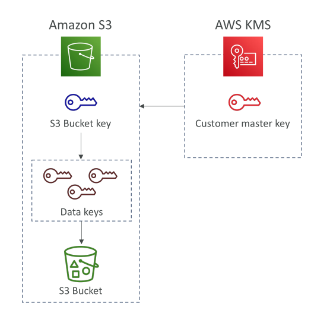

# S3 Bucket Key

การตั้งค่านี้สำหรับ **Amazon S3 Bucket** เมื่อใช้การเข้ารหัส **SSE-KMS** ช่วยลดจำนวน API calls ที่ส่งไปยัง **AWS KMS** จาก Amazon S3 ได้ถึง 99% ส่งผลให้ค่าใช้จ่ายจากการเข้ารหัส KMS ลดลงประมาณ 99% ด้วย

## การทำงานของ S3 Bucket Key

การปรับปรุงนี้ใช้ **data keys** และโดยเฉพาะอย่างยิ่ง **S3 Bucket Key**

ขั้นตอนการทำงาน:

1. **Customer Master Key (CMK)** ใน KMS จะสร้าง **data key** ให้กับ S3 Bucket ของคุณเป็นระยะ
2. **Data key นี้เรียกว่า S3 Bucket Key** และจะมีการหมุนเวียนเป็นระยะ
3. Bucket Key นี้จะใช้เข้ารหัส objects ใน S3 Bucket ด้วยการเข้ารหัส KMS
4. การเพิ่ม Bucket Key นี้ทำให้ S3 สามารถสร้าง **หลาย data keys** ด้วย **envelope encryption** เพื่อเข้ารหัส objects

## ประโยชน์ของการใช้ S3 Bucket Key

* ลดจำนวน API calls ไปยัง KMS อย่างมาก → ลดค่าใช้จ่าย KMS
* ลดความเสี่ยงในการเกิน limit ของการเข้ารหัสใน S3
* ไม่ลดทอนความปลอดภัย

ผลลัพธ์:

* เห็นจำนวน events ที่เกี่ยวกับ KMS ใน **CloudTrail** ลดลง
* ค่าใช้จ่าย KMS ลดลงอย่างมาก

## การเปิดใช้งาน S3 Bucket Key ใน S3 Console

ขั้นตอน:

1. ไปที่ **Amazon S3 Console**
2. สร้าง Bucket ใหม่ เช่น `"Demo S3 Bucket Key"`
3. ตั้งค่า Bucket:

   * Block all public access
   * ปิด versioning
   * เปิดการเข้ารหัส **SSE-KMS** โดยใช้ **AWS managed key**
   * เปิดตัวเลือก **bucket key** (ค่าดีฟอลต์เปิดอยู่แล้ว แต่สามารถปิดได้หากต้องการให้ทุกการอัปโหลดติดต่อ KMS โดยตรง)
4. สร้าง Bucket

เมื่อเปิดใช้งานแล้ว Bucket Key จะถูกใช้สำหรับการเข้ารหัสใน S3 Bucket → ลดค่าใช้จ่ายและ API calls โดยไม่กระทบความปลอดภัย

## สรุป

การตั้งค่า **S3 Bucket Key** เป็นการปรับปรุงที่มีประโยชน์มากสำหรับผู้ใช้ **SSE-KMS** ในปริมาณมาก

* ลด API calls ของ KMS และค่าใช้จ่ายถึง 99%
* ยังคงมีความปลอดภัยสูง
* การเปิดใช้งานใน S3 Console ทำได้ง่ายและแนะนำสำหรับงานเข้ารหัสขนาดใหญ่

## Key Takeaways

1. S3 Bucket Key ลดจำนวน KMS API calls ถึง 99% เมื่อใช้ SSE-KMS
2. ลดค่าใช้จ่าย KMS ใน S3 โดยไม่กระทบความปลอดภัย
3. Bucket Key คือ **data key** ที่สร้างและหมุนเวียนโดย CMK ใน KMS
4. การเปิดใช้งาน Bucket Key ใน S3 Console ทำได้ง่ายและแนะนำสำหรับงานเข้ารหัส SSE-KMS ขนาดใหญ่