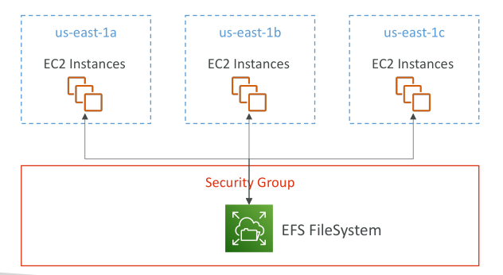
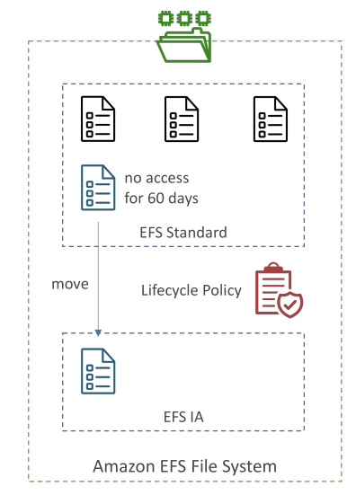

# Amazon EFS – Elastic File System

Amazon Elastic File System (EFS) เป็นบริการ **Network File System (NFS) ที่จัดการโดย AWS**

* เป็นไฟล์ระบบแบบเครือข่าย สามารถ **mount ได้พร้อมกันหลาย EC2 instances**
* EC2 เหล่านี้สามารถอยู่ใน **Availability Zones ที่ต่างกัน** ซึ่งเป็นข้อได้เปรียบสำคัญ ทำให้ EFS **มีความพร้อมใช้งานสูงและปรับขนาดได้ง่าย**
* ราคาสูงกว่าการใช้ GP2 EBS ประมาณ 3 เท่า
* ใช้ **โมเดลจ่ายตามการใช้งาน (pay-per-use)** ไม่ต้องเตรียม capacity ล่วงหน้า

## **สถาปัตยกรรมและการเชื่อมต่อ**

* สร้าง **EFS file system** และเชื่อมกับ **security group**
* EC2 หลาย instance ในหลาย Availability Zone (เช่น US East-1A, 1B, 1C) สามารถเชื่อมต่อ EFS พร้อมกันได้
* การเชื่อมต่อแบบ multi-AZ ทำให้สามารถ **แชร์ข้อมูลระหว่าง instance ต่าง ๆ** ได้

## **กรณีการใช้งานและความเข้ากันได้**

* เหมาะกับ: Content management, Web serving, Data sharing, WordPress เป็นต้น
* ใช้ **โปรโตคอล NFS**
* การควบคุมการเข้าถึงทำได้ผ่าน **security groups**
* รองรับเฉพาะ **Linux-based AMIs** ไม่รองรับ Windows
* สามารถเปิด **encryption at rest** ด้วย AWS KMS
* ใช้มาตรฐาน **POSIX file system** และมี **file API มาตรฐาน**

## **การปรับขนาดและการคิดค่าบริการ**

* ไม่ต้องวางแผน capacity ล่วงหน้า
* ระบบ **ปรับขนาดอัตโนมัติ**
* จ่ายตาม **ขนาดข้อมูลที่ใช้งานจริง**

## **ประสิทธิภาพและโหมด Throughput**

* รองรับ **ลูกค้า NFS หลายพัน client พร้อมกัน**

* Throughput มากกว่า **10 GB/s**

* ขยายได้ถึง **ระดับ Petabyte**

* **Performance Modes**:

  * **General Purpose (default)**: เหมาะกับ latency-sensitive เช่น เว็บเซิร์ฟเวอร์, CMS
  * **Max I/O**: Throughput สูงขึ้นแต่ latency สูง เหมาะกับ Big Data และ Media Processing

* **Throughput Modes**:

  * **Bursting**: Throughput เพิ่มตามขนาด storage เช่น 1 TB → 50 MB/s + burst 100 MB/s
  * **Provisioned**: กำหนด throughput แยกจาก storage เช่น 1 GB/s สำหรับ 1 TB
  * **Elastic**: ปรับ throughput อัตโนมัติตาม workload รองรับสูงสุด 3 GB/s (อ่าน) และ 1 GB/s (เขียน) เหมาะกับ workload ที่ไม่แน่นอน

## **Storage Classes และ Lifecycle Management**

* **Standard Tier**: ไฟล์ที่เข้าถึงบ่อย
* **EFS Infrequent Access (EFS-IA)**: ไฟล์เข้าถึงไม่บ่อย ลดค่าใช้จ่าย แต่มีค่าธรรมเนียม retrieval
* **Archive Storage Tier**: ไฟล์เข้าถึงน้อย เช่น ปีละไม่กี่ครั้ง ลดค่าใช้จ่ายมาก
* **Lifecycle Policies**: ย้ายไฟล์ระหว่าง tiers อัตโนมัติ เช่น ไฟล์ใน Standard ที่ไม่ถูกเข้าถึง 60 วัน → EFS-IA

## **ตัวเลือกความพร้อมใช้งานและความทนทาน**

* **Multi-AZ**: เหมาะสำหรับ production workloads ต้องการ high availability และ disaster recovery
* **Single-AZ**: เหมาะกับ development หรือค่าใช้จ่ายต่ำ (EFS One Zone-IA) ยังรองรับ backup และ EFS-IA
* เลือก **storage class + deployment option** → ลดค่าใช้จ่ายได้สูงสุด 90%

## **สรุป**

Amazon EFS เป็น **Network File System ที่ยืดหยุ่น ปรับขนาดได้ และพร้อมใช้งานสูง**

* รองรับ Linux-based EC2 instances หลาย Availability Zones
* มีหลาย **performance และ throughput modes**
* มีหลาย **storage classes พร้อม lifecycle management**
* มี **deployment options** สำหรับ production และ development
* **จ่ายตามการใช้งาน** และปรับขนาดอัตโนมัติ ช่วยบริหารจัดการ storage และควบคุมค่าใช้จ่าย