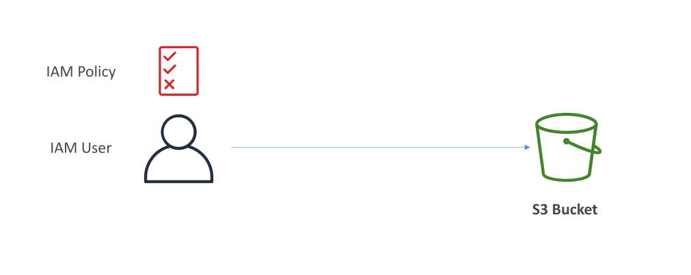
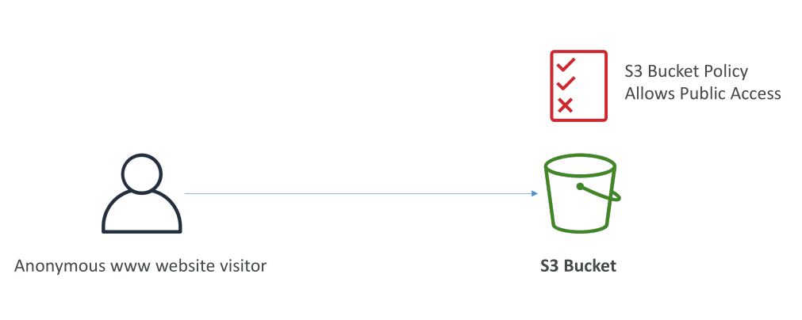
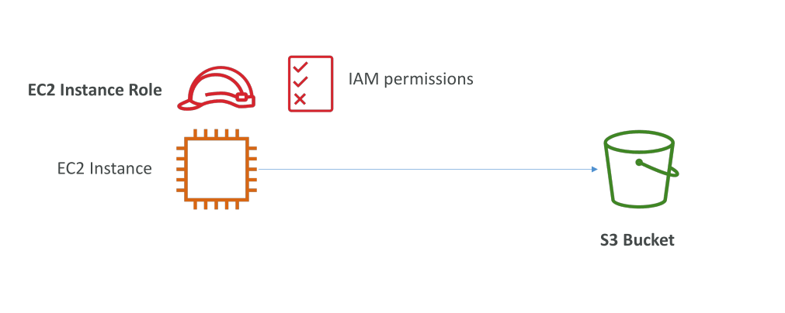
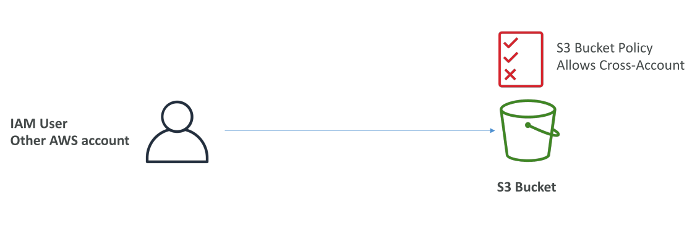
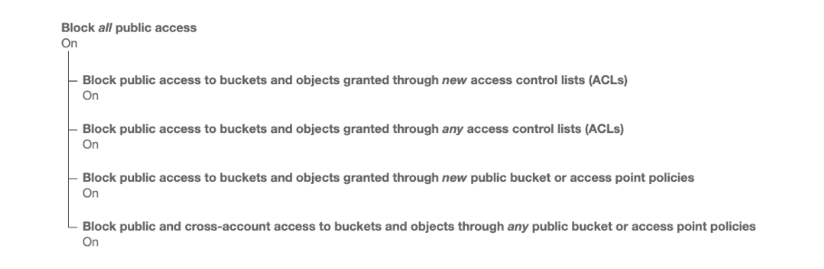

# S3 Security: Bucket Policy

ความปลอดภัยของ Amazon S3 แบ่งออกเป็นหลายส่วน:

1. **User-based security**: ใช้ IAM policy เพื่อกำหนดสิทธิ์ว่า IAM user คนใดสามารถเรียก API ไหนได้บ้าง

2. **Resource-based security**: ใช้นโยบายแบบ S3 Bucket Policy กำหนดสิทธิ์สำหรับ bucket ทั้งหมด

## Resource-Based Security: S3 Bucket Policies

* **Bucket Policies** เป็นกฎที่ใช้กับ bucket ทั้งหมด
* สามารถกำหนดให้ผู้ใช้เฉพาะ หรือผู้ใช้จากบัญชี AWS อื่น (cross-account) เข้าถึง bucket ได้
* เป็นวิธีที่ใช้ทำให้ bucket เป็น public ได้เช่นกัน

## Object และ Bucket ACLs

* **ACLs (Access Control Lists)**: ให้การควบคุมความปลอดภัยแบบละเอียด
* สามารถปิดใช้งานได้
* ปัจจุบันวิธีที่แนะนำที่สุดในการรักษาความปลอดภัย S3 คือ **Bucket Policies**

## เมื่อใดที่ IAM Principal สามารถเข้าถึง S3 Object?

IAM principal จะเข้าถึง object ได้เมื่อ:

1. สิทธิ์ IAM อนุญาต
2. นโยบาย resource อนุญาต
3. ไม่มี **explicit deny** สำหรับ action นั้น ๆ

## การเข้ารหัสเพื่อความปลอดภัย

* การเข้ารหัส objects เพิ่มความปลอดภัยให้ข้อมูลที่เก็บใน S3

## โครงสร้างของ S3 Bucket Policy

* เป็นเอกสาร **JSON**
* ประกอบด้วยส่วนสำคัญดังนี้:

  1. **Resource**: ระบุ bucket หรือ objects ที่นโยบายใช้
  2. **Effect**: Allow หรือ Deny action
  3. **Action**: ระบุ API calls ที่อนุญาตหรือปฏิเสธ เช่น `GetObject`
  4. **Principal**: ระบุบัญชีหรือผู้ใช้ที่นโยบายนี้ใช้ สามารถใช้ `*` หมายถึงทุกคน

**ตัวอย่าง:**

* นโยบายอนุญาตให้ทุกคน (`Principal: "*"`) เรียก `GetObject` บนทุก object ใน bucket → bucket เป็น public

## กรณีการใช้งานของ S3 Bucket Policies

* อนุญาต **public access** ให้ bucket
* บังคับให้ object ถูก **เข้ารหัส** ตอนอัปโหลด
* อนุญาตให้ผู้ใช้จาก **บัญชี AWS อื่น** เข้าถึง bucket

**ตัวอย่าง:**

* ถ้าอยากให้ผู้เข้าชมเว็บไซต์เข้าถึงไฟล์ใน bucket ได้สาธารณะ → ใช้นโยบาย bucket ให้ public

## การเข้าถึงโดย IAM User

* ถ้า IAM user ในบัญชี AWS ต้องเข้าถึง bucket → กำหนดสิทธิ์ผ่าน IAM policy

## การเข้าถึงโดย EC2 ผ่าน IAM Role

* สำหรับ EC2 ที่ต้องเข้าถึง S3 → สร้าง **IAM Role** ให้ EC2 instance แทนการใช้ IAM user

## Cross-Account Access

* ถ้า IAM user จากบัญชี AWS อื่นต้องเข้าถึง bucket → ใช้ **Bucket Policy** ให้สิทธิ์

## Block Public Access Settings

* AWS มี **Block Public Access** ที่ bucket และ account level
* ป้องกัน bucket ถูก public โดยไม่ตั้งใจ แม้ bucket policy จะกำหนดให้ public
* ควรเปิดถ้าบucket ไม่ควรเป็น public
* สามารถตั้งที่ account level เพื่อป้องกัน bucket ใด ๆ ถูก public โดยไม่ตั้งใจ

## สรุป Key Takeaways

* S3 Security มีทั้ง **IAM policies, bucket policies, object & bucket ACLs, และ encryption**
* Bucket Policies เป็น JSON ที่กำหนดสิทธิ์กับ bucket และ object เช่น `GetObject`
* Bucket Policies สามารถให้ **public access, cross-account access, หรือบังคับ encryption**
* AWS มี **Block Public Access** เพิ่มชั้นความปลอดภัย ป้องกัน bucket ถูก public โดยไม่ตั้งใจ
