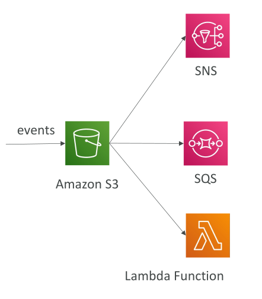
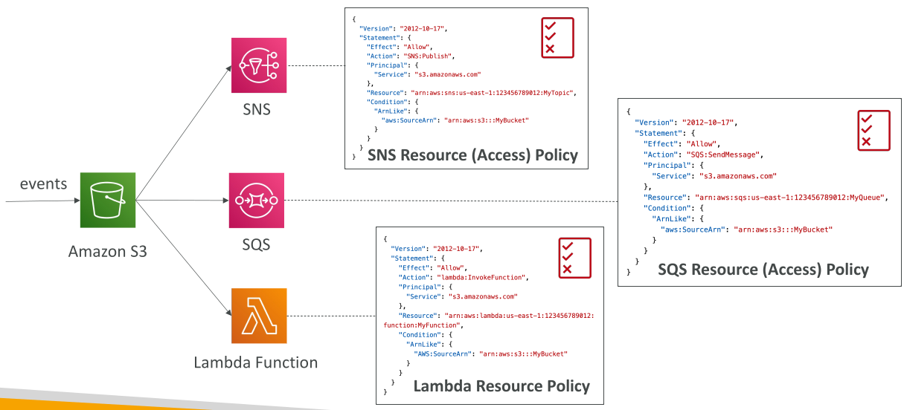
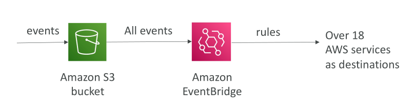

## S3 Event Notifications

**Amazon S3 Event Notifications** ช่วยให้คุณสามารถ **ตอบสนองอัตโนมัติ** ต่อเหตุการณ์ต่าง ๆ ที่เกิดขึ้นใน S3 bucket ของคุณ เช่น:

* มี object ถูกสร้าง (Created)
* Object ถูกลบ (Removed)
* Object ถูกกู้คืน (Restored)
* Object ถูกทำซ้ำ (Replicated)

## การกรองเหตุการณ์ (Event Filtering)

คุณสามารถกรองเหตุการณ์เพื่อมุ่งไปยัง object เฉพาะได้ เช่น ต้องการเฉพาะไฟล์ที่ลงท้ายด้วย `.JPEG`

* ช่วยให้การแจ้งเตือนตรงจุดและแม่นยำมากขึ้น

## ตัวอย่างการใช้งาน

ตัวอย่างทั่วไป:

* เมื่อผู้ใช้ upload รูปภาพไป S3 → สร้าง **thumbnails** อัตโนมัติ
* วิธีทำ: สร้าง **Event Notification** → trigger กระบวนการ downstream ทันที

## ปลายทางการแจ้งเตือน (Notification Destinations)

Event Notifications สามารถส่งไปยังปลายทางได้หลายแบบ:

1. **SNS Topic**
2. **SQS Queue**
3. **Lambda Function**

* สามารถสร้าง Event Notifications ได้หลายอันพร้อมกัน
* ปกติการส่งจะเกิดขึ้นภายในไม่กี่วินาที บางครั้งอาจใช้เวลาหนึ่งนาทีขึ้นไป

## สิทธิ์ IAM และ Resource Access Policies

เพื่อให้ Event Notifications ทำงานได้ถูกต้อง ต้องตั้งค่า **permissions** ให้ S3 สามารถส่งข้อมูลไปยังปลายทางได้

* **SNS Resource Access Policy** → แนบกับ SNS topic เพื่อให้ S3 ส่งข้อความไปได้
* **SQS Resource Access Policy** → แนบกับ SQS queue เพื่อให้ S3 ส่งข้อมูลไปได้
* **Lambda Resource Policy** → แนบกับ Lambda function เพื่อให้ S3 สามารถ invoke ฟังก์ชันได้

**สรุป:**

* Event Notifications จะอิง **resource access policies** ของปลายทาง (SNS/SQS/Lambda) ไม่ใช่ IAM role ของ S3
* Policies เหล่านี้ทำงานคล้ายกับ S3 bucket policy

## การรวมกับ Amazon EventBridge

* ทุกเหตุการณ์ที่เกิดขึ้นใน S3 bucket จะถูกส่งไปยัง **Amazon EventBridge** โดยอัตโนมัติ
* จาก EventBridge → สามารถตั้ง **rules** เพื่อส่งเหตุการณ์ไปยัง **บริการ AWS กว่า 18 รายการ**

**ข้อดีของ EventBridge:**

* กรองเหตุการณ์ขั้นสูง: metadata, ขนาด object, ชื่อ object
* ส่งไปหลายปลายทางพร้อมกัน เช่น Step Functions, Kinesis Data Streams, Firehose
* รองรับ **event archiving**, **replay**, และระบบส่งมอบที่เชื่อถือได้มากขึ้น

## สรุป

**Amazon S3 Event Notifications** ช่วยให้คุณตอบสนองอัตโนมัติเมื่อเกิดเหตุการณ์ใน S3 bucket โดยส่งการแจ้งเตือนไปยัง:

* SNS topic
* SQS queue
* Lambda function
* Amazon EventBridge

→ ทำให้สามารถสร้าง **workflow อัตโนมัติ** และเชื่อมต่อบริการ AWS อื่น ๆ ได้ง่าย

## Key Takeaways

* Event Notifications ช่วยตอบสนองอัตโนมัติเมื่อ object ถูกสร้าง, ลบ, หรือ replicate
* สามารถกรองเหตุการณ์ เช่น เฉพาะไฟล์ .JPEG
* ส่งการแจ้งเตือนไปยัง SNS, SQS, Lambda หรือ EventBridge
* ต้องตั้ง **resource access policies** บน SNS, SQS, Lambda เพื่ออนุญาตให้ S3 ส่งหรือ invoke events
* EventBridge ช่วยกรองขั้นสูง, ส่งไปหลายปลายทาง, เก็บ archive, replay, และเพิ่มความน่าเชื่อถือในการส่ง