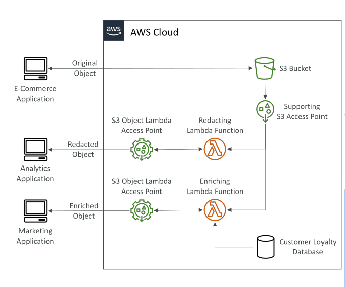

# S3 Object Lambda

* **S3 Object Lambda** เป็นอีกกรณีการใช้งานร่วมกับ **S3 Access Points**
* แนวคิดคือ เรามี **S3 bucket** แต่ต้องการ **ปรับแต่งวัตถุก่อนที่ client จะดึงข้อมูล**
* แทนที่จะสร้าง bucket ใหม่เพื่อเก็บแต่ละเวอร์ชันของวัตถุ เราใช้ **S3 Object Lambda** ร่วมกับ **Access Points**

## วิธีทำงานของ S3 Object Lambda

1. สมมติว่าเรามี **S3 bucket** สำหรับข้อมูลของ **แอป e-commerce**

   * แอปนี้เข้าถึงวัตถุโดยตรงเพื่อ PUT และ GET ข้อมูลดั้งเดิม
2. แอป **analytics** ต้องการเข้าถึงวัตถุ **เวอร์ชันที่ตัดบางข้อมูลออก (redacted)**

   * แทนที่จะสร้าง bucket ใหม่ เราสร้าง **S3 access point** บน bucket เดิม
   * เชื่อมต่อกับ **Lambda function** ที่ทำหน้าที่ตัดข้อมูลบางส่วนออกเมื่อถูกดึง
3. เมื่อ analytics app ดึงข้อมูล → Access Point เรียก Lambda → Lambda ดึงข้อมูลจาก bucket และปรับแต่ง → แอปได้รับวัตถุเวอร์ชัน redacted

สรุป: แอป analytics สามารถเข้าถึงข้อมูล **เวอร์ชันปรับแต่งแล้ว** จาก bucket เดียวกับที่ e-commerce ใช้อยู่

## การเสริมข้อมูล (Data Enrichment) ด้วย S3 Object Lambda

* แอป **marketing** ต้องการเข้าถึงวัตถุที่ **เสริมข้อมูลเพิ่มเติม** เช่น ข้อมูลลูกค้าจาก database

* เราสร้าง **Lambda function อีกตัว** เพื่อ enrich ข้อมูล

* สร้าง **S3 Object Lambda access point** บน Lambda ตัวนี้

* แอป marketing เข้าถึง access point เพื่อรับวัตถุ enriched

* ผลลัพธ์: เรามี **bucket เดียว แต่สามารถปรับแต่งข้อมูลได้ตามต้องการ** ผ่าน access points และ Lambda

## ตัวอย่างการใช้งานของ S3 Object Lambda

* **Redact ข้อมูลส่วนบุคคล (PII)** สำหรับ analytics หรือ non-production environment
* **แปลงรูปแบบข้อมูล** เช่น XML → JSON
* **ปรับแต่งรูปภาพ on-the-fly** เช่น ย่อขนาดหรือใส่ watermark เฉพาะผู้ขอวัตถุ

## สรุป

* S3 Object Lambda ช่วย **ปรับแต่งวัตถุเมื่อดึงข้อมูลโดยไม่ต้องสร้าง bucket ใหม่**
* ใช้ **S3 Access Points + Lambda** เพื่อ **redact** หรือ **enrich** ข้อมูลแบบ dynamic
* รองรับหลายแอปพลิเคชันเข้าถึง bucket เดียว แต่ได้มุมมองข้อมูลต่างกันผ่าน Lambda-powered access points

## Key Takeaways

* S3 Object Lambda → ปรับแต่งวัตถุเมื่อดึงข้อมูลโดยไม่ต้องสร้าง bucket ซ้ำ
* ใช้ **Access Points + Lambda** เพื่อจัดการ redaction และ enrichment
* ตัวอย่างการใช้งาน: redact PII, แปลงข้อมูล, ปรับแต่งรูปภาพแบบ dynamic
* รองรับหลายแอปเข้าถึง bucket เดียว แต่เห็นข้อมูลต่างกันผ่าน Lambda