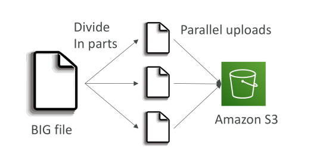
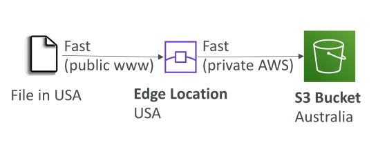

# S3 – Baseline Performance

## ประสิทธิภาพพื้นฐานของ S3 (S3 Baseline Performance)

Amazon S3 สามารถ **ปรับขนาดอัตโนมัติ** เพื่อรองรับจำนวนคำขอ (requests) ที่สูงมาก โดยมี **latency ต่ำ** ประมาณ 100–200 มิลลิวินาที สำหรับการดึง **byte แรก** ของไฟล์ ซึ่งถือว่ารวดเร็วมากตามค่าเริ่มต้น

* อัตราคำขอที่รองรับต่อ prefix ต่อวินาที:

  * **PUT, COPY, POST, DELETE:** 3,500 requests
  * **GET, HEAD:** 5,500 requests

> "ต่อ prefix" หมายถึงการนับแยกตาม **เส้นทาง (folder/path)** ของ object

คุณสามารถมีหลาย prefix ใน bucket เดียวกันเพื่อเพิ่ม throughput รวม

## การเข้าใจ Prefix ด้วยตัวอย่าง

สมมติว่ามีไฟล์ชื่อ `file` อยู่ในโฟลเดอร์ต่างกัน:

1. `/folder1/sub1/file` → prefix = `/folder1/sub1`

   * รองรับ 3,500 PUT และ 5,500 GET ต่อวินาที

2. `/folder1/sub2/file` → prefix = `/folder1/sub2`

   * รองรับอัตราเดียวกัน

* หากกระจายการอ่านไฟล์ไปยัง 4 prefix → throughput รวม = 22,000 GET/HEAD ต่อวินาที
* แสดงให้เห็นว่าการใช้หลาย prefix ช่วยเพิ่ม **ความเร็วโดยรวม**

## การปรับปรุงประสิทธิภาพของ S3

### 1. Multi-Part Upload

* **แนะนำ:** สำหรับไฟล์ใหญ่กว่า 100 MB
* **บังคับ:** สำหรับไฟล์ใหญ่กว่า 5 GB

**วิธีทำงาน:**

1. แบ่งไฟล์ใหญ่เป็นชิ้นเล็ก ๆ
2. อัปโหลดชิ้นเล็ก ๆ พร้อมกัน (parallel)
3. S3 รวมชิ้นเหล่านี้กลับเป็นไฟล์เดิม

* เพิ่ม **ความเร็วการอัปโหลด** และใช้ **bandwidth** ได้เต็มประสิทธิภาพ

### 2. S3 Transfer Acceleration

* เพิ่ม **ความเร็วการอัปโหลด/ดาวน์โหลด** โดยผ่าน **AWS edge locations**
* Edge location → ส่งไฟล์ไปยัง bucket ผ่าน **AWS private network** → ลดการใช้ public internet

**ตัวอย่าง:**

* อัปโหลดไฟล์จาก **สหรัฐอเมริกา → S3 bucket ออสเตรเลีย**

  1. ไฟล์ไปยัง edge location ใกล้ตัวในสหรัฐอเมริกา
  2. Edge location ส่งไฟล์ผ่าน private network ไปยัง S3 bucket ในออสเตรเลีย

* ใช้ได้ร่วมกับ **multi-part upload** → เร็วยิ่งขึ้น

### 3. S3 Byte Range Fetches

* สามารถดึง **ช่วงของ byte** ของไฟล์ได้
* ช่วยให้:

  * ดาวน์โหลดแบบ **parallel**
  * เพิ่ม **ความทนทาน** หากบางส่วนล้มเหลว
  * ดึงเพียงบางส่วนของไฟล์ เช่น 50 byte แรกที่เป็น header

## สรุป

* S3 รองรับ **request rate สูง** และ **latency ต่ำ**
* แต่ละ prefix → 3,500 PUT/COPY/POST/DELETE และ 5,500 GET/HEAD ต่อวินาที
* **Multi-part upload:** แนะนำ >100 MB, บังคับ >5 GB
* **Transfer Acceleration:** ใช้ edge locations ลด public internet → เร็วขึ้น
* **Byte Range Fetches:** ดาวน์โหลดแบบ parallel → เพิ่มความเร็วและความทนทาน

### Key Takeaways

* S3 ปรับขนาดอัตโนมัติ รองรับ request สูงและ latency ต่ำ
* แต่ละ prefix รองรับคำขอ PUT/COPY/POST/DELETE 3,500 และ GET/HEAD 5,500 ต่อวินาที
* Multi-part upload ช่วยอัปโหลดไฟล์ใหญ่ได้เร็วและมีประสิทธิภาพ
* Transfer Acceleration เพิ่มความเร็วโดยใช้ edge locations และ private network
* Byte Range Fetches ทำให้ดาวน์โหลดไฟล์แบบ parallel และเพิ่มความทนทาน