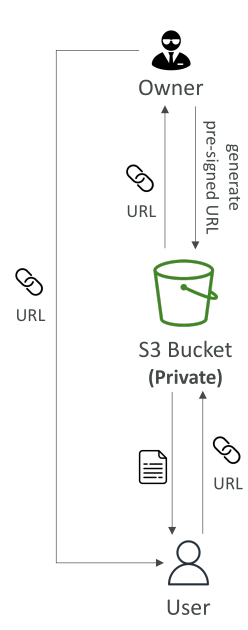

# S3 Pre-signed URLs

* **Pre-signed URLs** คือ URL ที่คุณสามารถสร้างได้ผ่าน **S3 Console, CLI, หรือ SDK**

* URL เหล่านี้มี **เวลาหมดอายุ (expiration time)** หลังจากนั้นจะใช้งานไม่ได้

* ตัวอย่าง:

  * ถ้าสร้างผ่าน **Console** → สามารถตั้งเวลาหมดอายุสูงสุดได้ **12 ชั่วโมง**
  * ถ้าสร้างผ่าน **CLI** → สามารถตั้งเวลาหมดอายุสูงสุดได้ **168 ชั่วโมง**

* **แนวคิดสำคัญ:**
  เมื่อสร้าง pre-signed URL ผู้ใช้ที่ได้รับ URL จะ **สืบทอดสิทธิ์ของผู้สร้าง URL**

  * ใช้ได้ทั้ง **GET** (ดาวน์โหลด) หรือ **PUT** (อัปโหลด)

## กรณีใช้งาน Pre-signed URLs

* สมมติว่าคุณมี **S3 bucket แบบ private**
* คุณต้องการให้ใครบางคนภายนอก AWS เข้าถึงไฟล์เฉพาะไฟล์หนึ่ง โดยไม่ต้องทำให้ไฟล์นั้นเป็น public

**ขั้นตอน:**

1. คุณในฐานะเจ้าของ bucket หรือผู้มีสิทธิ์สร้าง pre-signed URL สำหรับไฟล์นั้น
2. S3 จะสร้าง URL ที่ pre-signed (มี credential ของคุณฝังอยู่)
3. ส่ง URL ให้ผู้ใช้เป้าหมาย
4. ผู้ใช้สามารถใช้ URL เพื่อ **ดาวน์โหลดหรืออัปโหลดไฟล์** ภายในเวลาที่กำหนด

## ตัวอย่างการใช้งานทั่วไป

* ให้ผู้ใช้ที่ **ล็อกอินแล้วเท่านั้น** ดาวน์โหลดวิดีโอพรีเมียมจาก S3
* สร้าง URL แบบ dynamic ให้ผู้ใช้หลายคนดาวน์โหลดไฟล์ตามต้องการ
* อนุญาตให้ผู้ใช้ **ชั่วคราวอัปโหลดไฟล์** ไปยัง S3 bucket ที่เป็น private

## สรุป

* **Pre-signed URLs** ช่วยให้เข้าถึงไฟล์ใน S3 bucket แบบ private ได้ **ชั่วคราวและปลอดภัย**
* URL จะสืบทอด **สิทธิ์ของผู้สร้าง URL** เพื่อควบคุมการ GET หรือ PUT
* URL มี **เวลาหมดอายุ**:

  * Console → สูงสุด 12 ชั่วโมง
  * CLI → สูงสุด 168 ชั่วโมง
* ใช้เพื่อให้ **ดาวน์โหลดหรืออัปโหลดไฟล์ชั่วคราว** โดยไม่ต้องทำไฟล์ public

## Key Takeaways

* S3 pre-signed URLs = เข้าถึงไฟล์ private ชั่วคราวอย่างปลอดภัย
* URL สืบทอดสิทธิ์ของผู้สร้าง → ควบคุม GET/PUT ได้
* ตั้งเวลาหมดอายุได้ตาม Console หรือ CLI
* ใช้งานทั่วไป = ดาวน์โหลด/อัปโหลดชั่วคราวโดยไม่ทำไฟล์ public
