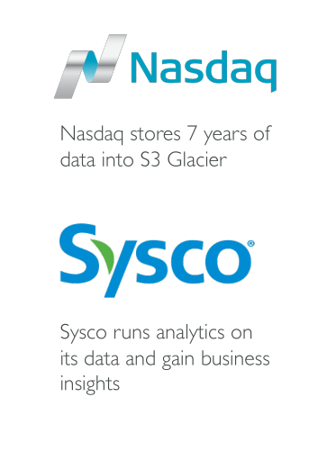

# Amazon S3

Amazon S3 เป็นหนึ่งในบริการหลักของ AWS และถูกโปรโมทว่าเป็น **storage ที่สามารถขยายตัวได้ไม่จำกัด**

* เว็บไซต์และบริการหลายตัวใช้ S3 เป็นพื้นหลัง
* ใช้เก็บข้อมูลและสำรองข้อมูล
* ใช้สำหรับ **disaster recovery** ย้ายข้อมูลไปยัง region อื่นเพื่อสำรองเมื่อ region หลักล่ม
* ใช้ **archival** เก็บไฟล์ระยะยาว เช่น S3 Glacier
* ใช้สำหรับ **hybrid cloud storage** ขยาย storage จาก on-premises ไปยัง cloud
* ใช้สำหรับ **hosting application, media files, data lakes, software updates, static websites**

ตัวอย่างผู้ใช้งานจริง:

* Nasdaq เก็บข้อมูล 7 ปีใน S3 Glacier
* Sysco วิเคราะห์ข้อมูลเพื่อทำ business insight

## Buckets และ Objects

* **Buckets** คือโฟลเดอร์หลักสำหรับเก็บไฟล์

  * ต้องมีชื่อ **globally unique** ทั่วโลก
  * กำหนด region สำหรับ bucket (S3 ไม่ใช่ global service จริง ๆ)
  * ชื่อ bucket ต้องเป็นตัวอักษรเล็กหรือเลข, ไม่มี underscore, ความยาว 3–63 ตัวอักษร, ไม่เป็น IP address

* **Objects** คือไฟล์ที่เก็บใน bucket

  * **Key** คือ path ของไฟล์ทั้งหมด เช่น

    * ไฟล์ `myfile.txt` key = `myfile.txt`
    * ไฟล์ในโฟลเดอร์ nested key = `myfolder1/anotherfolder/myfile.txt`
  * Key = **prefix + object name**
  * S3 ไม่มี concept ของ directory จริง ๆ แต่ console ทำให้ดูเหมือนมีโฟลเดอร์

## คุณสมบัติของ Objects

* **Content (ค่า body)**: ข้อมูลไฟล์ที่อัปโหลด
* **ขนาดไฟล์สูงสุด**: 5 TB (5,000 GB)

  * ไฟล์ใหญ่กว่า 5 GB ต้องใช้ **multipart upload**
* **Metadata**: key-value pairs ระบุคุณสมบัติไฟล์
* **Tags**: สูงสุด 10 คู่ key-value, ใช้สำหรับ security และ lifecycle management
* **Version ID**: หากเปิดใช้งาน versioning

## สรุป Key Takeaways

* Amazon S3 เป็น storage ที่ขยายตัวได้สูง ใช้กันอย่างแพร่หลายในเว็บและบริการ AWS
* S3 เก็บข้อมูลเป็น **objects** ใน **buckets** ที่เฉพาะ region และต้องมีชื่อ bucket ที่ unique ทั่วโลก
* Objects มี **keys** เป็น full path (prefix + object name) แม้ว่า S3 ไม่มี directory จริง ๆ
* Objects รองรับไฟล์ขนาดสูงสุด 5 TB, multipart upload, metadata, tags และ versioning